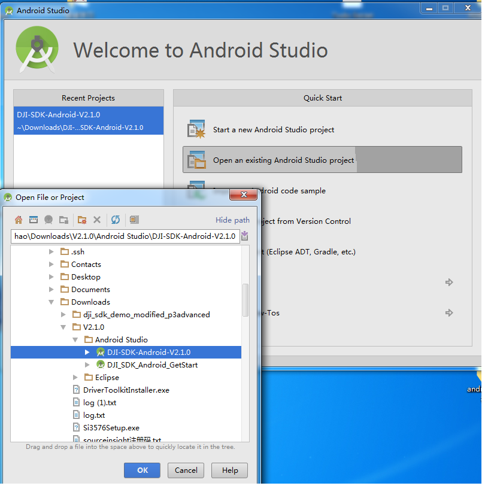
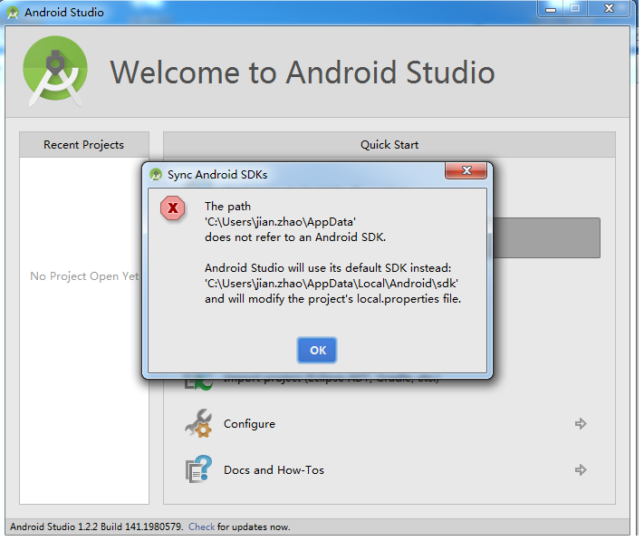
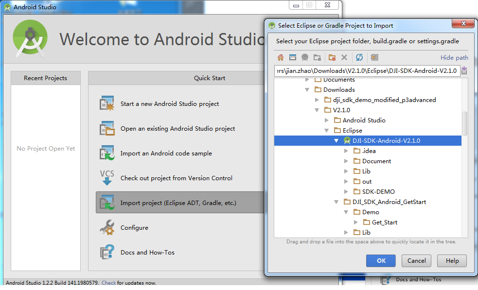
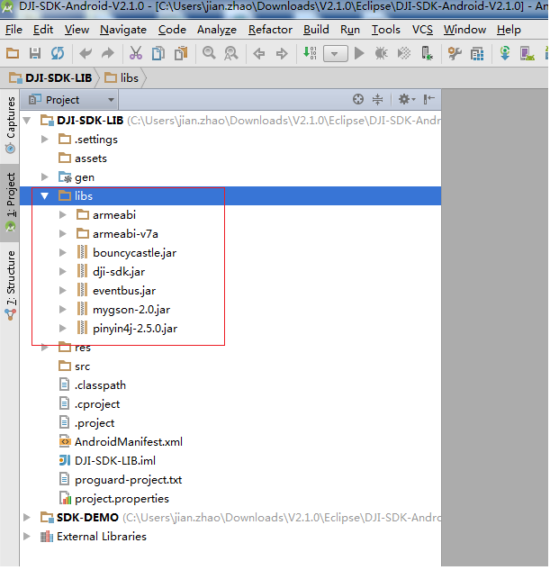
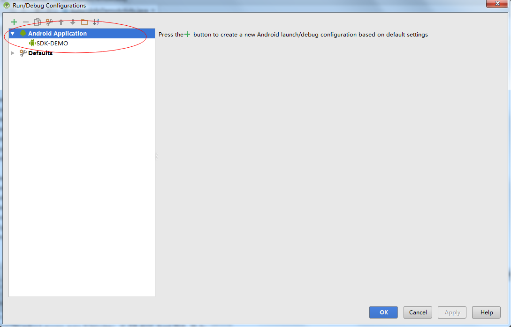
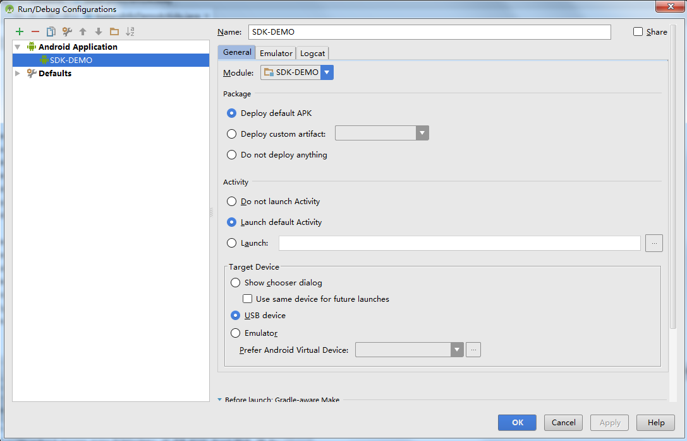
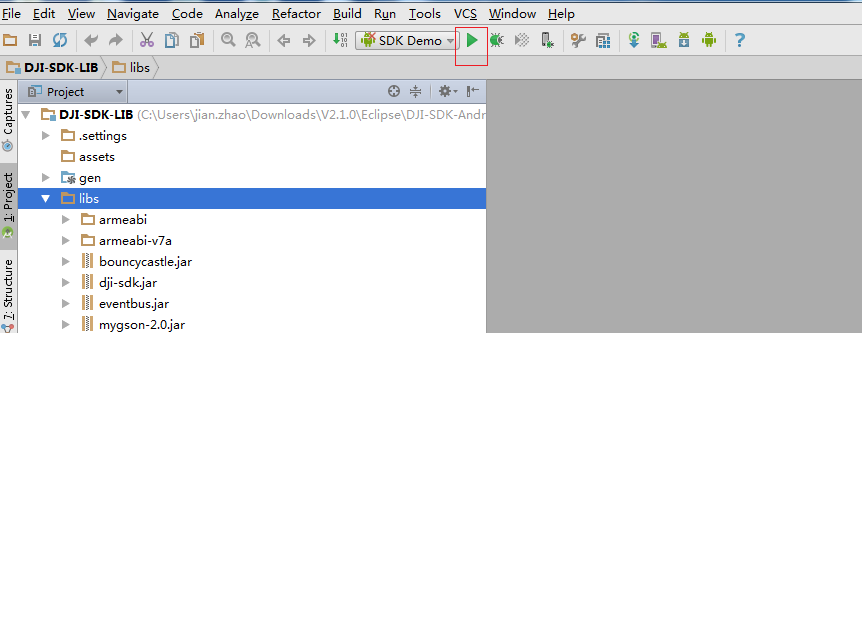

# DJI SDK Demo를 Android Studio로 Import하기

<!-- toc -->

DJI SDK Demo 라이브러리를 Android Studio로 import하는 방법에는 2가지가 있다. 첫번째로 Android Studio 버전의 DJI SDK Demo 라이브러리를 import하는 것이다. 두번째는 Eclipse 버전의 DJI SDK Demo를 Android Studio로 import하는 것이다.

## Android Studio 버전 Import하기

### 1. DJI Android SDK 다운받기
DJI Android SDK 다운받기 : <dev.dji.com/en/products/sdk/mobile-sdk/downloads>

다운 받은 패키지의 압축을 푼다. "./V2.1.0/Android Studio" 아래 **Android Studio** 폴더를 찾는다.

### 2. 프로젝트 Import하기

**Android Studio** 폴더에는 2개 프로젝트가 있다 : **DJI_SDK_Android_GetStart** 와 **DJI-SDK-Android-V2.1.0**. 여기서 **DJI-SDK-Android-V2.1.0**를 사용할 것이다.

Android Studio를 열고 **Open an existing Android Studio project**를 선택한다. 다이얼로그 윈도우 팝업이 뜨면 프로젝트 폴더의 path를 선택을 요구한다. **./V2.1.0/Android Studio/DJI-SDK-Android-V2.1.0** 위치와 import를 하기를 선택한다.

 **주의:** Android SDK가 지정한 경로 'xxx'를 참조하지 못한다면 Android Studio는 'xxx'대신 기본 SDK를 사용하며 프로젝트의 local.properties를 수정할 것이다. "OK"를 클릭하여 계속 진행한다. 이런 경우는 **local.properties** 파일에 Android SDK 경로 설정이 여러분의 컴퓨터의 Android SDK 경로로 수정되어야 하기 때문이다.
 

## Eclipse 버전 import하기

### 1. DJI Android SDK 다운받기
Please download DJI Android SDK: <dev.dji.com/en/products/sdk/mobile-sdk/downloads>

Unzip the downloaded package. Find the **Eclipse** folder under the path "./V2.1.0/Eclipse". 

### 2. Importing the project

Open Android Studio, select **Import project(Eclipse ADT, Gradle,etc.)**. A dialog window will pop-up asking you to select the project path. Select the path "./V2.1.0/Eclipse/DJI-SDK-Android-V2.1.0" to import the DJI SDK Demo.

Click "Next" for all the remaining dialogue boxes, the default values will be fine. After you click "Finish" on the last window, you will receive a pop-up window asking you to add dependency libraries. Just click "OK".

Please confirm that in your project's DJI-SDK-LIB's folder "libs", there are the following .so libs or jars:

If the "run" icon is grayed out, you will need your edit configurations. Click "Run->Edit Configurations...", then click the plus sign "+" and select Android Application. In the settings, change the "Target Device" to "USB device" and click "OK".

Your run icon should now be green. Click it to compile and install the demo on your Android device.

