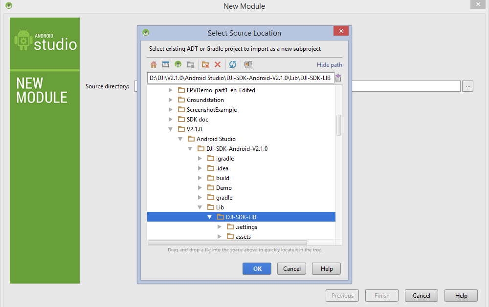
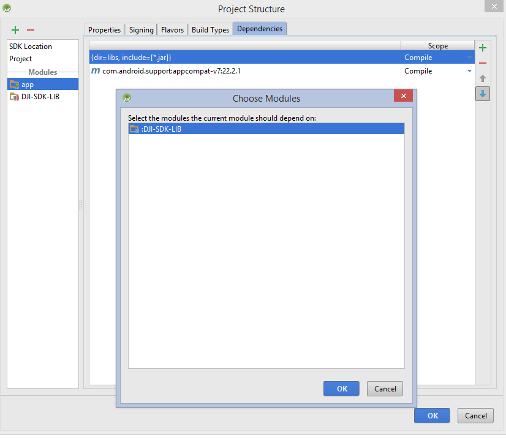
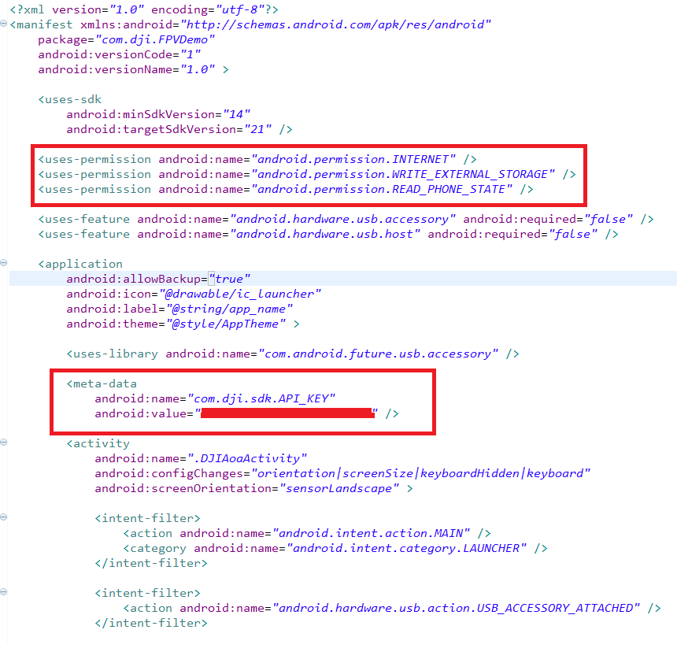
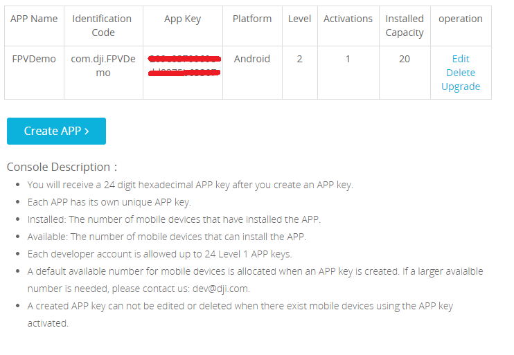
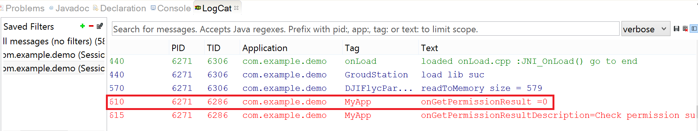
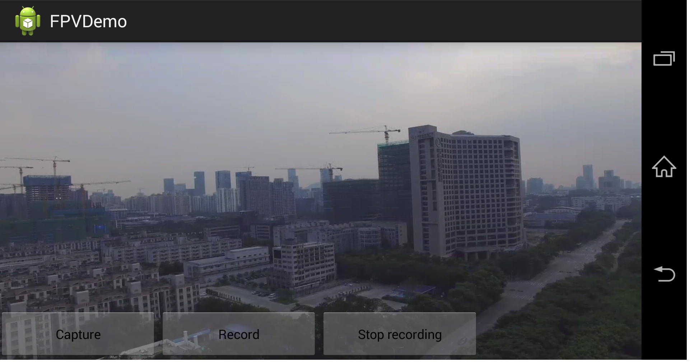
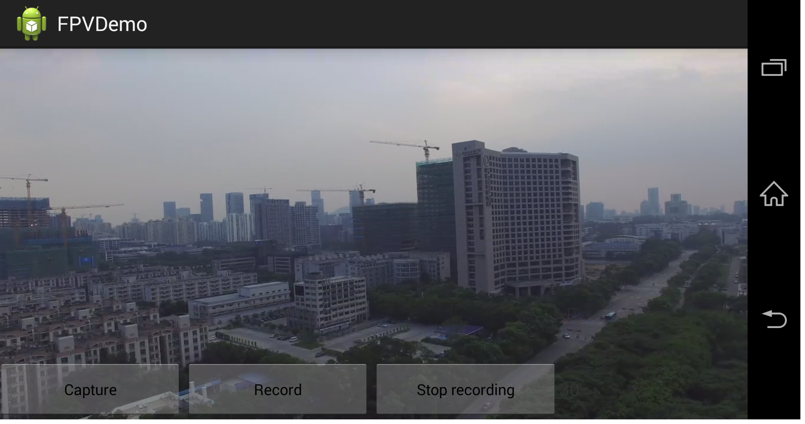

# 카메라 앱 만들기

<!-- toc -->

이 튜토리얼의 최종 프로젝트를 다운 받을 수 있다: <https://github.com/DJI-Mobile-SDK/Android-FPVDemo.git>. 
최종 프로젝트 코드를 다운받기를 추천하며 이 튜토리얼을 참조할 수 있도록 열어놨다.

## 준비하기

(1) Mobile SDK for Android를 아래 링크에서 다운받기 : 
<https://developer.dji.com/mobile-sdk/downloads/>

(2) 비행장치(Phantom 3 Professional, Phantom 3 Advanced or Inspire 1) 펌웨어 업데이트 하기: <https://developer.dji.com/mobile-sdk/downloads/>(
*"비행장치 펌웨어 업데이트" 참조: <http://download.dji-innovations.com/downloads/phantom_3/en/How_to_Update_Firmware_en.pdf> 펌웨어 업데이트를 위한 설명서*)

(3) 안드로이드 개발 환경 설정(아직 설정하지 않은 경우). 이 튜토리얼에서 Eclipse 4.2.2를 사용한다. 아래 링크에서 다운받을 수 있다: <https://eclipse.org/downloads/packages/eclipse-classic-422/junosr2>. 일단 Eclipse가 설치하고나면, Eclipse Android 개발 툴 Plug-In을 설치해야만 한다. 방법은 아래 링크에서 찾을 수 있다: http://developer.android.com/intl/zh-TW/sdk/installing/installing-adt.html

*주의: 구글은 Eclipse의 안드로이드 개발 도구에 대한 지원이 끝났다. 이 데모를 완성하기 위해서는 Eclipse를 사용하거나 이미 데모를 완성했다면 Android Studio로 옮기는 방법을 아래 링크에서 찾을 수 있다: <https://developer.android.com/intl/zh-TW/sdk/installing/migrate.html>. 만약에 이 튜토리얼을 Android Studio에서 따라한다면, mobile SDK 폴더는 Eclipse뿐만 아니라 Android Studio 라이브러리를 포함해야 한다. Instructions on how to import the SDK library are given for both Eclipse and Android Studio below. However, we recommend that you follow this guide using the provided installation of Eclipse, and migrate your project afterwards, as we cannot ensure that results in Android Studio will be identical to those displayed in this tutorial.*

## 프로그래밍 환경 설정하기

### Eclipse

 삭제 

### Android Studio

(1) 새로 Android Studio 프로젝트 시작하기. 원하는 application 이름을 입력한다. 'Customize the Activity' 페이지가 나올때까지 next'를 클릭한다. activity 이름은 'FPVActivity'으로 정해야 한다. layout 이름은 자동으로 'activity_fpv'가 들어간다. 'Finish'를 누른다.

(2) DJI 웹사이트에서 다운받은 SDK 패키지 압축을 푼다. 메뉴에서 File -> New -> Import Module로 이동한다. 'Source Directory'필드에 DJI-SDK-LIB 폴더를 찾는다.(Android Studio\DJI-SDK-Android-V2.1.0\Lib\DJI-SDK-LIB). 'Finish'를 누른다.

*주의: DJI 웹사이트에서 다운받은 SDK 패키지내에 'Android Studio' 폴더가 있다. 데모 프로젝트에서 사용하는 라이브러리는 동일한 SDK 패키지내에 'Eclipse' 폴더에 있다. 만약 Android Studio에서 작업하고 있다면, 올바른 라이브러리('Android Stduio' 폴더)를 사용하고 있는지 확인해야 한다. 편의를 위해 SDK 패키지 다운로드 링크를 여기서 다시 기록해 두겠다. <http://dev.dji.com/cn/products/sdk/mobile-sdk/downloads>*

다음으로 왼쪽에 있는 파일 디렉토리에 'app' 모둘에서 오른쪽 클릭을 하고 'Open Module Settings'을 클릭한다. 'Dependencies' 탭으로 이동한다. 녹색 + 표시를 누르고 'Module Dependency'를 클릭해서 ':DJI-SDK-LIB'를 선택한다. 확인을 위해 'OK'를 누른다. Gradle이 재구성을 마치면, 환경준비를 마치게 된다.

## App 활성화

(1) <http://dev.dji.com>에서 계정 등록한다. 일단 등록하면 오른쪽 상단 모서리에 여러분의 이름을 클릭한다. 'Mobile SDK'을 클릭하고 'Crate App'에서 생성폼을 채운다. 'Identification Code'에는 프로젝트의 패키지 이름을 입력한다.

(2) 코드의 **<uses-permission ... >** 모두를 복사해서 **AndroidManifest.xml** 파일 내부에 meta-data element를 하이라이트시킨다. 아래와 같다.  

Fill in the **android:value** field with the APP KEY that you have applied for from <http://dev.dji.com>.

FPVActivity.java file 파일에서 FPVActivity 클래스에 다음 변수를 추가한다.

~~~java
private static final String TAG = "MyApp";
~~~

활성화와 관련된 log error를 식별하기 위해서 이 string 값을 이용할 것이다.

onCreate 메소드에서 다음 코드를 추가하자. 많아 보이지만 이 코드들은 **DJIDrone.checkPermission()**라 불리는 단일 함수이다. 이 메소드는 DJI의 서버에 대해서 **AndroidManifest.xml**에 추가했던 정보를 체크함으로써 app의 유효성을 확인할 수 있다. 처음 여러분의 app을 실행한다면, 유효성을 확인하고 나면 app이 활성화 될것이다.

~~~java
	new Thread(){
		public void run(){
			try{
				DJIDrone.checkPermission(getApplicationContext(), new DJIGerneralListener(){
					@Override
					public void onGetPermissionResult(int result){
						if(result == 0) {
							// show success
							Log.e(TAG, "onGetPermissionResult ="+result);
							Log.e(TAG, 
"onGetPermissionResultDescription="+DJIError.getCheckPermissionErrorDescription(result));
						} else {
							// show errors
							Log.e(TAG, "onGetPermissionResult ="+result);
							Log.e(TAG, 
"onGetPermissionResultDescription="+DJIError.getCheckPermissionErrorDescription(result));
						}
					}
				});
			} catch (Exception e) {
        			// TODO Auto-generated catch block
        			e.printStackTrace();
        		}
		}
	}.start();
~~~

이 코드들을 나눠보자. 모든 코드를 thread내부에 두었다는 것을 명심하자. 이렇게 하는 이유는 **checkPermission()**이 네트워크에서 실행되기 때문이고 이런 절차는 반드시 thread에서 처리해야만 한다. 네트워크 연산이 완료되기를 기다리는 동안 전체 app이 멈추지 않게 하기 위해서다.

**checkPermission()**는 인자 2개를 가진다: context와 **DJIGerneralListener()**이다. **DJIGerneralListener()**는 **onGetPermissionResult()** 메소드를 가지는 인터페이스다: 이는 callback함수처럼 동작해서 **checkPermission()**이 응답하는 것을 정의한다.

~~~java
@Override
public void onGetPermissionResult(int result){
	if(result == 0) {
		// show success
		Log.e(TAG, "onGetPermissionResult ="+result);
		Log.e(TAG, 
"onGetPermissionResultDescription="+DJIError.getCheckPermissionErrorDescription(result));
	} else {
		// show errors
		Log.e(TAG, "onGetPermissionResult ="+result);
		Log.e(TAG, 
"onGetPermissionResultDescription="+DJIError.getCheckPermissionErrorDescription(result));
	}
}
~~~

**onGetPermissionResult()**는 **result**라는 하나의 정수를 인자로 갖는다. **result**는 app에다가 에러 코드를 반환한다. 만약 error 코드가 0이면 app은 성공적으로 유효성을 검증한 것이다. 만약 그렇지 않다면 **onGetPermissionResult()**는 Log를 이용해서 적절한 error 메시지를 출력한다. 여러분의 app을 개발할 때, error 코드를 처리하는게 좋을지 말지를 결정해야 한다.

(3) 활성화 절차를 완료하기 위해서 Android 장치나 Android emulator에서 여러분의 프로젝트를 실행하자. 여러분의 코드를 실행에 관련된 내용은 아래에서 찾을 수 있다: <http://developer.android.com/intl/zh-TW/tools/building/building-eclipse.html>

반환 메시지를 보기 위해서는 개발 환경 창의 밑에 있는'LogCat' 패널을 확인하라. "MyApp"을 표시하는 'Tag' 필드로 반환 메시지를 식별할 수 있다.

아래 테이블의 error 코드를 확인하자.

Error Code  	  | Description 
------------- | -------------
0   | Check permission successful
-1  | Cannot connect to Internet
-2  | Invalid app key
-3  | Get permission data timeout
-4  | Device uuid not match
-5  | Project package name does not match the app 	   key's identification code
-6  | App key is forbidden
-7  | Activated device number is up to the maximum 		available one
-8  | App key's platform is not correct
-9  | App key does not exist
-10 | App key has no permission
-11 | Server parser failed
-12 | Error in server obtaining uuid
-13 | Server app package name abnormal
-14 | Server parsing activation data failed
-15 | AES 256 encryption unsupported
-16 | AES 256 encryption failed
-17 | Get device uuid failed
-18 | Empty app key
-1000 | Server error 

0이 아닌 error 코드를 받으면 아래와 같은 지시를 따르도록 하자:

1. 인터넷에 연결되어 있는지 확인하기
2. http://dev.dji.com 사이트에서 앱을 생성할 때, 입력한 'Identification Code'와 프로젝트 패키지 이름이 같은지 확인하기 
3. APP KEY의 설치한 용량 제한을 넘었는지 확인하기. 만약 이런 문제가 해결되지 않는다면, 추가 문제해결을 위한 테이블을 참고하자.
추가 질문이 있다면 mobile SDK 지원을 담당하는 <sdk@dji.com>에 메일일 보낸다.

## Android Open Accessory (AOA) 지원 추가하기

DJI의 최신 리모트 컨트롤러의 최신 펌웨어는 USB Accessory를 이용해서 외부 장치에 연결한다. USB Debugging 예전 모델이 했던 것과 비슷하다. 이를 위해서 AOA 지원이 필요하다. 미래에는 DJI 드론을 이용해서 여러분의 app을 만들려고 할 때, 아래 보이는 바와 같이 AOA 지원이 필요할 것이다. 이 설정은 이전 리모트 장치와 하위 호환성을 가진다. 

(1) **AndroidManifest.xml**를 수정해서 **.DJIAoaActivity**가 main activity가 되도록 한다. 따라서 여러분의 app이 시작될 때 entry 포인트가 되도록 수정한 것이다. 이를 위해서 **<activity ... >** 엘리먼트를 찾아서 **android:name** 값을 **.FPVActivity**에서 **.DJIAoaActivity**로 바꾼다.

여러분의 **AndroidManifest.xml** 파일내에 'manifest' 엘리먼트 아래에 다음 code를 추가한다:
~~~xml
<uses-feature android:name="android.hardware.usb.accessory" android:required="false" />
<uses-feature android:name="android.hardware.usb.host" android:required="false" />
~~~ 

'application' 엘리멘트 아래에 다음 코드를 추가한다 :
~~~xml
uses-library android:name="com.android.future.usb.accessory"
~~~
**AndroidManifest.xml** 파일은 아래와 같아야 한다 :

~~~xml
	...
	
	<uses-feature android:name="android.hardware.usb.accessory" android:required="false" />
	<uses-feature android:name="android.hardware.usb.host" android:required="false" />
	<application
		android:label="@string/app_name"
		android:theme="@style/AppTheme">
		
		<uses-library android:name="com.android.future.usb.accessory" />
	...
		<activity
			android:name=".DJIAoaActivity"
			android:configChanges="orientation|screenSize|keyboardHidden|keyboard"
			android:screenOrientation="sensorLandscape" >
			
			<intent-filter>
				<action android:name="android.intent.action.MAIN" />
				<category android:name="android.intent.category.LAUNCHER" />
			</intent-filter>
			
			<intent-filter>
				<action android:name="android.hardware.usb.action.USB_ACCESSORY_ATTACHED" />
			</intent-filter>
			
			<meta-data
				android:name = "android.hardware.usb.action.USB_ACCESSORY_ATTACHED"
				android:resource = "@xml/accessory_filter" />
		</activity>
~~~

(2) 새로운 Android Activity 페이지를 생성하고 activity이름으로 **DJIAoaActivity**를 사용한다.(package에서 오른쪽 클릭을 해서 New -> Other -> Android -> Android Activity) 새로 생성한 **DJIAoaActivity.java** 파일에서 **onCreate()** 메소드에서 AOA 지원이 가능하도록 다음 코드로 교체하자.

~~~java
	private static boolean isStarted = false;
	...
	@Override
	protected void onCreate(Bundle savedInstanceState){
		super.onCreate(savedInstanceState);
		setContentView(new View(this));
		
		if (isStarted) {
			//Do nothing
		} else {
			isStarted = true;
			ServiceManager.getInstance();
			UsbAccessoryService.registerAoaReceiver(this); 
			Intent intent = new Intent(DJIAoaActivity.this, FPVActivity.class);
			startActivity(intent);
		}
		
		Intent aoaIntent = getIntent();
		if(aoaIntent != null) {
			String action = aoaIntent.getAction();
			if (action==UsbManager.ACTION_USB_ACCESSORY_ATTACHED || action == Intent.ACTION_MAIN){
				Intent attachedIntent = new Intent();
				attachedIntent.setAction(DJIUsbAccessoryReceiver.ACTION_USB_ACCESSORY_ATTACHED);
				sendBroadcast(attachedIntent);
			}
		}
		finish();
	}
	...
~~~ 

코드를 하나씩 살펴보자.

app이 시작할 때만 설정이 일어나도록 변수 **isStarted**를 생성했다.

~~~java
	private static boolean isStarted = false;
~~~

~~~java
	if (isStarted) {
		//Do nothing
	} else {
		isStarted = true;
		ServiceManager.getInstance();
		UsbAccessoryService.registerAoaReceiver(this); 
		Intent intent = new Intent(DJIAoaActivity.this, FPVActivity.class);
		startActivity(intent);
	}
~~~

app이 사작되면, main activity인 **FPVActivity**에서 intent를 설정해 준다. 아래 2줄 코드와 같다 :

~~~java
Intent intent = new Intent(DJIAoaActivity.this, FPVActivity.class);
startActivity(intent);
~~~

*주의: 향후 여러분의 app이 DJI remote와 사용하는 AOA 지원이 추가될 때, "FPVActivity.class"를 여러분의 class 이름으로 대체하기를 원할 것이다. 추가로 여러분이 첫번째 activity에 'FPVActivity'을 주지 않았다면 대신에 여러분이 여기서 선택한 이름을 넣으면 된다.*

다음으로 remote에 연결하기 위해서 broadcast를 보내는 역할을 하는 코드를 보자.

~~~java
Intent aoaIntent = getIntent();
if(aoaIntent != null) {
	String action = aoaIntent.getAction();
	if (action==UsbManager.ACTION_USB_ACCESSORY_ATTACHED || action == Intent.ACTION_MAIN){
		Intent attachedIntent = new Intent();
		attachedIntent.setAction(DJIUsbAccessoryReceiver.ACTION_USB_ACCESSORY_ATTACHED);
		sendBroadcast(attachedIntent);
	}
}
~~~

먼저 이 코드는 여기로 오게 만든 intent의 action을 얻는다. 이를 통해 app이 열렸는지 확인할 수 있고, app이 실행되는 장치가 DJI remote에 연결되었는지 확인할 수 있다. 만약 그렇다면, app과 DJI remote 사이에 연결을 설정하는 broadcast를 보낸다.

~~~java
if (action==UsbManager.ACTION_USB_ACCESSORY_ATTACHED || action == Intent.ACTION_MAIN){
	// Send broadcast
}
~~~ 

(3) 추가로 app이 멈추게 되면 AOA 데이터 연결 서비스도 멈춰야 하고(부분적으로 가시적 상태) app이 다시 재개되면 데이터 연결도 재개되어야 한다.(다시 완전히 가시적인 상태)

새로운 Android Activity Page로 **DemoBaseActivity**를 생성한다. 그리고 다음 코드를 추가한다. 이 코드는 **onPause()** 혹은 **onResume()** 라이프사이클 callback이 호출될 때, AOA data 연결 서비스를 멈추거나 재개할 수 있다.

이것은 우리 프로젝트의 기본 activity가 될 것이다. **FPVActivity** 클래스 헤더를 바꿔서 **Activity**보다는 **DemoBaseActivity**를 확장하도록 한다.

~~~java
	...
	@Override
	protected void onResume(){
		super.onResume();
		ServiceManager.getInstance().pauseService(false); // Resume the service
	} 
	
	@Override
	protected void onPause() {
		super.onPause();
		ServiceManager.getInstance().pauseService(true); // Pause the service
	}
~~~	
	
## FPV(First Person View) 구현하기

이제 거의 완성되어 간다. app과 DJI 리모트 컨트롤러 사이에 데이터 연결이 가능하도록 하는 것 뿐만 아니라 app을 활성화시키고 인증 매커니즘을 만들어야 한다. 남은 일은 드론의 카메라에서 라이브 비디오를 생성해서 app을 보는 일이다.

(1) SDK API를 사용하기 전에, 우리가 사용하고 있는 비행체의 타입에 따라서 초기화 해야만 한다. 안타깝지만 지금은 app이 연결한 비행체의 타입이 무엇인지 자동으로 검출하는 방법은 없다. 따라서 우리가 사용할 드론의 타입이 무엇인지 직접 입력해야한다. 아니면 어떤식으로든 사용자 입력을 받아야 한다. 이 튜토리얼의 목적을 위해 우리가 사용할 Inspire 1을 직접 입력하도록 하겠다. 하지만 메소드는 **switch()** 구문을 포함하여 다른 드론을 사용하는 경우 **DroneCode** 변수를 변경하도록 해놨다.

'FPVActivity.java'의 FPVActivity 클래스에 아래 변수를 추가한다.

~~~java
private int DroneCode;
~~~

Import the following package.

~~~java
import dji.sdk.api.DJIDroneTypeDef.DJIDroneType;
~~~

아래 'onCreate' 메소드에 2줄 코드를 추가한다. 추가로 'FPVActivity' 클래스 내부에 'onInitSDK' 메소드를 아래와 같이 추가한다.

~~~java
	@Override
	protected void onCreate(Bundle savedInstanceState){
		
		...
		DroneCode = 1; 
		onInitSDK(DroneCode);
		...
	}
	
	private void onInitSDK(int type){
		switch(type){
			case 0: {
				DJIDrone.initWithType(this.getApplicationContext(), DJIDroneType.DJIDrone_Vision);
				// The SDK initiation for Phantom 2 Vision or Vision Plus 
				break;
			}
			case 1: {
				DJIDrone.initWithType(this.getApplicationContext(), DJIDroneType.DJIDrone_Inspire1); 
				// The SDK initiation for Inspire 1 or Phantom 3 Professional.
				break;
			}
			case 2: {
				DJIDrone.initWithType(this.getApplicationContext(), DJIDroneType.DJIDrone_Phantom3_Advanced);
				// The SDK initiation for Phantom 3 Advanced
				break;
			}
			case 3: {
				DJIDrone.initWithType(this.getApplicationContext(), DJIDroneType.DJIDrone_M100);
				// The SDK initiation for Matrice 100.
				break;
			}
			default:{
				break;
			}
		}
	}
	
	...
~~~

(2) SDK API를 초기화 한 후에, 드론을 연결해야만 한다. 'onCreate' 메소드에서 비행체에 연결하기 위해 다음 코드들을 사용한다. 이 메소드는 여러분의 APP key가 활성화시키는 코드 뒤에 호출되어야 한다.

~~~java
	DJIDrone.connectToDrone(); // Connect to the drone
~~~	

(3) API는 초기화되고 드론에 연결된다. 이제 비디오에 연결할 수 있다. 만약 이 2가지 절차가 먼저 수행되지 않으면 API 함수 호출은 어떤 동작도 하지 않는다. **activity_fpv.xml** 파일(res/layout/activity_fpv.xml)에 **DjiGLSurfaceView** element 코드를 추가한다.

~~~xml
	<dji.sdk.widget.DjiGLSurfaceView
		android:id="@+id/DjiSurfaceView_02"
		android:layout_width="fill_parent"
		android:layout_height="fill_parent" />
~~~	

이 view는 DJI drone으로부터 video stream을 보여주는 역할을 한다.

'FPVActivity.java' 파일의 FPVActivity 클래스 내부에 아래와 같이 object를 추가한다.

~~~java
private DJIReceivedVideoDataCallBack mReceivedVideoDataCallBack = null;
private DjiGLSurfaceView mDjiGLSurfaceView;
~~~

'onCreate' 메소드에 다음과 같은 코드를 추가하고, connectToDrone() 메소드 호출하는 곳 이후에 호출되도록 추가되었는지 확인한다. 

~~~java
	@Override
	protected void onCreate(Bundle savedInstanceState) {
		super.onCreate(savedInstanceState);
		setContentView(R.layout.activity_fpv);
		
		...
		
		mDjiGLSurfaceView = (DjiGLSurfaceView)findViewById(R.id.DjiSurfaceView_02);
		mDjiGLSurfaceView.start();

		mReceivedVideoDataCallBack = new DJIReceivedVideoDataCallBack(){
			@Override
			public void onResult(byte[] videoBuffer, int size){
				mDjiGLSurfaceView.setDataToDecoder(videoBuffer, size);
			}
		};
		DJIDrone.getDjiCamera().setReceivedVideoDataCallBack(mReceivedVideoDataCallBack);
	}
~~~	

이 코드가 어떻게 동작하는지 알아보자.

먼저 **activity_fpv.xml**에서 생성한 **DjiSurfaceView_02** element가 객체 **mDjiGLSurfaceView**와 연결시킨다.

~~~java
mDjiGLSurfaceView = (DjiGLSurfaceView)findViewById(R.id.DjiSurfaceView_02);
mDjiGLSurfaceView.start();
~~~

다음으로 위에서 금방 선언한 callback 함수인 **mReceivedVideoDataCallBack**를 설정한다.

~~~java
mReceivedVideoDataCallBack = new DJIReceivedVideoDataCallBack(){
@Override
public void onResult(byte[] videoBuffer, int size){
	mDjiGLSurfaceView.setDataToDecoder(videoBuffer, size);
	}
};
~~~

**mReceivedVideoDataCallBack**는 드론의 카메라에서 raw video 데이터(raw H264 포맷)을 가져오고 이를 **DjiGLSurfaceView** element로 줘서 처리하게 한다. DJI가 제공하는 디코더는 raw data를 디코딩하고 **DjiGLSurfaceView** element는 여러분의 app 윈도우에서 나타나게 된다!

마지막으로 드론의 카메라에서 데이터를 받으면 이 callback 함수가 호출되도록 하자.

~~~java
DJIDrone.getDjiCamera().setReceivedVideoDataCallBack(mReceivedVideoDataCallBack);
~~~

(4) 마지막으로 app이 닫히면, 데이터 디코딩 프로세스를 종료시켜야만 한다. 따라서 **DjiGLSurfaceView** element를 제거한다. **onDestroy()** 메소드가 기존에 없다면 아래 코드를 이용해서 메소드를 생성한다. 반면에 **onDestroy()** 메소드가 있다면 아래 코드를 복사해서 넣자.

~~~java
	...
	
	@Override
	protected void onDestroy() {
		if (DJIDrone.getDjiCamera() != null) {
			DJIDrone.getDjiCamera().setReceivedVideoDataCallBack(null);
		}
		mDjiGLSurfaceView.destroy();
		
		...
	}
~~~

**onDestroy()** 메소드는 아주 중요하다. 위에서 본 것처럼**DjiGLSurfaceView** 객체를 제거하기 전에, 먼저 callback 함수를 **null**로 설정하는 방식으로 video data processing을 종료한다. surface view를 먼저 삭제하면, callback 함수는 데이터를 더이상 존재하지 않는 객체에게 계속해서 보낼 수 있으면 이렇게 되면 app이 문제를 일으킨다. 

반대로 **onCreate()** 메소드에서 callback 함수를 할당하기 전에 **DjiGLSurfaceView** 객체를 시작해야만 한다. 이는 위와 같은 이유에서다.(단계 (3)의 처음부분을 보면 이미 우리가 이것을 수행했다는 예제를 위해 **onCreate()** 메소드를 수정하는 부분이다.)

## 비행체에 연결하기

여러분이 성공적으로 프로젝트를 빌드하고 실행한 후에, 모바일 장치를 비행체와 연결해서 FPV를 확인할 수 있다. 비행체 모델에 따른 적합한 절차를 따른다 :

### 1. DJI Inspire 1 나 Phantom 3 Professional/Advanced에 연결하기:

1. 리모트 컨트롤러 켜고 비행체 켜기

2. USB 케이블을 이용해서 모바일 장치를 리모트 컨트롤러에 연결하기. app을 시행켜면 "Choose an app for the USB device"라는 팝업 창이 뜬다.

3. "Allow the app to access the USB accessory"라는 메시지 팝업이 나오면 "OK"를 누른다.

4. 활성화 경고가 표시되면 "OK"를 누른다.

5. 이제 FPV View app을 사용할 준비가 되었다.

### 2. DJI Phantom 2 Vision+ 혹은 Phantom 2 Vision에 연결하기:
	
1. 리모트 컨트롤러 켜고 비행체 전원 켜기

2. 모바일 장치가 인터넷에 연결되었는지 확인한다. app을 실행시켜 활성화 시키고 활성화가 되면 "OK"를 선택한다.

3. Wi-Fi 범위 확장기를 켠다.

4. 모바일 장치의 Wi-Fi를 켜고 Phantom-xxxxxx(xxxxxx는 범위 확장기의 SSID 숫자이다) 의 Wi-Fi 네트워크에 연결한다.

5. FPV View app을 사용할 준비가 되었다.

## 결과 검사하기
live video stream을 app에서 볼 수 있다면 성공한 것이다! FPV 구현을 성공적으로 해냈다.

## Handler 생성하기

error나 확인 메시지를 보여주기 위해서 handler를 사용한다. 아래 콛르 FPVActivity 클래스에 복사하여 handler를 구성한다:

~~~java
private Handler handler = new Handler(new Handler.Callback() {
        
        @Override
        public boolean handleMessage(Message msg) {
            switch (msg.what) {
                case SHOWDIALOG:
                    showMessage(getString(R.string.demo_activation_message_title),(String)msg.obj); 
                    break;
                case SHOWTOAST:
                    Toast.makeText(FPVActivity.this, (String)msg.obj, Toast.LENGTH_SHORT).show();
                    break;
                default:
                    break;
            }
            return false;
        }
    });
    
    private Handler handlerTimer = new Handler();
    Runnable runnable = new Runnable(){
        @Override
        public void run() {
        // handler自带方法实现定时器
        try {

            handlerTimer.postDelayed(this, TIME);
            viewTimer.setText(Integer.toString(i++));

        } catch (Exception e) {
            // TODO Auto-generated catch block
            e.printStackTrace();
        }
        }
    };
~~~

## Capture 기능 구현하기

**private void captureAction()** 함수는 사진을 찍는다. 소스코드에서 "Capture" 버튼을 구현하여 언제든 누르면 동작하도록 한다.

~~~java
	 // function for taking photo
    private void captureAction(){
        
        CameraMode cameraMode = CameraMode.Camera_Capture_Mode;
        // Set the cameraMode as Camera_Capture_Mode. All the available modes can be seen in
        // DJICameraSettingsTypeDef.java
        DJIDrone.getDjiCamera().setCameraMode(cameraMode, new DJIExecuteResultCallback(){

            @Override
            public void onResult(DJIError mErr)
            {
                
                String result = "errorCode =" + mErr.errorCode + "\n"+"errorDescription =" + DJIError.getErrorDescriptionByErrcode(mErr.errorCode);
                if (mErr.errorCode == DJIError.RESULT_OK) {
                    CameraCaptureMode photoMode = CameraCaptureMode.Camera_Single_Capture; 
                    // Set the camera capture mode as Camera_Single_Capture. All the available modes 
                    // can be seen in DJICameraSettingsTypeDef.java
                    
                    DJIDrone.getDjiCamera().startTakePhoto(photoMode, new DJIExecuteResultCallback(){

                        @Override
                        public void onResult(DJIError mErr)
                        {
                            
                            String result = "errorCode =" + mErr.errorCode + "\n"+"errorDescription =" + DJIError.getErrorDescriptionByErrcode(mErr.errorCode);
                            handler.sendMessage(handler.obtainMessage(SHOWTOAST, result));  // display the returned message in the callback               
                        }
                        
                    }); // Execute the startTakePhoto API if successfully setting the camera mode as
                    	// Camera_Capture_Mode 
                } else {
                    handler.sendMessage(handler.obtainMessage(SHOWTOAST, result)); 
                    // Show the error when setting fails
                }
                
            }
            
        });
                   
    }
~~~

지금까지 많은 코드를 보여줬다. 나눠서 살펴보도록 하자.

첫번째로 할 일은 CameraMode enum을 정의하여 DJI Drone에 있는 camera의 모드를 설정하는데 사용한다.

~~~java
CameraMode cameraMode = CameraMode.Camera_Capture_Mode;
~~~

 enum 'cameraMode'를 정의한 이유는 **setCameraMode()** 함수의 인자로 넘기려는 것이다. **setCameraMode()**는 DJI 드론의 카메라 모드(Capture Mode, Playback Mode, Record Mode)를 설정한다. **setCameraMode()**는 2개 인자를 갖는다 :

**setCameraMode(DJICameraSettingsTypeDef.CameraMode mode, DJIExecuteResultCallback mCall)**

첫번째 인자는 CameraMode enum으로 카메라가 설정해야할 모드를 함수에게 알려준다. 이 경우 카메라에게 Capture Mode를 설정하게 한다.
두번째 인자는 callback 함수이다. **setCameraMode()**가 camera mode를 설정하고나서 실행된다. callback 함수는 아래와 같이 간략하게 다시 만든다.

~~~java
new DJIExecuteResultCallback(){

            @Override
            public void onResult(DJIError mErr)
            {

                String result = "errorCode =" + mErr.errorCode + "\n"+"errorDescription =" + DJIError.getErrorDescriptionByErrcode(mErr.errorCode);
                if (mErr.errorCode == DJIError.RESULT_OK) {
                    // Take a photo!
                } else {
                    handler.sendMessage(handler.obtainMessage(SHOWTOAST, result)); 
                    // Show the error when setting fails
                }

            }

        });
~~~

callbakc 함수는 드론으로부터 확인신호를 받는다. DJIError 객체인 'mErr'의 형태다. 만약 'mErr'의 error code가 DJIError.RESULT_OK와 일치하면 사진을 찍는 코드가 실행된 것이다. 이외에 handler는 error code에 따라 적절한 error 메시지를 보여준다.

callback 함수 내부에서 drone에게 사진을 찍으라고 지시하는 코드를 넣는다.

~~~java
CameraCaptureMode photoMode = CameraCaptureMode.Camera_Single_Capture; 
// Set the camera capture mode as Camera_Single_Capture. All the available modes 
// can be seen in DJICameraSettingsTypeDef.java

DJIDrone.getDjiCamera().startTakePhoto(photoMode, new DJIExecuteResultCallback(){

	@Override
    public void onResult(DJIError mErr)
    {
    	String result = "errorCode =" + mErr.errorCode + "\n"+"errorDescription =" + DJIError.getErrorDescriptionByErrcode(mErr.errorCode);
        handler.sendMessage(handler.obtainMessage(SHOWTOAST, result));  // display the returned message in the callback               
    }
}); // Execute the startTakePhoto API if successfully setting the camera mode as
                        // Camera_Capture_Mode
~~~

이 코드에 익숙하다면, 큰 함수와 거의 동일한 구조를 따르기 때문이다. 먼저 'photoMode'라는 CameraCaptureMode enum을 생성한다. 드론이 사진을 찍을 때, 이 enum은 한 장 사진찍기인지 여러 사진찍기 인지 아니면 연속 사진찍기 인지 판단한다. 이 예제에서는 한 번에 하나의 사진을 찍는다.

**startTakePhoto()** 메소드는 드론의 카메라에게 사진을 찍으라고 지시한다. **setCameraMode()** 함수와 같이 enum과 callback 함수를 인자로 가진다. enum이 의미하는 것은 앞에서 이미 알아봤다. callback 함수는 드론의 카메라가 사진을 찍으려고 한 이후에 error code와 error description을 주는 메시지를 표시하는 handler를 이용한다. 성공적으로 사진을 찍으면, 확인 메시지가 뜬다.

잘 진행하고 있다! 이 메소드를 호출하는 app에 "Capture" 버튼을 추가하고 계속 진행한다.

## Recording 기능 구현하기

**recordAction()** 메소드는 몇 가지를 제외하고 좀전에 구현한 **captureAction()** 메소드와 거의 동일한다. 아래 코드를 빠르게 살펴보자.

~~~java
	 // function for starting recording
    private void recordAction(){
        // Set the cameraMode as Camera_Record_Mode.
        CameraMode cameraMode = CameraMode.Camera_Record_Mode;
        DJIDrone.getDjiCamera().setCameraMode(cameraMode, new DJIExecuteResultCallback(){
		 
            @Override
            public void onResult(DJIError mErr)
            {
                
                String result = "errorCode =" + mErr.errorCode + "\n"+"errorDescription =" + DJIError.getErrorDescriptionByErrcode(mErr.errorCode);
                if (mErr.errorCode == DJIError.RESULT_OK) {
                    
                    //Call the startRecord API
                    DJIDrone.getDjiCamera().startRecord(new DJIExecuteResultCallback(){

                        @Override
                        public void onResult(DJIError mErr)
                        {
                            
                            String result = "errorCode =" + mErr.errorCode + "\n"+"errorDescription =" + DJIError.getErrorDescriptionByErrcode(mErr.errorCode);
                            handler.sendMessage(handler.obtainMessage(SHOWTOAST, result));  // display the returned message in the callback               
                            
                        }
                        
                    }); // Execute the startTakePhoto API
                } else {
                    handler.sendMessage(handler.obtainMessage(SHOWTOAST, result));
                }
                
            }
            
        });
        
    }
~~~

이번에는 녹화 기능을 원하기 때문에, cameraMode enum은 **Camera_Record_Mode**로 설정해야 한다.

~~~java
// Set the cameraMode as Camera_Record_Mode.
CameraMode cameraMode = CameraMode.Camera_Record_Mode;
~~~

추가로 callback 함수 내부에서 **startTakePhoto()** 대신에 **startRecord()**를 호출한다. **startRecord()**는 1개 인자만 가지면 이는 callback 함수이다. **startTakePhoto()**와 달리 enum을 인자로 갖지 않는다. 왜냐하면 recording mode가 하나이기 때문이다.
## Recording 정지 기능 구현

일단 camera가 레코딩을 시작하면, 멈추라는 명령도 필요하다. **stopRecord()**에서 구현한다. 아래 코드는 익숙할 것이다:

~~~java
	 // function for stopping recording
    private void stopRecord(){
    // Call the API
        DJIDrone.getDjiCamera().stopRecord(new DJIExecuteResultCallback(){

            @Override
            public void onResult(DJIError mErr)
            {
                
                String result = "errorCode =" + mErr.errorCode + "\n"+"errorDescription =" + DJIError.getErrorDescriptionByErrcode(mErr.errorCode);
                handler.sendMessage(handler.obtainMessage(SHOWTOAST, result));

            }
            
        });
    }

~~~

'Record'와 'Stop Recording' 버튼을 app에 추가해서 각각을 **recordAction()**과 **stopRecord()**라고 부르자. 프로젝트를 빌드 및 실행하고 아래와 같이 보일 것이다.

축하한다! 여러분의 첫번째 FPV Android App이 완성되었다. 이제 DJI Drone로 원격 사진과 비디오 촬영이 가능하고 비디오 스트리밍을 볼 수 있게 되었다!

## 이미지 보기

안타깝게도 이 튜토리얼에서는 DJI Drone의 SD 카드에 있는 사진과 비디오를 보는 내용은 포함되어 있지 않다. 그러나 새로운 app을 통해서 촬영한 사진과 비디오를 보고 싶다면 DJI Pilot App을 다운받기 바란다. 아래에서 다운받을 수 있다 :
<https://play.google.com/store/apps/details?id=dji.pilot&hl=en>
다른 대안으로는 'DJI Pilot'라는 이름으로 Google Play Play에서 app을 검색할 수 있다.

## 요약

꽤 긴 튜토리얼을 진행했다 : 비행체 카메라의 FPV view와 DJI 플랫폼의 카메라 제어를 DJI Mobile SDK를 통해 사용법을 익혔다. 드론 모바일 app에서 **Capture** 와 **Record**는 가장 기본이며 일반적인 기능이다. 그러나 좀더 멋진 drone app을 만들기를 원한다면 갈 길이 멀다. 고급 기능으로 SD 카드에 있는 사진과 비디오 미리보기, 비행체의 OSD 데이터 보여주기 등이 있다. 이 튜토리얼을 잘 즐겼기를 기대하며 다음 것도 지켜봐 달라.
