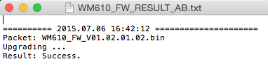

# MapView와 Waypoint 앱 만들기

<!-- toc -->

이 튜토리얼에서는 DJI PC Simulator를 설정하는 법을 배운고 Inspire 1, Phantom 3 Professional 그리고 Phantom 3의 펌웨어를 베타 버전으로 업데이트 한다. 그리고 DJI PC 시뮬레이터로 그라운드 스테이션 API를 테스트하는 방법을 배운다. DJI 그라운드스테이션의 Waypoint 기능을 사용하는 기본 절차를 경험한다. 자 이제 시작해보자.

데모 프로젝트를 다운받자 : <https://github.com/DJI-Mobile-SDK/Android-GSDemo-Part2-GoogleMap.git>

## DJI PC Simulator 사용하기

### 1. 소개

The DJI PC Simulator는 SDK 개발자를 위한 비행 simulator이다. simulator는 가상 3D 환경을 생성하고 UDP 프로토콜을 이용해서 데이터 분석 목적으로 비행 데이터를 PC로 전송한다.

**지원 운영체제**: Windows 7, Windows 8 그리고 Windows 8.1

**지원 DJI 플랫폼**: Matrice 100, Inspire 1, Phantom 3 Professional 그리고 Advanced

### 2. DJI PC 시뮬레이터 설치 및 설정

DJI PC Simulator 설치파일 및 WIN 드라이버 다운받기 : <http://dev.dji.com/en/products/sdk/onboard-sdk/downloads>
- DJI PC Simulator Installer & User Manual V1.0
- WIN Driver Installer

simulator를 설치하기 전에 WIN driver를 설치해야만 한다. Mac 사용자에 대해서는, simulator를 가상환경에서 simulator를 실행하는 것을 추천한다.(VMWare나 Parallels Desktop) DJI_WIN_Driver_Install.exe를 더블클릭해서 windows 드라이버를 설치하자. 화면에 **"Please power on MC and connect it to PC via USB!"** 메시지가 나오면 무시하고 "YES"를 클릭하고 화면의 지시에 따라 설치를 마치자.  

마지막으로 **DJISimulator-Installer.exe** 파일을 더블클릭하고 화면 명령을 따라 설치를 마치자.

### 3. DJI PC Simulator 사용하는 방법
**1.** DJI PC Simulator를 실행하면 Simulator Config 화면이 나타난다. 적당한 위경도 값을 home point로 설정한다. "SN"은 비행체의 시리얼 번호를 뜻한다.


---
**주의**: 

- home point가 No Fly Zone 바깥지점이여야 한다.

- "Log Settings" 태그아래 "Show Log Window"를 선택하면 비행 지점이 보인다.:

 

---

**2**. Micro USB 케이블로 비행체를 PC에 연결하고 비행체와 리모트 컨트롤에 전원을 넣는다. Display Simulator를 클릭한다. 아래와 같은 화면을 볼 수 있다:

 

---
**주의**: 

- DJI PC Simulator가 실행 중일 때는 DJI Pilot app을 실행하지 말라.

- DJI PC Simulator를 사용할 때는 프로펠러를 제거한다.

---

**3**. Start Simulator 버튼을 누르면 simulator 사용을 시작한다. 비행체의 코스를 변경하기 위해서 리모트 컨트롤러를 사용할 수 있다. 혹은 Return-to-Home 기능을 이용하면 돌아오게 할 수도 있다. 모바일이나 onboard 장치에서 제어하기 위해서 API Control를 사용할 수 있다. X, Y, Z는 북-남, 동-성, 위-아래 축을 뜻한다.(북, 동, 위 방향이 양의 방향이다)

**4**. 시야각을 변경하기 위해서 왼쪽 클릭을 누르면서 드래그한다. 줌인/아웃을 위해 스크롤한다.

 
 
 

**5**. simulation을 멈추기 위해서 Stop Simulation을 클릭한다. 사용 후에는 simulator를 닫고 비행체와 리모트 컨트롤의 전원을 내린다.

**중요**: GroundStation Waypoint Mission에서 중간에 멈추기를 원한다면, 우선 **Stop Simulation** 을 눌러야 한다. 그렇지 않으면 다시 시작할 때, simulator는 이전 groundstation mission을 실행할지도 모른다. 혼란을 줄 수 있다.

DJI PC Simulator에 관한 추가 정보는 simulator와 함께 다운받은 **DJI PC Simulator user manual.pdf** 파일을 확인하자.---
**주의**: 

## 비행체 펌웨어 업그레이드

DJI Mobile SDK API 사용하기 전에, 비행체의 베타 버전으로 펌웨어를 다운받고 업그레이드한다.

다음 펌웨어 사이트에서 골라서 다운받도록 하자 : <http://dev.dji.com/en/products/sdk/onboard-sdk/downloads> :

- Phantom 3 Professional Firmware (P3X_FW_V01.01.1003.bin)
- Inspire 1 Firmware (WM610_FW_V01.02.01.02.bin)

리모트 컨트롤러의 펌웨어를 업데이트할 필요는 없다. SD카드에 **bin** 파일을 넣고 카메라에 있는 Micro USB 포트 삽입한다. 이어서 비행체를 재시작하면 업데이트 절차가 자동으로 시작된다. 마치는데 10 ~ 30분 정도 소요된다.

Verify the result via the beeping pattern from the gimbals or the blinking pattern of the camera status indicator. Refer to the table below for the beeping pattern:

- Upgrading: B B B B...
- Upgrade Success: B BB...
- Upgrade Failed: B...
- Critical Error: D D D...

Also, you can check the firmware upgrade status by checking the **txt** file generated during the upgrade process. For Phantom 3 Professional, the txt file is named as **"P3X_FW_RESULT_AB.txt"**, For Inspire 1, it's named as **"WM610_FW_RESULT_AB.txt"**, here are the example contents:

  
  
  
  
  
## Map View 설정하기

### 1. map view 생성

waypoint를 표시하기 위해 map view를 사용하고 비행 타스크를 실행할 때 비행체의 경로를 보여준다. 예제로 Google map을 사용한다.

Google의 공식 가이드 문서<https://developers.google.com/maps/documentation/android/config>를 참조해서 Google map을 Android app에 추가하자. 

(1) Android SDK 설치

**Android SDK Manager**를 통해 Android SDK를 설치한다. **Android SDK Manager**는 메뉴에서 "Window"를 클릭해서 진입할 수 있다. 다음으로 "Android SDK Manager"를 클릭한다.

(2) Google Play services SDK를 설치하기 위해 다음을 참조한다 : <https://developers.google.com/android/guides/setup>

**The Google Maps Android API**는 Google Play services SDK에 포함되어 있다. **Android SDK Manager**로 Google Play services SDK를 설치한다.


Google Play services SDK를 설치 후, ADT 경로인 "xxx/\<android-sdk>/extras/google/google_play_services/libproject/google-play-services_lib" 아래에 library 프로젝트를 위치시킨다. library 프로젝트를 여러분의 Android app 프로젝트 위치에 복사한다.

library 프로젝트를 Eclipse workspace로 import시킨다. **File>Import**를 클릭하고 **Android>Existing Android Code into Workspace**를 선택한다. import시키기 위해서 library 프로젝트의 복사본에 접근할 수 있다.

Google Play services library는 **Package Explorer** 오른쪽 클릭으로 프로젝트를 참조한다. 다음으로 **Properties>Android**을 클릭한다. **google-play-services_lib**를 추가하기 위해서 **Add...**를 클릭한다.

 

Google Play services가 프로젝트를 프로젝트의 의존성을 위해 추가한다. **manifest** 파일을 열고 아래와 같이 ** \<application>** element의 자식으로 다음 태그를 추가한다 :

```xml
	<meta-data android:name="com.google.android.gms.version"
		android:value="@integer/google_play_services_version" />
```

이제 프로젝트를 개발하는데 Google Play services를 사용할 수 있게 되었다.

(3) API key를 얻는 것은 다음을 참조하자 : <https://developers.google.com/maps/documentation/android/signup>

1.App 인증 얻기

디버그 인증의 **SHA-1 fingerprint**를 얻거나 **keytool** 명령을 이용해서 인증을 릴리즈할 수 있다. 인증을 디버깅하기 위해서 **SHA-1 fingerprint**를 사용한다. Eclipse를 이용할 때, **Window>Preferences>Android>Build**를 선택해서 **SHA-1 fingerprint**를 얻을 수 있다.


2.Google Developers Console에서 프로젝트를 등록하고 Google Maps Android API v2를 프로젝트의 service로 추가한다.

Google Developer console <https://console.developers.google.com>에 로그인한다. 다음으로 기존 프로젝트나 프로젝트를 선택한다. 사이드바에서 **APIs & auth**를 확장한다. **APIs**를 선택한다. API 섹션에 있는 **Enabled APIs** link를 선택해서 유효한 모든 API를 탐색가능하다. 유효한 API 리스트에서 Android API를 확인한다. 만약 선택가능한 상태가 아니라면 API 리스트에서 API를 선택하고 Android API를 사용가능하게 하기 위해서 Enable API 버튼을 선택한다. 여러분에게 필요한 API는 **Google Maps Android API**이다.

3.Android API key 생성

프로젝트를 클릭한다. 왼쪽 사이드바에서 **Credentials**를 선택한다. 프로젝트가 **Key for Android applications**를 이미 가지고 있지 않다면, **Create New Key**를 클릭하고 **Android key**를 클릭해서 API key를 생성한다. 결과창에서 app의 SHA-1 fingerprint를 입력하고 세미콜론(;) 다음으로 app의 package 이름을 입력한다. Google Developers Console은 **Key for Android applications**라는 제목의 섹션과 여러분의 API key를 출력한다.


4.API key를 app에 추가히기

AndroidManifest.xml에서 다음 element를 \<application> element의 자식으로 추가한다. 

```xml
	<meta-data
		android:name="com.google.android.geo.API_KEY"
		android:value="API_KEY" />
```
 
여러분의 API key를 값 속성에 있는 API_KEY로 대체한다.

(4) 요청한 설정을 app의 manifest로 추가한다.

1.Android permission 지정 : 여러분의 app에서 필요로 하는 permission을 지정하기 위해서 **AndroidManifest.xml** 파일 내부에 \<manifest> element의 자식으로 **\<uses-permission>** elements를 추가한다. 

```xml
	<uses-permission android:name="android.permission.INTERNET"/>
	<uses-permission android:name="android.permission.ACCESS_NETWORK_STATE"/>
	<uses-permission android:name="android.permission.WRITE_EXTERNAL_STORAGE"/>
	<uses-permission android:name="android.permission.ACCESS_COARSE_LOCATION"/>
	<uses-permission android:name="android.permission.ACCESS_FINE_LOCATION"/>
```

permission의 상세한 내용을 <https://developers.google.com/maps/documentation/android/config>를 참조한다.

2. OpenGL ES version 2에 대한 요구사항

```xml
	<uses-feature android:glEsVersion="0x00020000" android:required="true" />
```

위에 설정을 완료하면, 이제 Google map을 로딩하기 위해서 다음과 같은 코드를 사용한다.

먼저 map을 로드할 app의 layout에 xml code를 추가한다. (데모에서는 **activity_gsdemo.xml** 파일)

```xml
	...
	<fragment
		android:id="@+id/map"
		android:layout_width="match_parent"
		android:layout_height="match_parent"
		class="com.google.android.gms.maps.SupportMapFragment" />
	...
```
 
Second, add the following codes in your Activity.

```java
	import android.os.Bundle;
	import android.support.v4.app.FragmentActivity;
	import com.google.android.gms.maps.CameraUpdateFactory;
	import com.google.android.gms.maps.GoogleMap;
	import com.google.android.gms.maps.OnMapReadyCallback;
	import com.google.android.gms.maps.SupportMapFragment;
	import com.google.android.gms.maps.model.LatLng;
	import com.google.android.gms.maps.model.MarkerOptions;
	
	...
	
	public class GSDemoActivity extends FragmentActivity implements OnMapClickListener, OnMapReadyCallback{
		private GoogleMap aMap;
		
		...
		
		@Override
		protected void onCreate(Bundle savedInstanceState){
			super.onCreate(savedInstanceState);
			setContentView(R.layout.activity_gsdemo);
			SupportMapFragment mapFragment=(SupportMapFragment) getSupportFragmentManager().findFragmentById(R.id.map);
			mapFragment.getMapAsync(this);
		
		...
		
		}
		
		...
		
		@Override
		public void onMapReady(GoogleMap googleMap){
			if(aMap == null){
				aMap = googleMap;
				...
			}
			
			LatLng Shenzhen = new LatLng(22.5500, 114.1000);
			googleMap.addMarker(new MarkerOptions().position(Shenzhen).title("Marker in Shenzhen"));
			googleMap.moveCamera(CameraUpdateFactory.newLatLng(Shenzhen));
		}
		
		...
		
	}
```

**주의:** class는 하나의 부모로부터 상속을 받을 수 있으므로, GSDemoActivity는 이미 FragmentActivity로부터 상속을 받으므로 DemoBaseActivity를 상속 받을 수 없다. GSDemoActivity의 callback인 **onResume**에서 **ServiceManager.getInstance().pauseService(false);**를 추가하고 **onPause**에서는 **ServiceManager.getInstance().pauseService(true);**를 추가한다.

```java
	 @Override
    protected void onResume(){
        super.onResume();
        DJIDrone.getDjiMC().startUpdateTimer(1000); // Start the update timer for MC to update info
        ServiceManager.getInstance().pauseService(false);
    }
    
    @Override
    protected void onPause(){
        super.onPause();
        DJIDrone.getDjiMC().stopUpdateTimer(); // Stop the update timer for MC to update info
        ServiceManager.getInstance().pauseService(true);
    }
```

Android장치에서 개발자 옵션을 켜고 다음 지시에 따르면 app에서 Google map을 로딩할 수 있다. Google map을 로딩하려면 미리 Android 장치는 Google Play service를 설치해야 한다.


 
### 2. 비행체 위치

Google map이 성공적으로 로딩되면, **DJIMainControllerSystemState**내에 **droneLocationLatitude**, **droneLocationLongitude**에서 제공하는 좌표를 기반으로 비행체의 위치를 마커로 지도상에서 보여줄 수 있다. 비행체의 위치를 업데이트 하기 위해서 **private void updateDroneLocation()** 함수를 구현할 수 있다.

비행체의 위치를 얻어오기 위해서 **public interface DJIMcuUpdateStateCallBack** 인터페이스를 구현한다. **public void setMcuUpdateStateCallBack(DJIMcuUpdateStateCallBack mCallBack)**를 이용해서 DJI SDK의 MainController 모듈에서 이 인터페이스를 설정한다. 지도상에 비행체의 위치를 보여주기 위해서 마커를 업데이트 한다. 코드 예제는 아래와 같다 :

```java
	// Update the drone location based on states from MCU.
    private void updateDroneLocation(){
        // Set the McuUpdateSateCallBack
        mMcuUpdateStateCallBack = new DJIMcuUpdateStateCallBack(){

            @Override
            public void onResult(DJIMainControllerSystemState state) {
                droneLocationLat = state.droneLocationLatitude;
                droneLocationLng = state.droneLocationLongitude;
                Log.e(TAG, "drone lat "+state.droneLocationLatitude);
                Log.e(TAG, "drone lat "+state.homeLocationLatitude);
                Log.e(TAG, "drone lat "+state.droneLocationLongitude);
                Log.e(TAG, "drone lat "+state.homeLocationLongitude);
            }     
        };
        Log.e(TAG,"setMcuUpdateState");
        DJIDrone.getDjiMC().setMcuUpdateStateCallBack(mMcuUpdateStateCallBack);
        
        // The following codes show the aircraft location on the map using a marker
        LatLng pos = new LatLng(droneLocationLat, droneLocationLng);
        //Create MarkerOptions object
        final MarkerOptions markerOptions = new MarkerOptions();
        markerOptions.position(pos);
        markerOptions.icon(BitmapDescriptorFactory.fromResource(R.drawable.aircraft));
        
        runOnUiThread(new Runnable() {
            @Override
            public void run() {
                if (droneMarker != null) {
                    droneMarker.remove();
                }
             
                droneMarker = aMap.addMarker(markerOptions);
            }
          });
    } 
```

SDK API를 초기화하고 **DJIDrone.connectToDrone()** 호출한 이후에 이 함수를 호출한다. 활성화를 마친 이후에 비행체 모듈에 대한 SDK API를 호출이 가능하다. **checkPermission**가 0을 반환한 이후에 위에 함수를 호출한다 :

```java
	new Thread(){
            public void run() {
                try {
                    DJIDrone.checkPermission(getApplicationContext(), new DJIGerneralListener() {
                        
                        @Override
                        public void onGetPermissionResult(int result) {
                            // TODO Auto-generated method stub
                            if (result == 0) {
                                handler.sendMessage(handler.obtainMessage(SHOWDIALOG, DJIError.getCheckPermissionErrorDescription(result)));
                                updateDroneLocation(); // Obtain the drone's lat and lng from MCU.
                            } else {
                                handler.sendMessage(handler.obtainMessage(SHOWDIALOG, getString(R.string.demo_activation_error)+DJIError.getCheckPermissionErrorDescription(result)+"\n"+getString(R.string.demo_activation_error_code)+result));
                        
                            }
                        }
                    });
                } catch (Exception e) {
                    e.printStackTrace();
                }
            }
        }.start();
```

Main Controller 시스템 상태를 업데이트 하기 위해서 **onResume**에서 **public boolean startUpdateTimer(int interval)**를 호출한다. **onPause** callback에서 **public boolean stopUpdateTimer()**를 호출함으로써 업데이트에 필요한 타이머를 일시 정지 시킬 수 있다. 

```java
    @Override
    protected void onResume(){
        super.onResume();
        DJIDrone.getDjiMC().startUpdateTimer(1000); // Start the update timer for MC to update info
        ServiceManager.getInstance().pauseService(false);
    }
    
    @Override
    protected void onPause(){
        super.onPause();
        DJIDrone.getDjiMC().stopUpdateTimer(); // Stop the update timer for MC to update info
        ServiceManager.getInstance().pauseService(true);
    }
```

app을 열 때, **updateDroneLocation()** 함수는 key가 활성화 된 후에 호출될 예정이다.

반면에 UI에 "Locate" 버튼을 구현한다. 사용자가 버튼을 클릭할 때, **updateDroneLocation()** 함수가 다시 호출된다.

"Locate" 버튼을 구현하기 위해서, 먼저 **activity_gsdemo.xml**에 Button view를 추가한다.

```xml

	...
	
	<LinearLayout
		android:layout_width="match_parent"
		android:layout_height="wrap_content"
		android:orientation="horizontal">
		
		<Button
			android:id="@+id/locate"
			android:layout_width="match_parent"
			android:layout_height="wrap_content"
			android:text="Locate"
			android:layout_weight="1"/>
	
	...
	
	</LinearLayout>
	
	...
	
``` 
두번째로 **OnClickListener** 인터페이스를 activity(데모에서는 **GSDemoActivity**)에 추가한다. 이 activity는 **public class GSDemoActivity extends ... implements OnClickListener ...** 인터페이스를 구현하고 **public void onClick(View v)**에 대한 메소드를 위한 코드를 구현한다.

```
	@Override
	public void onClick(View v) {
		switch(v.getId()){
			case R.id.locate:{
				updateDroneLocation();
				cameraUpdate(); //
				break;
			}
			...
			default:
				break; 
		}	
		
	}	
	
```

3번째로 activity에 "Locate" 버튼을 등록한다.

```java
	private Button locate;
	
	...
	
	@Override
	protected void onCreate(Bundle savedInstanceState){
		...
		locate = (Button) findViewById(R.id.locate);
		...
		locate.setOnClickListener(this);
		... 
	}
```

app을 빌드 및 실행해서 위치 함수가 제대로 동작하는지 확인한다. USB 케이블을 통해서 비행체를 컴퓨터에 연결하고 DJI PC simulator를 실행한다:


"locate" 버튼을 클릭하고 다음 GUI 프롬프트로 지도상에서 비행체의 위치를 보여준다.


### 3. waypoint 추가 및 제거

사용자가 GroundStation에서 직관적으로 waypoint를 추가하도록 하는 것은 중요하다. waypoint를 지도에 추가하는 방법 살펴보자. "Add"버튼을 만들자. "Add" 버튼을 누를 때마다, "isAdd" 변는 "true"를 반환한다. 버튼의 텍스트는 "Exit"로 보인다. 모드를 추가하기 위해서 waypoint를 넣자: 지도상에 원하는 위치를 클릭해서 waypoint를 추가하자. 마커는 새로운 waypoint가 추가되었다는 것을 보여주기 위해서 지도상에 나타난다. 원하는 waypoint를 모두 넣고 난 후에, "Exit"버튼을 누르면 waypoint 추가 모드를 빠져나간다. 지도상에 클릭에 대한 listener는 다음과 같다 :

```java
	 @Override
    public void onMapClick(LatLng point) {
    	if (isAdd == true){
    		markWaypoint(point);
    		DJIGroundStationWaypoint mDJIGroundStationWaypoint = new DJIGroundStationWaypoint(point.latitude, point.longitude);
    		mGroundStationTask.addWaypoint(mDJIGroundStationWaypoint);
    		//Add waypoints to Waypoint arraylist;
    	}else{
    		// Do not add waypoint;
    	}
    		
    }
```

지도상에 클릭할 때, **public void onMapClick(LatLng point)**내에 코드가 실행된다. **DJIGroundStationWaypoint**의 인스턴스가 생성되고 **mGroundStationTask**에 추가된다. 


"clear" 버튼을 추가해서 추가된 모든 waypoint를 제거한다. 지도상에 모든 마커는 사라지고 **mGroundStationTask**에 있는 모든 waypoint도 삭제된다.

```java
	 @Override
    public void onClick(View v) {
        // TODO Auto-generated method stub
        switch (v.getId()) {
			  
			  ...
            
            case R.id.clear:{
                runOnUiThread(new Runnable(){
                    @Override
                    public void run() {
                        aMap.clear();
                    }
                    
                });            
                mGroundStationTask.RemoveAllWaypoint(); // Remove all the waypoints added to the task
                break;
            }
			  
			  ...
			  
        }
    }

```


## 네비게이션 태스크 설정

프로젝트의 코드 구조는 단순하지만 잘 짜여진 것은 아니다. 이 튜토리얼에서 좀더 구현하기 위해서 리팩터링이 필요하고 UI 컴포넌트를 더 추가해야한다.

여기서는 간단한 예제로, waypoint를 설정하는 방법만 보여줄 예정이다. waypoint를 연속으로 설정하기 위해서는 개발자가 추가로 코드를 작성해야 한다.

먼저 새로 "Config" 버튼을 추가한다. 사용자가 버튼을 클릭할 때, 새로운 설정창이 나타난다. 


설정 셋팅 view를 로딩하는데 dialog를 사용한다. 설정은 waypoint의 고도, 태스트 반복, 태스크 동안 비행체의 수평 속도, 태스크가 끝난 후에 동작, 태스크 동안 비행체의 방향(고도와 속도는 **DJIGroundStationWaypoint**의 필드을 포함하고 있다. 여기서 모든 waypoint의 고도나 속도를 예제와 동일하게 설정한다. 사용자는 다른 waypoint의 구도나 속도에 대해서 다른 값으로 설정할 수 있다.)을 포함한다. 여기서는 dialog에 대한 코드는 보여주지 않는다. 값을 입력하거나 아이템의 옵션을 선택한 이후에 사용자가 "Finish"를 클릭할 때, 다음에 호출되는 함수는 **DJIGroundStationTask** 와 **DJIGroundStationWaypoint**의 필드 값을 설정하는 것이다:

```java
	    private void configGroundStationTask(){
        mGroundStationTask.isLoop = repeatGSTask;
        mGroundStationTask.finishAction=actionAfterFinishTask;
        mGroundStationTask.movingMode = heading;
        for (int i=0; i<mGroundStationTask.wayPointCount; i++){
            mGroundStationTask.getWaypointAtIndex(i).speed = speedGSTask;
            mGroundStationTask.getWaypointAtIndex(i).altitude = altitude;
        }
    }
```

## 비행체에 태스크를 업로드 하기

**DJIGroundStationTask**를 설정했다. 하지만 태스크는 현재 모바일 장치에 저장된 상태다. 태스크를 시작하기 전에 비행체에 태스크를 업로드해야 한다. "Upload" 버튼을 클릭해서 비행체에 태스크를 업로드한다. "Upload" 버튼이 클릭되면 다음과 같은 함수가 실행된다 :

```java
	   private void uploadGroundStationTask(){
        DJIDrone.getDjiGroundStation().openGroundStation(new DJIGroundStationExecuteCallBack(){

            @Override
            public void onResult(GroundStationResult result) {
                // TODO Auto-generated method stub
                String ResultsString = "return code =" + result.toString();
                handler.sendMessage(handler.obtainMessage(SHOWTOAST, ResultsString));
                
                if (result == GroundStationResult.GS_Result_Success) {
                    DJIDrone.getDjiGroundStation().uploadGroundStationTask(mGroundStationTask, new DJIGroundStationExecuteCallBack(){
    
                        @Override
                        public void onResult(GroundStationResult result) {
                            // TODO Auto-generated method stub
                            String ResultsString = "return code =" + result.toString();
                            handler.sendMessage(handler.obtainMessage(SHOWTOAST, ResultsString));
                        }
                        
                    });
                }
            }
            
        });
    }
```

Ground Station 기능을 초기화하기 위해서 먼저 **public void openGroundStation(final DJIGroundStationExecuteCallBack mCallBack)**를 호출하고 Ground Station이 성공적으로 초기화되면(이 callback은 **GroundStationResult.GS_Result_Success**를 반환한다) **public void uploadGroundStationTask(final DJIGroundStationTask task, final DJIGroundStationExecuteCallBack mCallBack)** 함수가 실행된다.


**중요:** Ground Station을 사용할 때, **GroundStationResult.GS_Result_Rc_Control_Mode_Error**가 발생할 가능성이 있다. 주요 원인은 리모트 컨트롤러에 빟애 모드 스위치가 "F"로 설정되어 있지 않는 경우이다. "F"로 스위치를 변경해야 하고 Ground Station을 사용하기 전에 다시 waypoint를 업로드한다. 

비행체가 켜질 때, 만약 비행 모드 스위치가 "F" 위치면 다른 사용자는 F와 다른 스위치를 왔다갔다해야만 하고 waypoint를 업로드한다.


모든 waypoint가 성공적으로 업로드되면 DJI PC Simulator 로그가 "received mission length xx from app"를 출력한다.


## DJIGroundStationTask 시작 및 정지

비행체에 태스크를 업로딩한 이후에 **DJIGroundStationTask**를 실행한다. "Start" 버튼을 클릭하면 **public void startGroundStationTask(final DJIGroundStationExecuteCallBack mCallBack)**내부에 있는 다음과 같은 코드가 실행된다. 

```java
	    private void startGroundStationTask(){
        DJIDrone.getDjiGroundStation().startGroundStationTask(new DJIGroundStationExecuteCallBack(){

            @Override
            public void onResult(GroundStationResult result) {
                // TODO Auto-generated method stub
                String ResultsString = "return code =" + result.toString();
                handler.sendMessage(handler.obtainMessage(SHOWTOAST, ResultsString));
            }
        });
    }
```


DJIGroundStationTask는 **public void pauseGroundStationTask(final DJIGroundStationExecuteCallBack mCallBack)** 함수를 호출해서 태스크를 일시 정지 상태로 만든다. 태스크 일시 정지 상태 이후에 **public void closeGroundStation(final DJIGroundStationExecuteCallBack mCallBack)**를 이용해서 Ground Station 기능을 종료시킨다.

```java
	    private void stopGroundStationTask(){
        DJIDrone.getDjiGroundStation().pauseGroundStationTask(new DJIGroundStationExecuteCallBack(){

            @Override
            public void onResult(GroundStationResult result) {
                // TODO Auto-generated method stub
                String ResultsString = "return code =" + result.toString();
                handler.sendMessage(handler.obtainMessage(SHOWTOAST, ResultsString));
                
                DJIDrone.getDjiGroundStation().closeGroundStation(new DJIGroundStationExecuteCallBack(){

                    @Override
                    public void onResult(GroundStationResult result) {
                        // TODO Auto-generated method stub
                        String ResultsString = "return code =" + result.toString();
                        handler.sendMessage(handler.obtainMessage(SHOWTOAST, ResultsString));
                    }

                });
            }
        });
        mGroundStationTask.RemoveAllWaypoint();
    }
``` 

## 요약

이 튜토리얼에서 Ground Station app을 테스트 하기 위해서 DJI PC Simulator 사용 및 설정방법, 개발 버전을 위해 펌웨어 업데이트 방법, DJI Mobile SDK 사용해서 간단한 MapView 생성 방법, map view의 annotation 수정, DJI PC Simulator에서 GPS 데이터 시뮬레이터를 통해 map view에서 비행체 확인 방법 등을 익혔다. 많은 기본 지식을 다뤘다.

추가로 **DJIGroundStationWaypoint** 와 **DJIGroundStationTask**를 설정하는 방법을 배웠다. waypoint 처리 방법과 **DJIGroundStationTask** 와 **DJIInspireGroundStation** 사용해서 태스크 처리 방법을 배웠다.

축하한다! 이제 데모 프로젝트를 마쳤다. 여러분이 배운 것을 만들 수 있고 여러분의 ground station app을 만들 수 있게 되었다. waypoint를 추가하는 방법(waypoint 생성 및 선연결을 자동화)을 개선하고 waypoint의 속성을 이용하여 추가 기능을 구현할 수 있다. 멋진 ground station app을 만들기 위해서 할 일이 많다. 행운을 빌며 재밌게 즐겼기를 기대한다.
