# 사진과 비디오 재생 앱 생성하기

*주의: 이 튜토리얼은 Phantom 3 Professional와 Inspire 1에만 해당된다.*

<!-- toc -->

## 소개
이번 튜토리얼을 통해서 Inspire 1, Phantom 3 Professional 그리고 M100에 부착된 카메라와 익숙진다. Camera Mode를 제어하는 방법, 사진 및 비디오 앨범 앱을 적합한 UI를 만드는 방법 그리고 미디어 파일을 선택하고 다운로드 받는 방법을 익힌다. 이제 시작해 보자.

이번 튜토리얼의 데모 프로젝트를 다운로드 받을 수 있다 : <https://github.com/DJI-Mobile-SDK/Android-PlaybackDemo>

이 튜토리얼을 따라하는 동안 데모 프로젝트의 소스 코드를 참고할 것이다.

## Camera Mode

앨범 app을 개발하기 전에, 각 camera mode에서 SDK가 지원하는 범위를 간략히 알아보도록 하자. Inspire 1, Phantom 3 Professional 그리고 M100에는 4개 camera mode가 있다. (**Capture Mode, Record Mode, Playback Mode**, **Download Mode**). **Capture Mode**에는 사진을 찍고 카메라에 파라미터를 설정과 같이 사용자가 캡쳐 기능을 사용할 수 있다. **Record Mode**에서는 이런 캡쳐 기능이 막혀있고 사용자는 비디오 녹화 시작/정지만 가능하다. **Playback Mode**는 SD카드에 있는 미디어 파일 미리보기 기능을 사용가능하다. **Download Mode**는 미디어 파일을 다운로드 받을 수 있다. 사용하기 전에 올바르게 설정해야 한다.

** 하지만 Phantom 3 Advanced는 3개 camera mode만 제공한다 : Capture Mode, Record Mode, Download Mode. 추후 튜토리얼에서 다룬다.**

Mobile Android SDK에서 개발자는 `setCameraMode`를 호출해서 가능한 camera mode를 설정하고 `getCameraMode`를 통해 camera mode를 얻어올 수 있다.(Phantom 2 시리즈는 2개 모드만 제공한다 : `CameraMode.Camera_Camera_Mode` 와 `Camera.Camera_USB_Mode`이며 최근 다른 드론에서는 지원하지 않는다.)

~~~java
	//Set up the Camera Mode. 
    DJIDrone.getDjiCamera().setCameraMode(CameraMode, DJIExecuteResultCallback)
	
	//Get the Camera Mode
	DJIDrone.getDjiCamera().getCameraMode(DJICameraModeCallBack)
~~~

## 카메라 재생상태 구별하기

위에서 소개한 바와 같이 3개 혹은 4개 camera mode가 있다.(여러분이 사용하는 드론에 따라) 설정한 mode가 올바로 인지하는 방법은 포토 앨범 app을 개발하는 핵심이다. mobile android SDK에서 camera 재생 상태의 현재 상태를 반환하는 callback 함수가 있다. 개발자는 상태가 변경되었을 때 실행할 callback 함수를 설정할 수 있다. 이 callback은 초당 10번 호출된다.

~~~java
	DJIDrone.getDjiCamera().setDJICameraPlayBackStateCallBack(new DJICameraPlayBackStateCallBack() {
		@Override
		public void onResult(DJICameraPlaybackState state) {
			....
			
			Some statements..

			....
		}
	});
~~~

SDK가 재생 상태 정보를 받을 때마다, 정보를 패키지화해서 `DJICameraPlaybackState`객체를 생성해서 SDK에서 app으로 전송한다. 상태 통보(status notifications)에 대해서 좀더 이해하기 위해 아래 테이블에 `DJICameraPlaybackState` 속성을 간략히 설명한다.

<table>
<tbody>
<tr>
<td><b>Attribute</b></td>
<td><b>Description</b></td>
</tr>
<tr>
<td>currentSelectedFileIndex</td>
<td>The index of the currently selected file. Can be used to identify which media file is currently being previewed by the user.</td>
</tr>
<tr>
<td>fileDeleteStatus</td>
<td>Reflects the status of a media file being deleted. There are three possible statuses:
<ul>
<li><b>Media_File_Delete_Failed</b></li>
<li><b>Media_File_Delete_Successed</b></li>
<li><b>Media_File_Deleting</b></li>
</ul>
Developers can use this enum to notify users of deletion progress.</td>
</tr>
<tr>
<td>isAllFilesInPageSelected</td>
<td>Returns whether all the media files in the current page have been selected.</td>
</tr>
<tr>
<td>isFileDownloaded</td>
<td>Notifies users, while the camera is in single preview mode, if the media file they are previewing has already been downloaded. Prevents files from being unintentionally being repeatedly downloaded.</td>
</tr>
<tr>
<td>isSelectedFileValid</td>
<td>Downloading 4K video or DNG images is not allowed. This attribute returns whether a selected file is valid to download.</td>
</tr>
<tr>
<td>mediaFileType</td>
<td>Reflects the file type of the currently previewed media file. There are three types of media files: 
<ul>
<li><b>Media_File_DNG</b></li>
<li><b>Media_File_JPEG</b></li>
<li><b>Media_File_VIDEO</b></li>
</ul>
</td>
</tr>
<tr>
<td>numbersOfMediaFiles</td>
<td>The number of the media files on the SDcard. Useful for displaying the album's basic information.</td>
</tr>
<tr>
<td>numbersOfPhotos</td>
<td>The number of the image files on the SDcard (DNG and JPEG files).</td>
</tr>
<tr>
<td>numbersOfSelected</td>
<td>The number of currently selected files. Can be used to show and confirm the number of files the user wants to delete or download.</td>
</tr>
<tr>
<td>numbersOfThumbnail</td>
<td>The number of the thumbnails that can be downloaded from the SDcard.</td>
</tr>
<tr>
<td>numbersOfVideos</td>
<td>Similar to numberOfPhotos, reflects the number of the video files.</td>
</tr>
<tr>
<td>photoCenterCoordinateX</td>
<td>The x-coordinate of the center of the photo.</td>
</tr>
<tr>
<td>photoCenterCoordinateY</td>
<td>The y-coordinate of the center of the photo.</td>
</tr>
<tr>
<td>photoHeight</td>
<td>The height of the photo.</td>
</tr>
<tr>
<td>photoWidth</td>
<td>The width of the photo.</td>
</tr>
<tr>
<td>playbackMode</td>
<td>An enum for identifying the current playback mode. There are 7 possible values: <b><ul><li>Media_Files_Download</li> <li>Multiple_Media_Files_Delete</li> <li>Multiple_Media_Files_Display</li> <li>Single_Photo_Playback</li> <li>Single_Photo_Zoom</li> <li>Single_Video_Playback_Start</li> <li>Single_Video_Playback_Stop</li></ul></b> UI elements and logical settings should be adjusted according to the current playback mode.</td>
</tr>
<tr>
<td>videoDuration</td>
<td>This attribute is related only to video previews. Shows the length of the video.</td>
</tr>
<tr>
<td>videoPlayPosition</td>
<td>The current position of the video.</td>
</tr>
<tr>
<td>videoPlayProgress</td>
<td>This attribute can be used to update the video progress bar. </td>
</tr>
</tbody>
</table>

 본 것처럼 이 클래스에는 많은 속성이 있다. 이들 중 일부는 미디어 파일에 대한 기본 정보를 포함하며, 다른 정보는 카메라가 무엇을 사용하고 app이 이에 따라서 적절하게 동작하는지 개발자에게 중요한 정보이다. 예를 들면, 개발자는 표시할 UI 앨리먼트를 선택하기 위해서 DJICameraPlaybackState 정보를 이용할 수 있다.

이제 SDK가 제공하는 재생 정보에 알아봤으며 앨범 app을 만들어보자.

## 포토 앨범 app을 위한 UI 컴포넌트

### 1. 다중 프리뷰 재생 모드를 위한 GridView

공식 app인 DJI Pilot에서 카메라가 다중 재생 모드인 경우 app view에서 8개 썸네일이 있다. 아직 DJI Pilot가 [설치하기 위해 여기를 클릭하자](https://play.google.com/store/apps/details?id=dji.pilot&hl=en). 편안한 UX를 달성하기 위해서 개발자가 app에 포함할 수 있는 비슷한 UI 컴포넌트를 제공한다. 첫번째로 구현할  Gridview가 그것이다.(추가 정보는 Android 튜토리얼의 GridView로 [여기를 클릭하자](http://developer.android.com/reference/android/widget/GridView.html))

아래는 다중 미리보기 UI를 위한 대략적인 아웃라인이다. 이 8개 사진 미리보기의 각각은 button이다. 이 button을 GridView로 구현해보자.

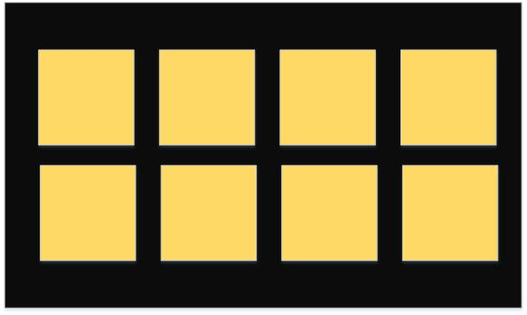

grid view의 2가지 특징이 있는데 여기서부터 시작해 보자 :

- gird view는 스크롤이 가능하다.
- 각 블록에 있는 객체는 사용자가 디자인할 수 있다.

기본 GridView를 override해서 요구사항을 만족시키자(스크롤이 되지 않는 8개 button으로 된 gridview). 다음 코드에서는 어떻게 GridView를 override해야할지 보여준다. 아주 기본적인 것이라 여러분의 향후 app에는 더 많은 기능을 추가할 것이기 때문에 가벼운 마음으로 보도록 하자.

~~~java
	public class PlaybackGridView extends GridView {
		public PlaybackGridView(Context context) {
			super(context);
		}

		public PlaybackGridView(Context context, AttributeSet attrs) {
			supper(context, attrs);
		}

		public PlaybackGridView(Context context, AttributeSet attrs, int defStyle) {
			super(context, attrs, defStyle);
		}

		@Override
		public boolean dispatchTouchEvent(MotionEvent ev) {
			if (ev.getAction() == MotionEvent.ACTION_MOVE) {
				return true;
			}
			return super.dispatchTouchEvent(ev);
		}
	}
~~~

`dispatchTouchEvent(MotionEvent ev)` 메소드는 gridview의 스크롤할 수 없는 속성을 설정한다. GridView를 override 위해서 이것을 사용하려면 개발자는 item tag로 전체 패스를 사용해야만 한다. 데모 프로젝트에 있는 `activity_playback_protocol.xml` 파일을 에제로 보면 :

~~~xml
	<?xml version="1.0" encoding="utf-8"?>
	<RelativeLayout xmlns:android="http://schemas.android.com/apk/res/android"
		android:layout_width="match_parent"
		android:layout_height="match_parent"
		android:orientation="vertical">
			<com.dji.download.demo.PlaybackGridView
				android:id="@+id/GridView"
				android:layout_width="fill_parent"
				android:layout_height="fill_parent"
				android:layout_marginTop="57dp"
				android:layout_marginLeft="6dp"
				android:layout_marginRight="6dp"
				android:marginBottom="57dp"
				android:numberColumns="4"
				android:android:verticalSpacing="8dp"
				android:horizontalSpacing="8dp"
				android:stretchMode="columnWidth"
				android:gravity="center"/>
	</RelativeLayout>
~~~

이제 앨범 app를 위해 기본 gridview를 갖게 되었다. 다음으로 'button_gridview_item.xml'는 gridview의 각 엘리먼트를 정의하고 block layout을 제공한다.

~~~xml
	<?xml version="1.0" encoding="utf-8"?>
	<LinearLayout xmlns:android="http://schemas.android.com/apk/res/android"
	    android:layout_width="match_parent"
	    android:layout_height="match_parent"
	    android:orientation="vertical" 
	    >
    
	    <Button 
	        android:id="@+id/TransparencyButton"
	        android:layout_width="fill_parent"
	        android:layout_height="110dp"
	        android:background="@android:color/yellow"
	        android:focusable="false"
	        android:focusableInTouchMode="false"
	        />
	</LinearLayout>
~~~

축하한다! 이제 다중 재생 미리보기 앨범을 만드는데 있어서 모든 컴포넌트의 요구사항을 만족한다. 앞으로의 코드는 UI가 좋아 보이도록 이것들을 조합하는 것을 볼 것이다.

~~~java
	public class PlaybackProtocolActivity extends Activity implements OnClickListener {
		private PlaybackGridView mGridView;

		@Override
		protected void onCreate(Bundle savedInstanceState) {
			super.onCreate(savedInstanceState);
			setContentView(R.layout.activity_playback_protocol);

			onInitActivity();
		}

		private void onInitActivity() {
			mGridView = (PlaybackGridView)findViewById(R.id.GridView);

			ButtonAdapter adapter = new ButtonAdapter(this);
			mGridView.setAdapter(adapter);
		}

		@Override
		protected void onPause() {
			//Pause the AOA service
			ServiceManager.getInstance().pauseService(true);
		}

		@Override
		protected void onResume() {
			//Resume the AOA service
			ServiceManager.getInstance().pauseService(false);
		}

		@Override
		public void onClick(View v)	{
			....
		
			Some statements
		
			....
		}

		class ButtonAdapter extends BaseAdapter {
	        private LayoutInflater inflater;
	        
	        public ButtonAdapter (Context mContext) {
	            super();
	            inflater = LayoutInflater.from(mContext);
	        }
	        
	        @Override
	        public int getCount()
	        {
	            return 8;
	        }
	
	        @Override
	        public Object getItem(int position)
	        {
	            return position;
	        }
		
	        @Override
	        public long getItemId(int position)
	        {
	            return position;
	        }
		
	        @Override
	        public View getView(int position, View convertView, ViewGroup parent)
	        {
	            Button mBtn;
	            final int p = position;
	            if (null == convertView) {
	                convertView = inflater.inflate(R.layout.button_gridview_item, null);
	                mBtn = (Button)convertView.findViewById(R.id.TransparencyButton);
	                convertView.setTag(mBtn);
	            } else {
	                mBtn = (Button)convertView.getTag();
	            }
	            return convertView;
	        }
	        
	    }
	}
~~~

이제 막 우리 app의 framework를 마쳤다. 이제는 `PlaybackProtocolActivity`를 main activity로 설정하기 위해서 `AndroidManifest.xml`에 설정하자. 우리가 한 작업의 결과를 얻기 위해 프로젝트를 실행해보자.

### 2. Camera mode UI 

이 단원을 시작하기 전에, 먼저 약간의 조정이 필요하다:

1. AOA(Android Open Accessory) 지원하도록 설정하기 위해 [Camera App 생성하기](../../Android/FPVDemo/FPVDemo_en.md)를 따라하자.
2. main activity인 `PlaybackProtocolActivity`를 `DJIAoaActivity`로 변경한다.
3. FPV(first personal view)를 보여주기 위해 DjiGLSurfaceView element를 추가한다.(단계 2와 3은 "Camera App 생성하기" 튜토리얼에서 다루고 있다.)
4. `activity_playback_protocol.xml`에 gridview에 `android:visibility="Gone"`을 추가하자.
5. `button_gridview_item.xml`내에 `android:background="@android:color/yellow"`를 `android:background="@android:color/transparent"`로 대체하여 버튼 색상을 조절한다.

이제 계속 진행해 보자. 섹션 1에서 알아본 바와 같이 4개 camera mode가 있고 이 각각에 따라 기능이 달라진다. 개발자는 현재 camera 상태를 기반으로 UI 컴포넌트를 조정해야만 사용자에게 명확하다. `activity_playback_protocol.xml`에 버튼을 추가해 보자.

~~~xml
	<RelativeLayout xmlns:android="http://schemas.android.com/apk/res/android"
		android:layout_width="match_parent"
		android:layout_height="martch_parent"
		android:orientation="vertical">
			<com.dji.download.demo.PlaybackGridView
				android:id="@+id/GridView"
				.../>
			
			<RelativeLayout 
		        android:layout_width="fill_parent"
		        android:layout_height="40dp"
		        android:layout_alignParentBottom="true">
		        
		        <Button 
		            android:id="@+id/CaptureBtnPlayback"
		            android:layout_width="wrap_content"
		            android:layout_height="wrap_content"
		            android:layout_alignParentLeft="true"
		            android:text="@string/playback_protocol_capture_button_string"
		            android:textSize="14sp"
		            android:visibility="gone"
		            />
		        
		        <Button 
		            android:id="@+id/StartRecordBtnPlayback"
		            android:layout_width="wrap_content"
		            android:layout_height="wrap_content"
		            android:layout_toRightOf="@id/CaptureBtnPlayback"
		            android:text="@string/playback_protocol_strat_record_button_string"
		            android:textSize="14sp"
		            android:visibility="gone"
		            />
		        
		        <Button 
		            android:id="@+id/StopRecordBtnPlayback"
		            android:layout_width="wrap_content"
		            android:layout_height="wrap_content"
		            android:layout_toRightOf="@id/StartRecordBtnPlayback"
		            android:text="@string/playback_protocol_strat_record_button_string"
		            android:textSize="14sp"
		            android:visibility="gone"
		            />
		        
		        <Button
		            android:id="@+id/MultiplePreviewBtnPlayback"
		            android:layout_width="wrap_content"
		            android:layout_height="wrap_content"
		            android:layout_toRightOf="@id/StopRecordBtnPlayback"
		            android:text="@string/playback_protocol_multiple_preview_mode_button_string"
		            android:textSize="14sp"
		            android:visibility="gone"
		            />
		        
		        <Button
		            android:id="@+id/MultiSelectPreviewBtnPlayback"
		            android:layout_width="wrap_content"
		            android:layout_height="wrap_content"
		            android:layout_toRightOf="@id/MultiplePreviewBtnPlayback"
		            android:text="@string/playback_protocol_edition_mode_button_string"
		            android:visibility="gone"
		            android:textSize="14sp" 
		            />
		        
		        <Button
		            android:id="@+id/DownloadBtnPlayback"
		            android:layout_width="wrap_content"
		            android:layout_height="wrap_content"
		            android:layout_toRightOf="@id/MultiSelectPreviewBtnPlayback"
		            android:visibility="gone"
		            android:text="@string/playback_protocol_download_button_string"
		            android:textSize="14sp"
		            />
		        
		        <Button
		            android:id="@+id/DeleteBtnPlayback"
		            android:layout_width="wrap_content"
		            android:layout_height="wrap_content"
		            android:layout_toRightOf="@id/DownloadBtnPlayback"
		            android:visibility="gone"
		            android:text="@string/playback_protocol_delete_button_string"
		            android:textSize="14sp"
		            />
		        
		        <Button 
		            android:id="@+id/PlaybackModeBtnPlayback"
		            android:layout_width="wrap_content"
		            android:layout_height="wrap_content"
		            android:layout_alignParentRight="true"
		            android:text="@string/playback_protocol_playback_mode_button_string"
		            android:textSize="14sp"
		            />
		        
		        <Button 
		            android:id="@+id/RecordModeBtnPlayback"
		            android:layout_width="wrap_content"
		            android:layout_height="wrap_content"
		            android:layout_toLeftOf="@id/PlaybackModeBtnPlayback"
		            android:text="@string/playback_protocol_record_mode_button_string"
		            android:textSize="14sp"
		            />
		        
		        <Button 
		            android:id="@+id/CaptureModeBtnPlayback"
		            android:layout_width="wrap_content"
		            android:layout_height="wrap_content"
		            android:layout_toLeftOf="@id/RecordModeBtnPlayback"
		            android:text="@string/playback_protocol_capture_mode_button_string"
		            android:textSize="14sp"
		            />
		    </RelativeLayout>
	</RelativeLayout>
~~~

**Capture**, **Record** 와 **Playback** 버튼은 항상 나타나야하며 사용자가 이 3개 모드를 전환할 수 있게 한다. 하지만 **Playback** mode는 **Single Preview**, **Multiple Preview** 와 **Multiple Edition** 같은 3개 서브 모드가 있다. **Playback** mode에 들어가면 사용자가 **Single Preview** mode가 된다. **Multiple Preview** mode에서는 이미지를 누르면 **Single Preview** mode에 들어가게 된다. **Multiple Edition** playback mode는 **Multiple Preview**와 달라서 사용자가 파일을 선택, 다운받기, 삭제가 가능하다. 아래 스크린샷을 통해서 각 모드에 들어가는 버튼과 기능에 대해서 대략 살펴볼 수 있다. 상태 다이어그램을 통해서 각 모드 사이의 관계에 대해서 알 수 있다:

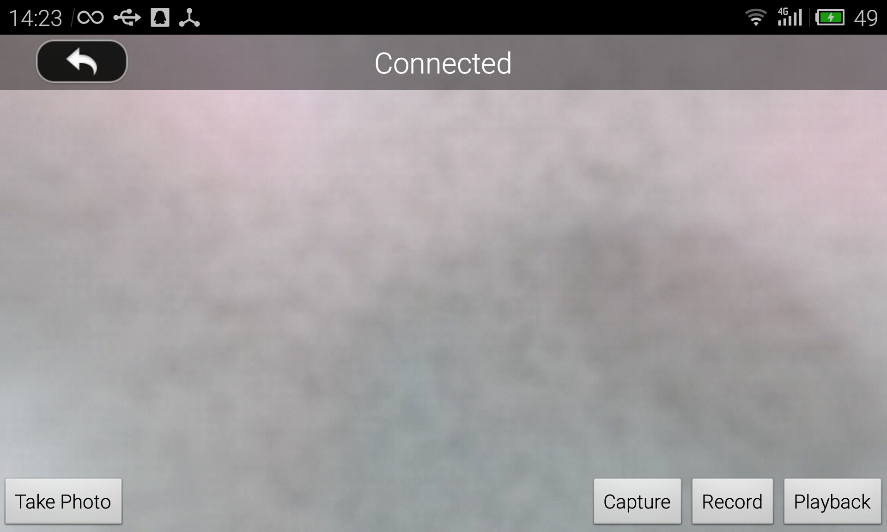

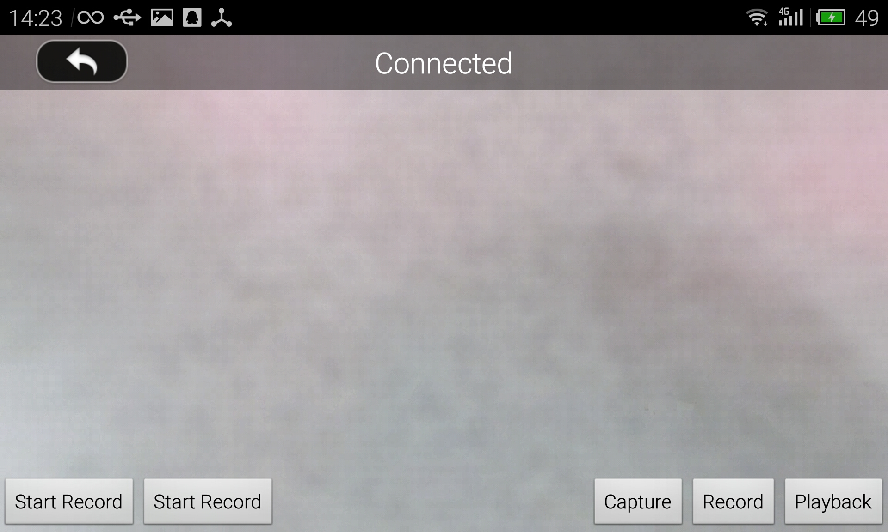

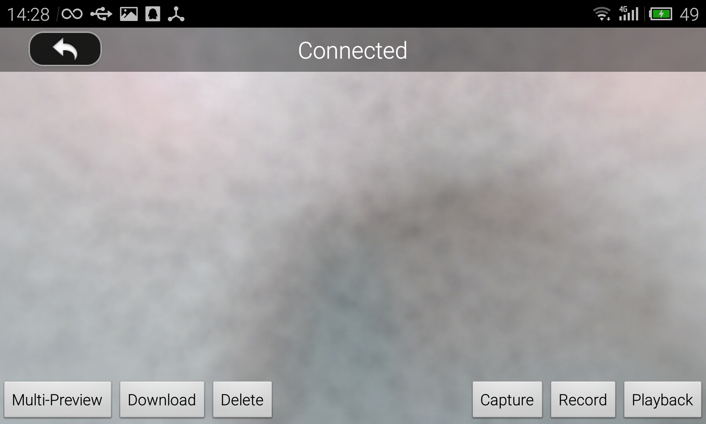

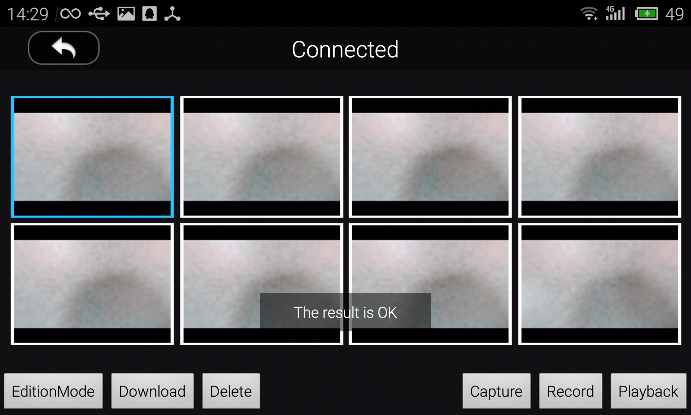

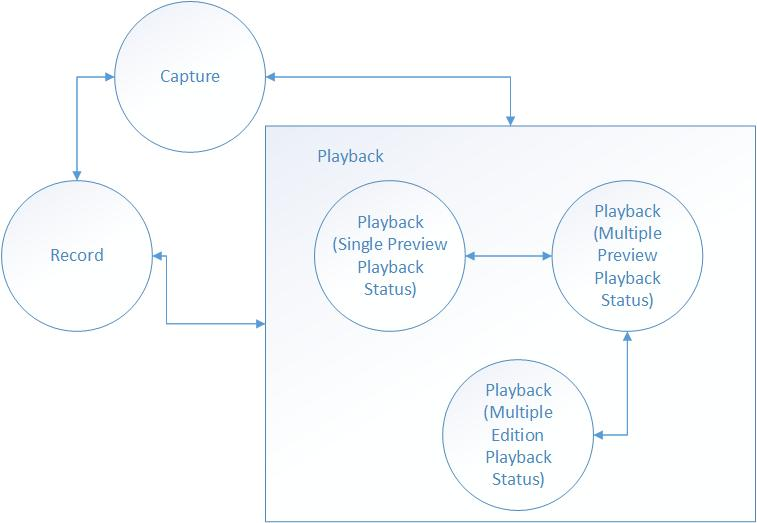

이제 gridview `onItemClick` 로직은 현재 playback 상태를 기반으로 수정하자. 코드는 다음과 같다 :

~~~java
	private void onStatusChange(final int status) {
        PlaybackProtocolActivity.this.runOnUiThread(new Runnable() {
            public void run() {
                switch (status) {
                    case CAPTURE : {
                        mStartTakePhotoBtn.setVisibility(VISIBLE);
                        mStartRecordBtn.setVisibility(GONE);
                        mStopRecordBtn.setVisibility(GONE);
                        mMultiplePreviewModeBtn.setVisibility(GONE);
                        mMultiSelectPreviewModeBtn.setVisibility(GONE);
                        mDownloadBtn.setVisibility(GONE);
                        mDeleteBtn.setVisibility(GONE);
                        mGridView.setVisibility(GONE);
                        mPlayVideoBtn.setVisibility(GONE);
                        mPauseVideoBtn.setVisibility(GONE);
                        break;
                    }
                    
                    case RECORD : {
                        mStartTakePhotoBtn.setVisibility(GONE);
                        mStartRecordBtn.setVisibility(VISIBLE);
                        mStopRecordBtn.setVisibility(VISIBLE);
                        mMultiplePreviewModeBtn.setVisibility(GONE);
                        mMultiSelectPreviewModeBtn.setVisibility(GONE);
                        mDownloadBtn.setVisibility(GONE);
                        mDeleteBtn.setVisibility(GONE);
                        mGridView.setVisibility(GONE);
                        mPlayVideoBtn.setVisibility(GONE);
                        mPauseVideoBtn.setVisibility(GONE);
                        break;
                    }
                    
                    case PLAYBACK : {
                        mStartTakePhotoBtn.setVisibility(GONE);
                        mStartRecordBtn.setVisibility(GONE);
                        mStopRecordBtn.setVisibility(GONE);
                        mMultiplePreviewModeBtn.setVisibility(VISIBLE);
                        mMultiSelectPreviewModeBtn.setVisibility(GONE);
                        mDownloadBtn.setVisibility(VISIBLE);
                        mDeleteBtn.setVisibility(VISIBLE);
                        mGridView.setVisibility(GONE);
                        break;
                    }
                    
                    case MULTIPLEPLAYBACK : {
                        mStartTakePhotoBtn.setVisibility(GONE);
                        mStartRecordBtn.setVisibility(GONE);
                        mStopRecordBtn.setVisibility(GONE);
                        mMultiplePreviewModeBtn.setVisibility(GONE);
                        mMultiSelectPreviewModeBtn.setVisibility(VISIBLE);
                        mDownloadBtn.setVisibility(VISIBLE);
                        mDeleteBtn.setVisibility(VISIBLE);
                        mGridView.setVisibility(VISIBLE);
						break;
                    }
                }
            }
        });
    }
~~~

이 메소드는 UI 상태를 4개 부분(capture, record, playback과 multipleplayback)으로 분류한다. camera mode가 변경될 때, 이 루틴은 개별 UI 컴포넌트의 visibility를 조정할 수 있다.

UI를 조정하는 것 외에, app에서 drone으로 camera mode를 바꾸라는 요청을 보낼 수 있다. 섹션 1에서 `setCameraMode(CameraMode mode)` 메소드가 있었다. 이것을 사용해 보자 :

~~~java
	private void onPressStatusBtn(final int status) {
        DJIDrone.getDjiCamera().setCameraMode(CameraMode.find(status), new DJIExecuteResultCallback() {
            @Override
            public void onResult(DJIError mErr) {
                if (DJIError.RESULT_OK == mErr.errorCode) {
                    onStatusChange(status);
                }
            }
        });
    }
~~~

`status` 인자는 이 메소드에게 어떤 mode로 전환되어야 하는지 알려준다. 다음과 같은 constant를 입력 인자로 사용한다.

~~~java
	private final static int CAPTURE = 2;
    private final static int RECORD = 3;
    private final static int PLAYBACK = 4;
    private final static int MULTIPLEPLAYBACK = 5;
~~~

constant가 `2`부터 시작하는 이유는 `CameraMode` enum 내에서 `Camera_Capture_Mode`의 갑이 2이기 때문이다. 적절한 버튼이 눌러지면 `onPressStatusBtn(final int status)`이 호출되도록 `onClick()`을 수정한다. 각 버튼이 눌러지느냐에 따라서 어느 constant를 전달할지 정한다 :

~~~java
	public void onClick(View v) {
		switch(v.getId()) {
			....
			
			case R.id.CaptureModeBtnPlayback : {
                onPressStatusBtn(CAPTURE);
                break;
            }
			
			case R.id.RecordModeBtnPlayback : {
                onPressStatusBtn(RECORD);
                break;
            }
            
            case R.id.PlaybackModeBtnPlayback : {
                onPressStatusBtn(PLAYBACK);
                break;
            }
            
            case R.id.MultiplePreviewBtnPlayback : {
                DJIDrone.getDjiCamera().enterMultiplePreviewMode(mExecuteCallback);
                onStatusChange(MULTIPLEPLAYBACK);
                break;
            }

			....
		}
	}
~~~

UI logic을 일정하게 유지하기 위해서, `onCreate()` 함수에서 camera의 현재 상태를 알아낸다. 우리 데모에서 `checkPermission(Context, DJIGeneralListener)`가 SDK level을 얻은 후에 수행한다.

~~~java
	 new Thread(){
            public void run() {
                try {
                    DJIDrone.checkPermission(getApplicationContext(), new DJIGerneralListener() {
                        
                        @Override
                        public void onGetPermissionResult(int result) {
                            // TODO Auto-generated method stub
                            Log.e(TAG, "onGetPermissionResult = "+result);
                            Log.e(TAG, "onGetPermissionResultDescription = "+DJIError.getCheckPermissionErrorDescription(result));
                            if (result == 0) {
                                //This method require sdk level higher than level-1. Also permission should be got befor invoking this method.
                                DJIDrone.getDjiCamera().getCameraMode(new DJICameraModeCallBack() {
                                    public void onResult(CameraMode mode) {
                                        onStatusChange(mode.value());
                                        if (mode._equals(CameraMode.Camera_PlayBack_Mode.value())) {
                                            DJIDrone.getDjiCamera().setCameraMode(CameraMode.Camera_PlayBack_Mode, mExecuteCallback);
                                        }
                                    }
                                });
                            } else {
                                Log.e(TAG,"Result error.");                     
                            }
                        }
                    });
                } catch (Exception e) {
                    // TODO Auto-generated catch block
                    e.printStackTrace();
                }
            }
        }.start();
~~~
Inspire 1, Phantom 3 Professional와 M100의 리모크 컨트롤은 capture, recording 그리고 playback 모드에 들입하는 버튼이 있다. 일단 이런 버튼이 눌러지면 camera 상태는 바로 변경된다. 만약 우리가 만든 app에서 리모트 컨트롤에서 버튼이 눌려졌는지 알 수 있고 UI가 변경된다면 멋질 것이다.

리모트 컨트롤의 상태를 감시하기 위해서 `DJIRemoteControllerUpdateAttitudeCallBack`을 설정한다. onCreate() 에 아래 코드를 추가하는데 `mRemoteControllerUpdateAttitudeCallBack` 변수가 선언했는지를 먼저 확인한다.

~~~java
	        mRemoteControllerUpdateAttitudeCallBack = new DJIRemoteControllerUpdateAttitudeCallBack() {

            @Override
            public void onResult(DJIRemoteControllerAttitude attitude)
            {
                if (attitude.playbackStatus || attitude.recordStatus || attitude.shutterStatus) {
                    DJIDrone.getDjiCamera().getCameraMode(new DJICameraModeCallBack() {

                        @Override
                        public void onResult(CameraMode mode)
                        {
                            onStatusChange(mode.value());
                        }
                        
                    });
                }
            }
            
        };
        
        DJIDrone.getDjiRemoteController().setRemoteControllerUpdateAttitudeCallBack(mRemoteControllerUpdateAttitudeCallBack);
~~~

`attitude.playbackStatus`, `attitude.recordStatus` 와 `attitude.shutterStatus`는 리모트 컨트롤에 있는 대응 버튼의 상태를 반영한다. 일단 사용자가 리모느 컨트롤러에서 대응 버튼을 클릭하면 이 속성은 `true`가 된다.

이제 UI 구현을 마쳤다. app을 빌드 및 실행하고 즐기자!

### 3. 앨범 gesture 제어

보다 나은 UX를 위해서 gesture를 app에 추가할 예정이다. **Multiple Preview**에서 사용자가 위/아래로 스위핑을 하면, 이전 혹은 다음 이미지가 화면에 나타난다. **Single Preview** 모드에서 사용자가 왼쪽/오른쪽으로 스위핑하면 이전/이후 미디어 파일을 표시한다. 이 기능을 구현하기 위해서 GestureDetector를 사용한다.

*For a further understanding of the GestureDetector class, follow this link: <http://developer.android.com/reference/android/view/GestureDetector.html>*

~~~java

	private GestureDector mGestureDector;

	mGestureDetector = new GestureDetector(this, new GestureDetector.SimpleOnGestureListener(){ 
           @Override
           public boolean onFling(MotionEvent e1, MotionEvent e2, float velocityX, float velocityY) {
               if (e2.getRawX() - e1.getRawX() > GESTURETHRESHOLD) {
                   DJIDrone.getDjiCamera().singlePreviewNextPage(mExecuteCallback);
                   return true;
               }
               
               if (e1.getRawX() - e2.getRawX() > GESTURETHRESHOLD) {
                   DJIDrone.getDjiCamera().singlePreviewPreviousPage(mExecuteCallback);
                   return true;
               }
               
               if (e1.getRawY() - e2.getRawY() > GESTURETHRESHOLD) {
                   DJIDrone.getDjiCamera().multiplePreviewPreviousPage(mExecuteCallback);
                   return true;
               }
               
               if (e2.getRawY() - e1.getRawY() > GESTURETHRESHOLD) {
                   DJIDrone.getDjiCamera().multiplePreviewNextPage(mExecuteCallback);
                   return true;
               }
               return false;
           }
	});
~~~

app을 실행하고 메소드를 테스트를 시도하는데, 아무런 일도 발생하지 않았다는 것을 알수 있다. 이유는 gridview와 gesture 검출기는 사용자의 동작을 처리하려고 한다. 두 가지 모두 동시에 하나의 동작을 처리하려고 한 것이 실패 원인이다. 이런 상황을 피하기 위해서는 `dispatchTouchEvent` 메소드를 override해야 한다.

~~~java
	@Override
    public boolean dispatchTouchEvent(MotionEvent event) {
        if (mGestureDetector.onTouchEvent(event))
            return false;
        super.dispatchTouchEvent(event);
        return true;
    }
~~~

좋다! 일부 미리 정의한 gesture를 app에 추가했고 이제 app이 사용자가 사용하기 쉽게 되었다.

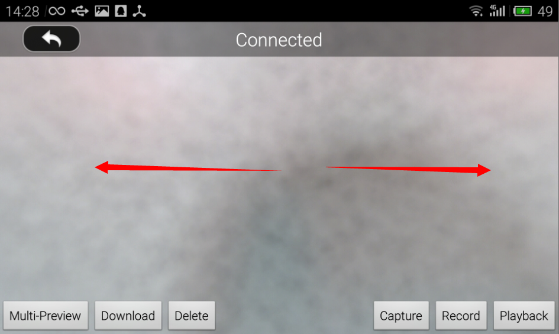

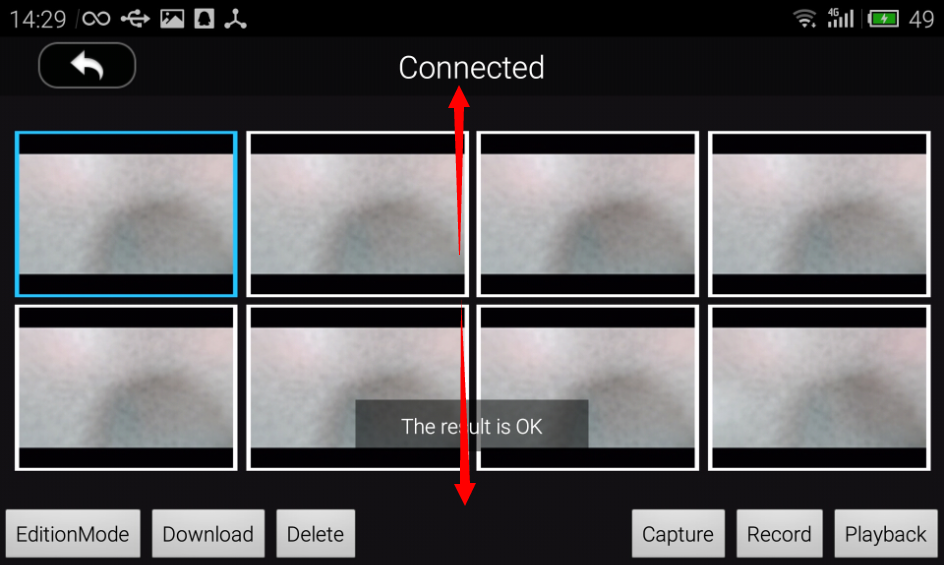

### 4. video 재생

DJI Camera는 사용자가 녹화한 video를 즐기게 하기 위해 video preview 기능을 제공한다.현재 app의 상태는 사용자가 single preview playback mode에 진입할 수 있고 왼쪽/오른쪽 스위핑을 통해 video 파일을 탐색할 수 있다. video 파일을 미리보기 하는 동안에 play나 pause 버튼을 통해 video 재생을 제어할 수 있게 만들고 싶다. 이를 구현하기 위해서 먼저 2개 버튼을 `activity.xml`파일에 추가한다.

~~~xml
	 <RelativeLayout 
        android:layout_width="fill_parent"
        android:layout_height="50dp"
        android:layout_alignParentBottom="true"
        android:layout_marginBottom="40dp"
        >"
        
        <ImageButton
            android:id="@+id/PlayVideoBtnPlayback"
            android:layout_height="wrap_content"
            android:layout_width="wrap_content"
            android:layout_alignParentLeft="true"
            android:layout_marginLeft="40dp"
            android:src="@drawable/play_video"
            android:visibility="gone"
            android:background="@android:color/transparent"
            />
        
        <ImageButton 
            android:id="@+id/PauseVideoBtnPlayback"
            android:layout_height="wrap_content"
            android:layout_width="wrap_content"
            android:layout_alignParentLeft="true"
            android:layout_marginLeft="40dp"
            android:src="@drawable/pause_video"
            android:visibility="gone"
            android:background="@android:color/transparent"
        />
    </RelativeLayout>
~~~

이 버튼을 위한 이미지 리소스는 `drawable-mdpi`에 복사하고, `drawable` xml 파일내부에 2개 element를 추가한다.

~~~xml
	<item android:drawable="drawable/play_video" android:state_pressed="false"></item>
	<item android:drawable="drawable/pause_video" adnroid:state_pressed="false"></item>
~~~

하지만 여기에는 single preview playback mode에서 사용자가 미리보기 가능한 2가지 미디어 파일 종류가 있다. image와 video 파일이다. 만약 play 버튼이나 pause 버튼이 사용자가 사진을 미리보기 하는 동안 나타나면, 사용자에게 불필요하며 귀찮게 만든다. 사용자가 현재 미리보기 하는 파일의 종류를 알아내기 위해서 `onCreate()`에서 listener를 설정한다.

~~~java
	  mCameraPlaybackStateCallBack = new DJICameraPlayBackStateCallBack(){

            @Override
            public void onResult(DJICameraPlaybackState state)
            {
                mCameraPlaybackState = state;
                    PlaybackProtocolActivity.this.runOnUiThread(new Runnable() {

                        @Override
                        public void run()
                        {
                            // TODO Auto-generated method stub
                            isVideoPreview();
                        }
                        
                    });
            }
            
        };
~~~

`isVideoPreview()` is used to adjust the UI features.

~~~java
	private void isVideoPreview() {
        if (mCameraPlaybackState.mediaFileType.value() == CameraMediaFileType.Media_File_VIDEO.value()) {
            if (mCameraPlaybackState.videoPlayProgress == 0) {
                mPlayVideoBtn.setVisibility(VISIBLE);
                mPauseVideoBtn.setVisibility(GONE);
            } else {
                mPlayVideoBtn.setVisibility(GONE);
                mPauseVideoBtn.setVisibility(VISIBLE);
            }
        } else {
            mPlayVideoBtn.setVisibility(GONE);
            mPauseVideoBtn.setVisibility(GONE);
        }
    }
~~~

이제 app은 자동으로 camera가 video single preview playback mode에 있는지 검출하고 만약 모드가 아니라면 play와 pause 버튼을 제거한다.

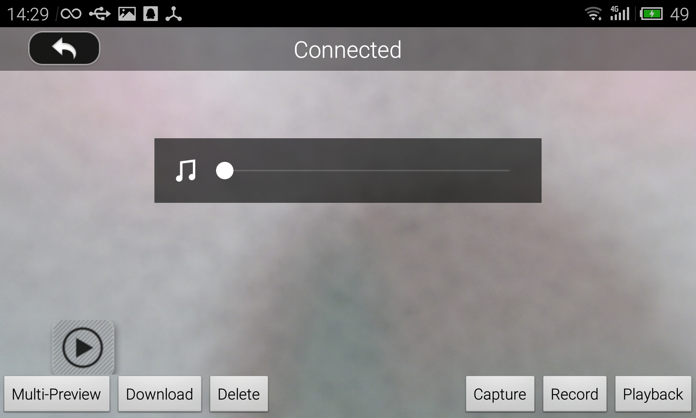

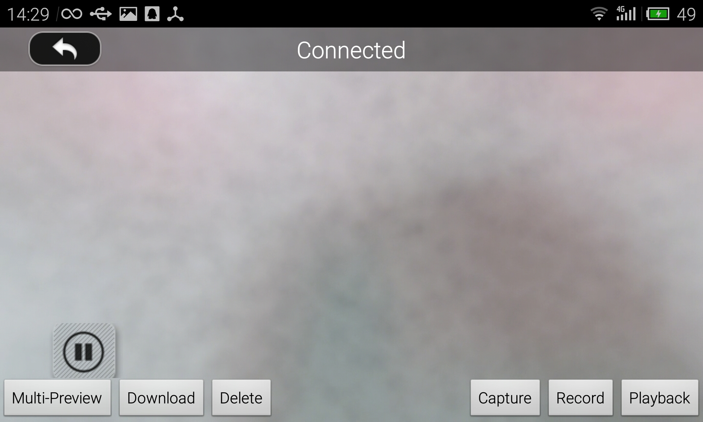

여러분은 이 튜토리얼에서 제공하는 모든 UI 기능을 성공적으로 구현했다!

## 미디어 파일 다운로드 및 삭제

### 1. 다운로드 기능 마무리 하기

이전 섹션에서 4개 camera mode에서 3개를 구현했다. 이 섹션에서는 마지막 camera mode인 **Download Mode**에 대해서 다룬다.

**DNG 이미지와 4k 비디오는 playback mode**를 통해 다운받을 수 없다. 추가로 아래 2개 메소드는 Inspire 1, Phantom 3 Professional이나 M100을 지원하지 않는다.

- `fetchMediaData(DJIMedia, DJIExecuteResultCallback)`
- `fetchMediaThumbnail(DJIMedia, DJIExecuteResultCallback)`

이미 필요한 모든 UI 기능을 구현했으므로, 이제 나은 일은 버튼에 대해서 로직을 추가하는 것이다. 다음과 같은 코드를 `onClick(View v)`에 추가하자 :

~~~java
	@Override
	public void onClick(View v) {
	....
		
		case R.id.MultiSelectPreviewBtnPlayback : {
	        if (!isEdited) {
	            DJIDrone.getDjiCamera().enterMultipleEditMode(mExecuteCallback);
	            isEdited = true;
	        } else {
	            DJIDrone.getDjiCamera().exitMultipleEditMode(mExecuteCallback);
	            isEdited = false;
	        }
	        break;
	    }
	    
	    case R.id.DeleteBtnPlayback : {
	        if (mCameraPlaybackState.playbackMode._equals(CameraPlaybackMode.Multiple_Media_Files_Display.value())) {
	            DJIDrone.getDjiCamera().deleteAllSelectedFiles(mExecuteCallback);
	            isEdited = false;
	        } else {
	            DJIDrone.getDjiCamera().deleteCurrentPreviewFile(mExecuteCallback);
	        }
	        break;
	    }
	    
	    case R.id.DownloadBtnPlayback : {
	        File destDir = new File(Environment.getExternalStorageDirectory().getPath() + "/Dji_Sdk_Test/");
	        if (!destDir.exists()) {
	            destDir.mkdirs();
	        }
	        if (!mCameraPlaybackState.playbackMode._equals(CameraPlaybackMode.Multiple_Media_Files_Display.value()))
	            DJIDrone.getDjiCamera().downloadCurrentPreviewFile(destDir, mFileDownloadCallBack);
	        else
	            DJIDrone.getDjiCamera().downloadAllSelectedFiles(destDir, mFileDownloadCallBack);
	        break;
	    }
		
	....
	}
~~~

`onCreate()`에 추가할 `DJIFileDownloadCallBack` 객체를 생성한다. `DJIFileDownloadCallBack` 는 handler를 포함한다. 데모코드에 handler 선언부를 찾을 수 있다.

~~~java
	mFileDownloadCallBack = new DJIFileDownloadCallBack() {
            
            @Override
            public void OnStart()
            {
                handler.sendMessage(handler.obtainMessage(SHOWDOWNLOADDIALOG, null));
                
                if(mProgressDialog != null){
                    mProgressDialog.setProgress(0);
                }
                
                handler.sendMessage(handler.obtainMessage(SHOWTOAST, "download OnStart"));
                DJILogHelper.getInstance().LOGD("", "download OnStart",true,false);
            }

            @Override
            public void OnError(Exception exception)
            {
                // TODO Auto-generated method stub
                handler.sendMessage(handler.obtainMessage(CLOSEDOWNLOADDIALOG, null));
                handler.sendMessage(handler.obtainMessage(SHOWTOAST, "download OnError :"+exception.toString()));
                DJILogHelper.getInstance().LOGD("", "download OnError :"+exception.toString(),true,false);
            }
            
            @Override
            public void OnEnd()
            {
                // TODO Auto-generated method stub
                
                handler.sendMessage(handler.obtainMessage(CLOSEDOWNLOADDIALOG, null));
                handler.sendMessage(handler.obtainMessage(SHOWTOAST, "download OnEnd" + mCameraPlaybackState.numbersOfSelected));
                
                DJILogHelper.getInstance().LOGD("", "download OnEnd",true,false);
                
                DJIDrone.getDjiCamera().finishDownloadAllSelectedFiles(new DJIExecuteResultCallback() {
                    
                    @Override
                    public void onResult(DJIError mErr)
                    {
                        // TODO Auto-generated method stub
                        DJILogHelper.getInstance().LOGD("", "download finishDownloadAllSelectedFiles:"+mErr.errorDescription,true,false);
                    }
                });
                
                isEdited = false;
            }

            @Override
            public void OnProgressUpdate(int progress)
            {
                // TODO Auto-generated method stub
                if(mProgressDialog != null){
                    mProgressDialog.setProgress(progress);
                }
                
                DJILogHelper.getInstance().LOGD("", "download OnProgressUpdate progress="+progress,true,false);
            }

        };
~~~

multiple preview 내려받기를 위해서 개발자는 먼저 `enterMultipleEditMode(DJIExecuteResultCallback)`를 호출해서 multiple edition playback 모드로 들어가야 한다. 사용자가 자신이 지우거나 다운받길 원하는 미디어 파일을 선택할 수 있다. 미디어 파일을 선택하고 single preview playback 상태로 지원하기 위해서 `ButtonAdapter`의 `getView(int position, View convertView, ViewGroup parent)` 함수에 아래 코드를 추가해야 한다.

~~~java
	mBtn.setOnClickListener(new OnClickListener() {
	
	    @Override
	    public void onClick(View v)
	    {
	        if (!isEdited) {
	            DJIDrone.getDjiCamera().enterSinglePreviewModeWithIndex(p, new DJIExecuteResultCallback() {
	
	                @Override
	                public void onResult(DJIError mErr)
	                {
	                    // TODO Auto-generated method stub
	                    if (mErr.errorCode == DJIError.RESULT_OK) {
	                        onStatusChange(PLAYBACK);
	                    }
	                }
	            });
	            isMultiple = false;
	            
	        } else {
	            DJIDrone.getDjiCamera().selectFileAtIndex(p, mExecuteCallback);
	        }
	    }
	    
	});
~~~

이제 미디어 파일을 선택해보고 다운로드 해보자!

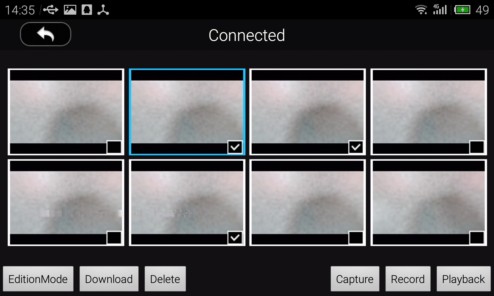

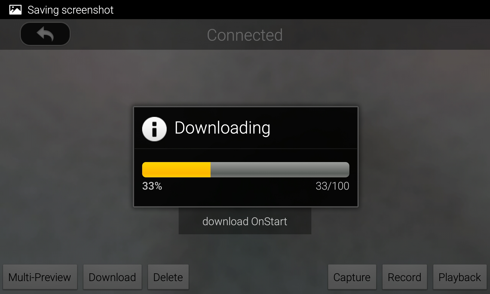

### 2. 자동으로 미디어 파일 다운받기

어떤 개발자는 drone에서 자동으로 미디어 파일을 내려받기 가능하게 구현하기 원할 것이다. 이 서브섹션은 이것을 하는 방법을 다룬다. 우선 개발자는 ** 내려받기와 함께 호출되는 모든 메소드는 비동기방식이며, 이 말은 일부 루틴은 drone에서 ack를 받을 때까지 대기해야한다는 뜻이다.**

여기 자동 내려받기를 구현하는 코드가 있다. 개발자는 `ENTERPLAYBACK` 기능을 구현하기 위해서 `handler`를 사용해야만 한다. process가 자동으로 실행될 것이다 :

~~~java
	private Handler handler = new Handler(new Handler.Callback() {
        
        @Override
        public boolean handleMessage(Message msg)
        {
            switch (msg.what) {
				case STARTAUTODOWNLOAD : {
					DJIDrone.getDjiCamera().setCameraMode(CameraMode.Camera_PlayBack_Mode, new DJIExecuteResultCallback() {
            
			            @Override
			            public void onResult(DJIError mErr)
			            {
			                // TODO Auto-generated method stub
			                if(mErr.errorCode == DJIError.RESULT_OK) {
			                    handler.sendEmptyMessageDelayed(ENTERMULTIPLEPLAYBACK, 2000);
			                }
			            }
			        });
					break;
				}                
                case ENTERMULTIPLEPLAYBACK : {
                    DJIDrone.getDjiCamera().enterMultiplePreviewMode(new DJIExecuteResultCallback() {
                        
                        @Override
                        public void onResult(DJIError mErr)
                        {
                            // TODO Auto-generated method stub
                            if (mErr.errorCode == DJIError.RESULT_OK) {
                                handler.sendEmptyMessageDelayed(ENTERMULTIPLEEDIT, 2000);
                            }
                        }
                    });
                    break;
                }
                
                case ENTERMULTIPLEEDIT : {
                    DJIDrone.getDjiCamera().enterMultipleEditMode(new DJIExecuteResultCallback() {
                        
                        @Override
                        public void onResult(DJIError mErr)
                        {
                            // TODO Auto-generated method stub
                            if (mErr.errorCode == DJIError.RESULT_OK) {
                                handler.sendEmptyMessageDelayed(SELECTFIRSTFILE, 2000);
                            }
                        }
                    });
                    break;
                }
                
                case SELECTFIRSTFILE : {
					// There are a lot of selection methods in our SDK, developers could use them to handle which one they want to download.
                    DJIDrone.getDjiCamera().selectFileAtIndex(0, new DJIExecuteResultCallback() {
                        
                        @Override
                        public void onResult(DJIError mErr)
                        {
                            // TODO Auto-generated method stub
                            if (mErr.errorCode == DJIError.RESULT_OK) {
                                handler.sendEmptyMessageDelayed(DOWNLOADIT, 2000);
                            }
                        }
                    });
                    break;
                }
                
                case DOWNLOADIT : {
                    File destDir = new File(Environment.getExternalStorageDirectory().getPath() + "/Dji_Sdk_Test/");
                    if (!destDir.exists()) {
                        destDir.mkdirs();
                    }
					/** The implementation of mFileDownloadCallBack could be found in the previous tutorial. **/
                    DJIDrone.getDjiCamera().downloadAllSelectedFiles(destDir, mFileDownloadCallBack);
                    break;
                }
            }
            return false;
        }
    });
~~~

`handler.sendEmptyMessage(STARTAUTODOWNLOAD)`를 호출해서 자동으로 미디어 파일을 다운받을 수 있다.

요약하자면, 개발자는 다음과 같은 단계를 통해서 사용자가 여러 파일을 다운받을 수 있게 한다:

1. `setCameraMode`는 camera 상태를 playback mode로 전환시킨다.

2. `enterMultiplePreviewMode`는 여러 미디어 파일을 다운받을 준비를 한다.

3. `enterMultipleEditMode`는 다양한 에디션 playback 상태에 들어가서 사용자가 다운받기를 원하는 이미지를 살펴볼 수 있다.
 
4. 일단 `enterMultipleEditMode`이 성공하고 ack를 반환한다. 사용자 입력을 기반으로 파일을 선택하기 위해서 `selectFileAtIndex`, `selectAllFiles` 과 `selectAllFilesInPage` 함수를 사용한다.

5. 일단 선택 모드가 성공하고 ack를 반환하면 `downloadAllSelectedFiles`를 호출한다.

6. App에서 파일을 성공적으로 다운받았다. `finishDownloadAllSelectedFiles`는 camera가 playback mode로 돌아오도록 하는 ack가 오는 동안 호출되어야 한다.

## 정리

이 튜토리얼의 전체 과정에서 카메라 모드를 전환하고 설정하는 것, 미디어 파일을 다운로드 받고 삭제하는 것, gesture 제어 구현, 사진/비디오 앨범 app 만드는 방법을 배웠다.(Inspire 1, Phantom 3 Professional, M100에 해당)

다음 튜토리얼에서는 Phantom 3 Advanced를 위한 앨범 앱을 구현할 것이다.

