# 카메라 앱 만들기

<!-- toc -->

*주의: 이 튜토리얼의 코드는 iPad에서 실행되도록 작성하였다. 따라서 iPad나 iPad simulator에서 이 코드를 실행하시오.*

이 튜토리얼은 DJI Mobile SDK의 기초를 이해를 돕도록 설계하였다. FPV 보기와 2가지 기본 카메라 기능을 구현한다: **사진 찍기** and **비디오 녹화**.

   이 튜토리얼의 전체 프로젝트를 다운받을 수 있다 : <https://github.com/DJI-Mobile-SDK/iOS-FPVDemo.git>

## SDK 다운로드

최신 iOS SDK 다운받기 : <https://dev.dji.com/en/products/sdk/mobile-sdk/downloads>

개발 패키지는 다음알 포함한다 :

- SDK demo 프로젝트 (카메라, gimbal 제어, 그라운드 스테이션과 제이스틱과 같은 주요 기능을 구현)
- Documentations
- Framework

최소 요구: iOS 6.1 이상

## SDK 프레임워크 Import하기

**1**. **Lib** 폴더에서 **DJISDK.framework** 복사한다. 그리고 여러분의 Xcode 프로젝트 폴더로 복사한다. 아래와 같이 Xcode 프로젝트 네비게이터내에서 해당 프레임워크를 Framework 폴더로 drag한다 :

   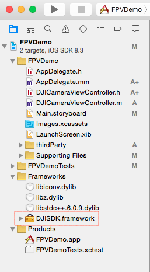
   
**2**. project target을 선택한다. **FPVDemo**의 경우 **Build Phases -> Link Binary With Libraries**로 이동한다. 밑에 있는 "+" 버튼을 클릭하고 2개 라이브러리를 여러분의 프로젝트에 추가한다 : (libstdc++.6.0.9.dylib 와 libz.dylib) 이 2개 라이브러리는 SDK 프레임워크를 컴파일 하는데 필요하다.

**3**. SDK 프레임워크 내부 일부 코드는 C++을 사용하므로 프로젝트의 구현파일의 확장자를 "**.mm**"로 변경해야한다. 예제로 "**AppDelegate.m**" 파일을 사용하며 이름을 "**AppDelegate.mm**"로 바꾼다.

**4**. **중요**: 만약 Inspire 1이나 Phantom 3 시리즈용 앱을 개발한다면 MFI communications support가 필요하다.

   프로젝트의 Supporting Files 폴더내에 plist 파일로 가서 MFI 프로토콜 이름을 추가하자. 아래와 같다 :
  
   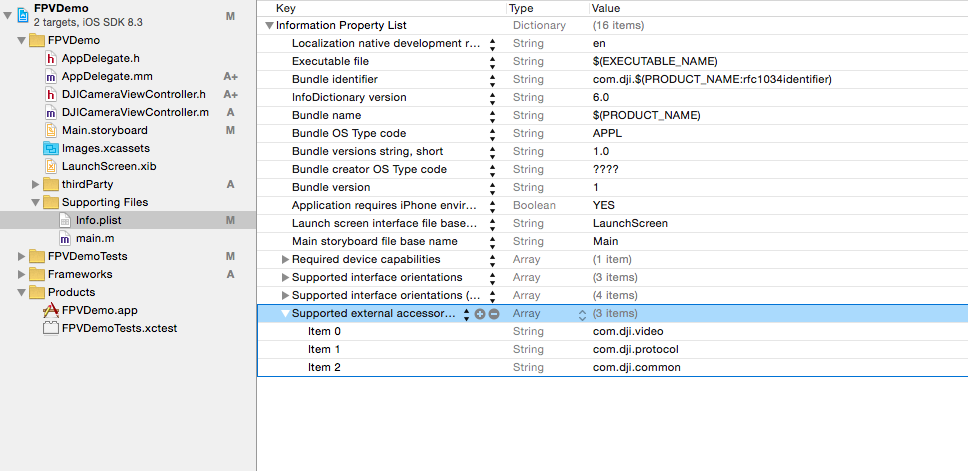

## FPV 구현하기
  **1**. FFMPEG decoding 라이브러리(http://ffmpeg.org)를 사용해서 비디오 스트림을 디코딩한다. 다운받은 SDK내부에 **VideoPreviewer** 폴더를 볼 수 있다. 전체 **VideoPreviewer** 폴더를 Xcode 프로젝트의 폴더로 복사하고 난 뒤, Xcode 프로젝트 네비게이터에 이것을 추가한다. 아래와 같다 :
  
 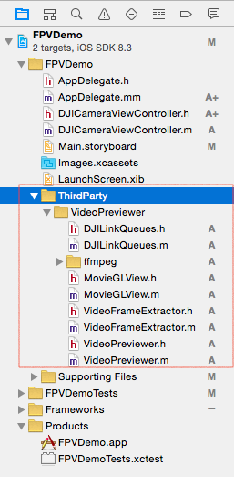
 
 **2**. **XCode -> Project -> Build Phases -> Link Binary With Libraries**로 이동해서 **libiconv.dylib** 라이브러리를 추가한다. 다음으로 **FFMPEG** 폴더내에 **~/include** 경로를 설정하기 위해 **Build Settings**내에 **Header Search Paths**를 설정한다. 다음은 **Library Search Paths**를 **FFMPEG** 폴더 내부에서 **~/lib**에 대한 경로를 설정한다. 아래와 같다 :
 
  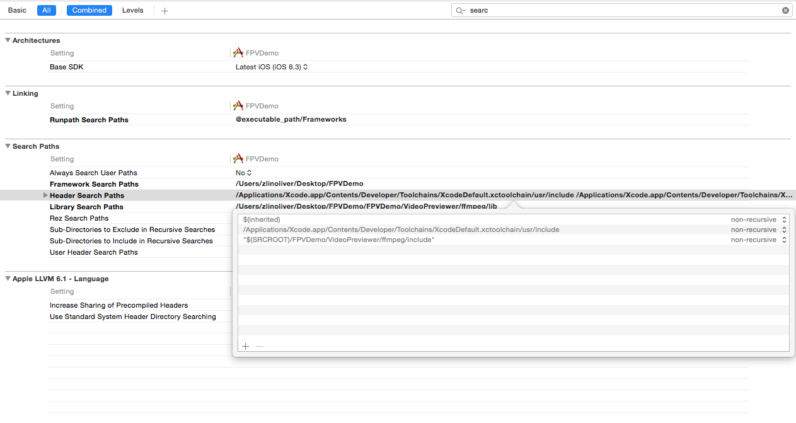
  
  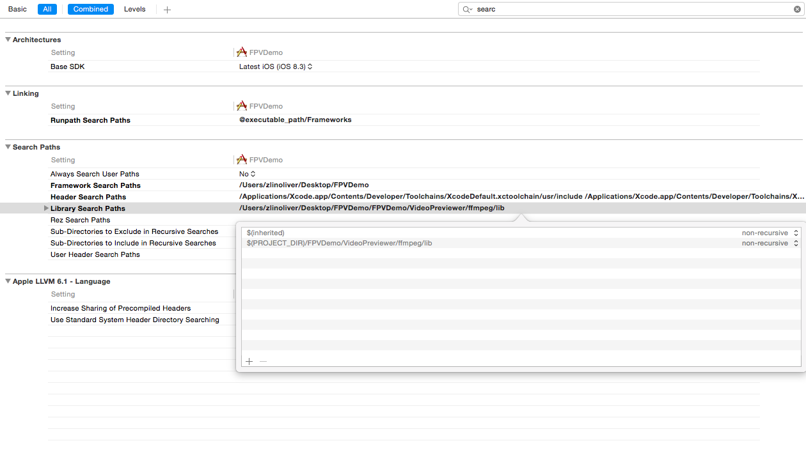
  
  **3**. **Main.storyboard**내에서 새로운 View Controller를 추가하고 **DJICameraViewController**라고 이름 붙이자. **DJICameraViewController**를 root View Controller로 설정한다. 이는 **Main.storyboard** 내부에 막 추가한 새로운 View Controller를 위해서다 :
  
  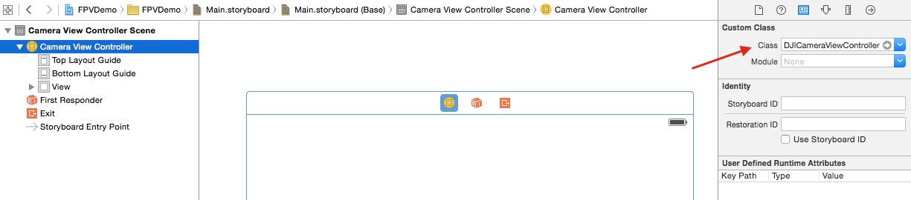
  
View Controller내부에 새로운 UIView를 추가하고 이를 IBOutlet로 설정하고 "**fpvPreviewView**"라고 이름 붙이자. 다음으로 2개 UIButton과 View Control 밑에 있는 UISegmentedControl을 추가한다. IBOutlets와 IBActions를 설정한다. 아래와 같다 :
  
  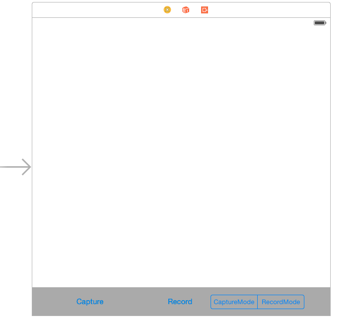
  
  **DJICameraViewController.m** 파일로 가서 **DJISDK**와 **VideoPreviewer** 헤더 파일을 import한다. 다음으로 **DJIDrone**과 **DJICamera** 인스턴스 변수를 생성하고 delegate 프로토콜을 아래와 같이 구현한다 :
  
~~~objc
#import <DJISDK/DJISDK.h>
#import "VideoPreviewer.h"

@interface DJICameraViewController ()<DJICameraDelegate, DJIDroneDelegate>
{
    DJIDrone *_drone;
    DJICamera* _camera;
}

~~~
**4**. **DJIDrone** 인스턴스를 추기화하고 이 타입을 **DJIDrone_Inspire**로 설정한다.(여러분이 가지고 있는 UAV을 기반해서 타입을 변경할 수 있다.) **_drone**과 **_camera** 인스턴스의 delegate를 **self**로 설정한다. 아래와 같다 :
  
~~~objc
- (void)viewDidLoad {
    [super viewDidLoad];
    
    _drone = [[DJIDrone alloc] initWithType:DJIDrone_Inspire];
    _drone.delegate = self;
    _camera = _drone.camera;
    _camera.delegate = self;
        
}
~~~
  
 **viewWillAppear** 메소드 내부에서 **fpvPreviewView** 인스턴스를 **VideoPreviewer**의 View로 설정하여 비디오 스트림을 볼 수 있고 **viewWillDisappear** 메소드 내부에서 이를 nil로 리셋한다 :
 
~~~objc
- (void)viewWillAppear:(BOOL)animated
{
    [super viewWillAppear:animated];
    [[VideoPreviewer instance] setView:self.fpvPreviewView];
    
}

- (void)viewWillDisappear:(BOOL)animated
{
    
    [super viewWillDisappear:animated];
    [_camera stopCameraSystemStateUpdates];
    [_drone disconnectToDrone];
    [_drone destroy];
    [[VideoPreviewer instance] setView:nil];
    
}
~~~
  
  마지막으로, **DJICameraDelegate** 메소드를 구현하는데 아래와 같다 :
  
~~~objc
#pragma mark - DJICameraDelegate

-(void) camera:(DJICamera*)camera didReceivedVideoData:(uint8_t*)videoBuffer length:(int)length
{
    uint8_t* pBuffer = (uint8_t*)malloc(length);
    memcpy(pBuffer, videoBuffer, length);
    [[VideoPreviewer instance].dataQueue push:pBuffer length:length];
}

-(void) camera:(DJICamera*)camera didUpdateSystemState:(DJICameraSystemState*)systemState
{
    if (!systemState.isTimeSynced) { //Only for Phantom 2 Vision/Phantom 2 Vision+ to check camera time
        [_camera syncTime:nil];
    }
    if (systemState.isUSBMode) { //Only for Phantom 2 Vision/Phantom 2 Vision+ to keep cameraMode when systemState is under USBMode
        [_camera setCamerMode:CameraCameraMode withResultBlock:Nil];
    }
    
}

-(void) droneOnConnectionStatusChanged:(DJIConnectionStatus)status
{
    if (status == ConnectionSuccessed) {
        NSLog(@"Connection Successed");
    }
    else if(status == ConnectionStartConnect)
    {
        NSLog(@"Start Reconnect");
    }
    else if(status == ConnectionBroken)
    {
        NSLog(@"Connection Broken");
    }
    else if (status == ConnectionFailed)
    {
        NSLog(@"Connection Failed");
    }
}

~~~
   -(void) camera:(DJICamera*)camera didReceivedVideoData:(uint8_t*)videoBuffer length:(int)length method is used to send the video stream to **VideoPreviewer** to decode.
   
   -(void) camera:(DJICamera*)camera didUpdateSystemState:(DJICameraSystemState*)systemState method is used to get the camera state from the camera on your aircraft. It will be called frequently, so you can update your user interface or camera settings accordingly here.
   
   -(void) droneOnConnectionStatusChanged:(DJIConnectionStatus)status method is used to check the drone's connection.
 
## SDK 활성화

**1**. DJICameraViewController.m 파일을 확장하여 **DJIAppManagerDelegate** 프로토콜 메소드를 구현한다 :

~~~objc
@interface DJICameraViewController ()<DJICameraDelegate, DJIDroneDelegate,DJIAppManagerDelegate>
{
    DJIDrone *_drone;
    DJICamera* _camera;
}
~~~

**registerApp**라는 새로운 메소드를 생성하고 viewDidLoad 메소드 내부에서 아래와 같이 호출한다 :

~~~objc
- (void)registerApp
{
    NSString *appKey = @"Enter Your App Key Here";
    [DJIAppManager registerApp:appKey withDelegate:self];
}

- (void)viewDidLoad {
    [super viewDidLoad];
    
    _drone = [[DJIDrone alloc] initWithType:DJIDrone_Inspire];
    _drone.delegate = self;
    _camera = _drone.camera;
    _camera.delegate = self;
    
    [self registerApp];    
}
~~~
---
**주의**: 위에 코드에서, DJI개발자 사이트에서 App Key를 얻어와야 한다. **Enter Your App Key**라는 항목에 이 키를 입력한다.  **Create APP**를 클릭하면 App Key를 받을 수 있다. **Identification Code**는 **Bundle Identifier**이다. 일단 이것을 하면 App Key가 생성된다. 우리가 생성한 **App Key**는 Xcode 프로젝트의 **Bundle Identifier**와 관련이 있다. 따라서 다른 Xcode 프로젝트에서 동일한 App Key를 사용할 수 없다. 각 프로젝트는 반드시 개별적으로 개별적으로 App Key를 받아서 사용해야 한다. 아래는 정보를 전송하면 보게 되는 화면이다 :

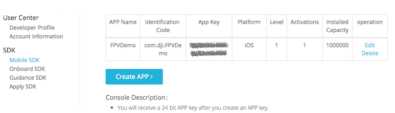

---

만약에 등록이 실패하면, **error** 변수의 값을 검사해서 delegate 메소드에서 문제가 무엇인지 확인한다 :

~~~objc
-(void)appManagerDidRegisterWithError:(int)error;
~~~

 APP KEY 활성화를 위한 error 코드 정보는 아래와 같다 :
 
 result  	  | Description 
------------- | -------------
0   | Check permission successful
-1  | Cannot connect to Internet
-2  | Invalid app key
-3  | Get permission data timeout
-4  | Device uuid not match
-5  | Project package name does not match the app 	   key's identification code
-6  | App key is forbidden
-7  | Activated device number is up to the maximum 		available one
-8  | App key's platform is not correct
-9  | App key does not exist
-10 | App key has no permission
-11 | Server parser failed
-12 | Error in server obtaining uuid
-13 | Server app package name abnormal
-14 | Server parsing activation data failed
-15 | AES 256 encryption unsupported
-16 | AES 256 encryption failed
-17 | Get device uuid failed
-18 | Empty app key
-1000 | Server error 

**2**. 다음으로, DJIAppManagerDelegate 메소드는 아래와 같다 :

~~~objc
#pragma mark DJIAppManagerDelegate Method
-(void)appManagerDidRegisterWithError:(int)error
{
    NSString* message = @"Register App Successed!";
    if (error != RegisterSuccess) {
        message = @"Register App Failed! Please enter your App Key and check the network.";
    }else
    {
        NSLog(@"registerAppSuccess");
        [_drone connectToDrone];
        [_camera startCameraSystemStateUpdates];
        [[VideoPreviewer instance] start];

    }
    UIAlertView* alertView = [[UIAlertView alloc] initWithTitle:@"Register App" message:message delegate:nil cancelButtonTitle:@"OK" otherButtonTitles:nil];
    [alertView show];
}
~~~

 위 코드에서, DJIDrone의 **connectToDrone** 메소드를 호출하는 이유는 drone과 연결을 시작하기 위해서다.  DJICamera의 **startCameraSystemStateUpdates** 메소드는 camera system state를 업데이트 하기 위해서 호출한다. 등록한 app이 video decode 시작에 성공했을 때, **VideoPreviewer** 인스턴스의 **start** 메소드를 호출한다.

**3**. Xcode에서 Build and Run을 실행한다. 만약 모든 것이 정상이라면 app이 로드될 때, "Register App Successed!"라는 문구를 볼 수 있다. 또 아래와 같은 스크린 샷을 보게 되면, 여러분의 비행체에 연결을 시작할 수 있고 카메라로부터 비디오 스트림을 즐길 수 있다.
  
  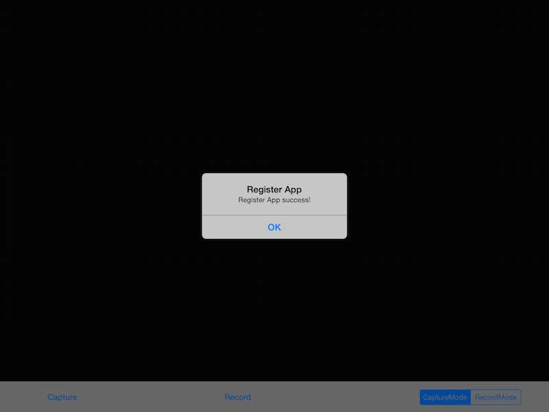

## 비행체 연결
위에 절차를 완료한 후에, 여러분의 모바일 장치를 DJI 비행체와 연결해서 app을 사용할 수 있다. 몇 가지 가이드 사항이 있다 :

* DJI Inspire 1, Phantom 3 Professional 혹은 Phantom 3 Advanced에 연결을 위해 :

  **1**. 맨 먼저 remote controller를 켠다.
  
  **2**. DJI 비행체의 전원을 켠다.
  
  **3**. 라이트링 케이블을 이용해서 iOS 장치를 remote controller에 연결한다.
  
  **4**. “Do you trust this device”가 알람이 뜨면 해당 장치를 신뢰를 선택한다.
  
  **5**. 이제 여러분의 비행체 카메라에서 라이브 비디오 스트림을 볼 수 있다!

* DJI Phantom 2 Vision+ 나 Phantom 2 Vision에 연결하기 위해서

  **1**. 맨 먼저 remote controller를 켠다.
  
  **2**. DJI 비행체의 전원을 켠다.
  
  **3**. Wi-Fi 영역 확장기를 켠다.
  
  **4**. 모바일 장치의 Wi-Fi를 켜고 Phantom-xxxxxx 이름의 네트워크에 연결한다. (xxxxxx는 영역 확장기의 SSID 숫자이다.)
  
  **5**. 이제 여러분의 비행체 카메라에서 라이브 비디오 스트림을 볼 수 있다!
  
  
## FPV 즐기기

app에서 라이브 비디오 스트림을 볼 수 있다면 성공이다!. 조금더 진도를 나가보자.

  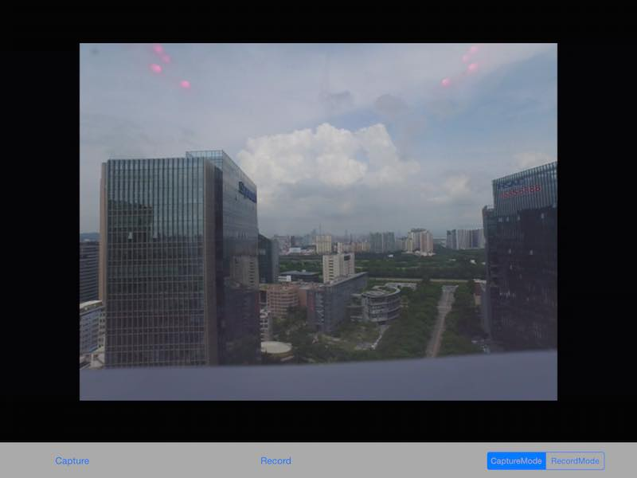

## 캡쳐 기능 구현하기

**captureAction** IBAction 메소드에 다음 코드를 추가하자 :

~~~objc
- (IBAction)captureAction:(id)sender {
    
    [_camera startTakePhoto:CameraSingleCapture withResult:^(DJIError *error) {
        if (error.errorCode != ERR_Successed) {
            NSLog(@"Take Photo Error : %@", error.errorDescription);
        }
    }];
}
~~~
   **DJICamera**의 다음 메소드만 호출해 주자 :
   
   -(void) startTakePhoto:(CameraCaptureMode)captureMode withResult:(DJIExecuteResultBlock)block;
   
  **CameraCaptureMode**의 4개 타입이 있다 :
  
~~~objc
  /**
 *  Camera capture mode
 */
    typedef NS_ENUM(uint8_t, CameraCaptureMode){
    /**
     *  Single capture
     */
    CameraSingleCapture,
    /**
     *  Multiple capture
     */
    CameraMultiCapture,
    /**
     *  Continuous capture
     */
    CameraContinousCapture,
    /**
     *  AEB capture. Support in Inspire 1/Phantom3 professional/Phantom3 Advanced
     */
    CameraAEBCapture,
};
~~~
  
  These enum values give you mutiple ways to capture photos, **CameraSingleCapture** is easy to use because you do not need to set any param before calling **startTakePhoto** method, unlike the other modes. For **CameraMultiCapture**, you need to use the
  **-(void) setMultiCaptureCount:(CameraMultiCaptureCount)count withResultBlock:(DJIExecuteResultBlock)block;** method in **DJICamera.h** header file to set the **captureCount** param and check if the take photo action succeed in the block before calling **startTakePhoto** method.
  
  For more infos, you can check **DJICamera.h** and **DJICameraSettingsDef.h** files.
    
---
##### Note: Since DJICamera has several subclasses: DJIInspireCamera, DJIPhantom3AdvancedCamera, DJIPhantomCamera, etc, you should find the corresponding methods when you want to set the params. For example, CameraAEBCapture mode is supported in Inspire 1, so you should find the AEB setting method in DJIInspireCamera.h file rather than in DJICamera.h file.

---

  Here we set the capture mode to **CameraSingleCapture**. You can check the capture result from the **DJIError** instance in the block.
  
  Build and run your project and then try the capture function. If the screen flash after your press the **capture** button, your capture fuction should be working.
  
  
## Implement the Record function
  
### 1. Switching Camera Mode
   Before we implementing the record function, we need to switch the camera work mode firstly.
   
   Let's check the **DJICameraSettingsDef.h** file.
   
~~~objc
   /**
 *  Camera work mode. Used in Inspire/Phantom3 professional/Phantom3 Advanced
 */
    typedef NS_ENUM(uint8_t, CameraWorkMode){
    /**
     *  Capture mode. In this mode, user could do capture action only.
     */
    CameraWorkModeCapture                   = 0x00,
    /**
     *  Record mode. In this mode, user could do record action only.
     */
    CameraWorkModeRecord                    = 0x01,
    /**
     *  Playback mode. In this mode, user could preview photos or videos and delete the file.
     */
    CameraWorkModePlayback                  = 0x02,
    /**
     *  Download mode. In this mode, user could download the selected file from SD card
     */
    CameraWorkModeDownload                  = 0x03,
    /**
     *  Unknown
     */
    CameraWorkModeUnknown                   = 0xFF
};
~~~
   You can see above that there are 5 types of **CameraWorkMode**. Since we are using the Inspire 1 as an example, **CameraWorkModeCapture** and **CameraWorkModeRecord** are used as follows:
   
   -(void) setCameraWorkMode:(CameraWorkMode)mode withResult:(DJIExecuteResultBlock)block; method inside **DJIInspireCamera.h** file to switch camera work mode.
   
   Open **Main.storyboard** and add an IBOutlet for the UISegmented Control called "changeWorkModeSegmentControl". Remember the delegate method of DJICameraDelegate in **Tutorial Part 1**?
   
   -(void) camera:(DJICamera*)camera didUpdateSystemState:(DJICameraSystemState*)systemState;
   
   We can update the state of the segmented control when switching between **CameraWorkModeCapture** and **CameraWorkModeRecord** using the above delegate method.
   
~~~objc
-(void) camera:(DJICamera*)camera didUpdateSystemState:(DJICameraSystemState*)systemState
{
    if (_drone.droneType == DJIDrone_Inspire) {
        
        //Update UISegmented Control's state        
        if (systemState.workMode == CameraWorkModeCapture) {
            [self.changeWorkModeSegmentControl setSelectedSegmentIndex:0];
        }else if (systemState.workMode == CameraWorkModeRecord){
            [self.changeWorkModeSegmentControl setSelectedSegmentIndex:1];
        }
    }
}

~~~
 Now we can implement the **changeWorkModeAction** method as follows:
 
~~~objc
- (IBAction)changeWorkModeAction:(id)sender {
    
    DJIInspireCamera* inspireCamera = (DJIInspireCamera*)_camera;
    __weak DJICameraViewController *weakSelf = self;

    UISegmentedControl *segmentControl = (UISegmentedControl *)sender;
    if (segmentControl.selectedSegmentIndex == 0) { //CaptureMode
        
        [inspireCamera setCameraWorkMode:CameraWorkModeCapture withResult:^(DJIError *error) {
            
            if (error.errorCode != ERR_Successed) {
                UIAlertView *errorAlert = [[UIAlertView alloc] initWithTitle:@"Set CameraWorkModeCapture Failed" message:error.errorDescription delegate:weakSelf cancelButtonTitle:@"OK" otherButtonTitles:nil];
                [errorAlert show];
            }
            
        }];
        
    }else if (segmentControl.selectedSegmentIndex == 1){ //RecordMode
    
        [inspireCamera setCameraWorkMode:CameraWorkModeRecord withResult:^(DJIError *error) {
            
            if (error.errorCode != ERR_Successed) {
                UIAlertView *errorAlert = [[UIAlertView alloc] initWithTitle:@"Set CameraWorkModeRecord Failed" message:error.errorDescription delegate:weakSelf cancelButtonTitle:@"OK" otherButtonTitles:nil];
                [errorAlert show];
            }
        
        }];
        
    }
    
}

~~~
 Here we add two UIAlertViews to get a warning when the user set CameraWorkMode failed.
 
### 2. 녹화 동작 추가하기

  Firstly, we need a BOOL variable to save the status of the record action and a UILabel to show the current record time. So let's go to **Main.storyboard** and drag a UILabel on top of the screen, set up the Autolayout for it and create an IBOutlet named "**currentRecordTimeLabel**" to the **DJICameraViewController.m** file. Moreover, create an IBOutlet called "**recordBtn**" for the Record Button.
  
  Then add a BOOL variable **isRecording** in the class extension of **DJICameraViewController**. Be sure to hide **currentRecordTimeLabel** in the **viewDidLoad** method. We can update the text values for **isRecording** and **currentRecordTimeLabel**'s text value in the following delegate method.
   
~~~objc
-(void) camera:(DJICamera*)camera didUpdateSystemState:(DJICameraSystemState*)systemState
{
    if (_drone.droneType == DJIDrone_Inspire) {
        
        self.isRecording = systemState.isRecording;
        
        [self.currentRecordTimeLabel setHidden:!self.isRecording];
        [self.currentRecordTimeLabel setText:[self formattingSeconds:systemState.currentRecordingTime]];
        
        if (self.isRecording) {
            [self.recordBtn setTitle:@"Stop Record" forState:UIControlStateNormal];
        }else
        {
            [self.recordBtn setTitle:@"Start Record" forState:UIControlStateNormal];
        }
        
        //Update UISegmented Control's state
        if (systemState.workMode == CameraWorkModeCapture) {
            [self.changeWorkModeSegmentControl setSelectedSegmentIndex:0];
        }else if (systemState.workMode == CameraWorkModeRecord){
            [self.changeWorkModeSegmentControl setSelectedSegmentIndex:1];
        }
       
    }
}
   
~~~
   
   **currentRecordingTime** 값이 초단위로 카운트되기 때문에 "mm:ss" 포맷으로 변환하자 :
   
~~~objc
- (NSString *)formattingSeconds:(int)seconds
{
    NSDate *date = [NSDate dateWithTimeIntervalSince1970:seconds];
    NSDateFormatter *formatter = [[NSDateFormatter alloc] init];
    [formatter setDateFormat:@"mm:ss"];
    [formatter setTimeZone:[NSTimeZone timeZoneForSecondsFromGMT:0]];
    
    NSString *formattedTimeString = [formatter stringFromDate:date];
    return formattedTimeString;
}
~~~
   
   다음으로 **recordAction** IBAction 메소드에 다음 코드를 추가하자 :
   
~~~objc
- (IBAction)recordAction:(id)sender {
    
    __weak DJICameraViewController *weakSelf = self;
    
    if (self.isRecording) {
        
        [_camera stopRecord:^(DJIError *error) {
            
            if (error.errorCode != ERR_Successed) {
                UIAlertView *errorAlert = [[UIAlertView alloc] initWithTitle:@"Stop Record Error" message:error.errorDescription delegate:weakSelf cancelButtonTitle:@"OK" otherButtonTitles:nil];
                [errorAlert show];
            }
        }];
        
    }else
    {
        [_camera startRecord:^(DJIError *error) {
            
            if (error.errorCode != ERR_Successed) {
                UIAlertView *errorAlert = [[UIAlertView alloc] initWithTitle:@"Start Record Error" message:error.errorDescription delegate:weakSelf cancelButtonTitle:@"OK" otherButtonTitles:nil];
                [errorAlert show];
            }
        }];

    }

}  
~~~

   위에 코드에서 **isRecording** 프로퍼티 값을 기반으로 **DJICamera** 클래스의 **startRecord** 와 **stopRecord** 메소드를 구현했다. error가 발생하면 alertView를 볼 수 있다.
   
   이제 프로젝트를 빌드 및 실행이 가능하며 기능을 확인하자. **Record** 와 **Switch Camera WorkMode** 기능을 동작시켜보고 잘 동작한다면 아래와 같은 화면을 볼 수 있다:
   
   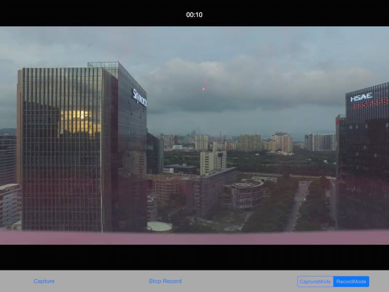
   
   축하한다! 여러분의 FPV iOS app이 완성되었다. Inspire 1 카메라 제어하는 app으로 사용할 수 있다.

## 정리
   
   이 긴 튜토리얼을 따라왔다 : DJI Mobile SDK 사용법을 배우고 DJI 비행체의 카메라를 제어하는 방법을 배웠따. 이는 전형적인 drone app이 가지는 가장 기본이며 일반적인 기능이다.(**Capture**과 **Record**) 그러나 좀더 멋진 drone app을 만들고자 한다면 가야할 길이 멀다. 더 향상된 기능으로 SD카드에 있는 사진이나 비디오 미리보기와 비행체의 OSD 데이터 보기를 추가할 수 있다. 이 튜토리얼을 도움이 되기를 바라며 다음 것도 참고하기 바란다.
   
   