# MapView와 Waypoint App 만들기

<!-- toc -->

*주의: 이 튜토리얼의 코드는 iPad에서 실행되도록 작성하였다. 따라서 iPad나 iPad simulator에서 이 코드를 실행하시오.*

이 튜토리얼엣어 DJI PC Simulator를 설정하는 방법을 배우고 베타 버전으로 Inspire 1, Phantom 3 Professional과 Phantom 3 Advanced 펌웨어를 업그레이드해서 DJI PC Simulator와 GroundStation API를 테스트하는 방법을 배워보자. DJI GroundStation Waypoint 기능을 이용하는 것에 익숙해 질 것이다. 자 이제 시작해보자!

   이 튜토리얼의 전체 프로젝트를 다운받을 수 있다 : <https://github.com/DJI-Mobile-SDK/iOS-GSDemo.git>

## DJI PC Simulator 사용하기

### 1. 소개

DJI PC Simulator는 SDK 개발자를 위해 설계된 비행 simulator이다. simulator는 가상 3D 환경을 만들고 UDP 프로토콜을 통해 PC로 전달된 비행 데이터를 분석을 제공한다.

**지원하는 운영체제**: Windows 7, Windows 8 그리고 Windows 8.1

**지원하는 DJI 플랫폼**: Matrice 100, Inspire 1, Phantom 3 Professional, 그리고 Phantom 3 Advanced

### 2. DJI PC Simulator 설치 및 설정

먼저 DJI PC Simulator와 WIN Driver 다운받는다 : <http://dev.dji.com/en/products/sdk/onboard-sdk/downloads> :

- DJI PC Simulator Installer & User Manual V1.0
- WIN Driver Installer

simulator를 실행하기 전에 driver 설치해야만 한다. simulator는 윈도우만 지원하기 때문에 Mac에서 윈도우를 실행할려면 가상 머신(VMWare나 Parallels Desktop)을 설치해야 한다. **DJI_WIN_Driver_Installer.exe** 을 설치하기 위해서 더블 클릭한다. 다이얼로그 박스에 **"Please power on MC and connect it to PC via USB!"** 나오면 무시하고 그냥 **"YES"**를 클릭한다. 다음으로 driver를 설치하기 위해 다음과 같은 절차를 따른다.

다음으로 **DJISimulator-Installer.exe**를 더블 클릭해서 설치하고 설치를 위해 다음 절차를 따른다.

### 3. DJI PC Simulator 사용하는 방법

**1**. DJI PC Simulator를 실행하면 **Simulator Config** 창이 한 번 나타난다. 원하는 값으로 **Latitude** 와 **Longitude** 값을 설정한다. **SN**은 연결한 비행체의 시리얼 넘버를 뜻한다. **SN**을 찾지 못했다면, 여러분의 비행체가 PC에 제대로 연결이 안되었거나 펌웨어와 문제가 있을 수 있다.

 

---
**주의**: 

- 비행금지 구역([No Fly Zone](http://flysafe.dji.com/no-fly))에 가까운 값으로 비행체의 고도와 위도를 설정하면 이륙하지 않는다.

- Log Settings 탭 아래 **show log window**를 선택하여 log 창을 볼 수 있다 :

 

---

**2**. 마이크로 USB 케이블을 통해 비행체를 PC로 연결하고 리모트 컨트롤러을 켜고 마지막으로 비행체를 켠다. **Display Simulator**를 클릭하고 스크린샷이 보인다.(사용하고 있는 비행체에 관계 없이 보인다) 아래 경우는 Inspire 1인 경우 :

 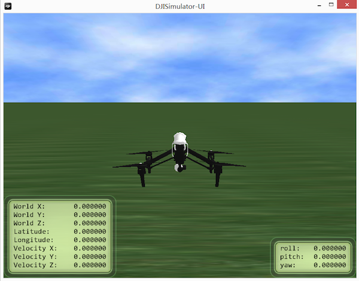

---
**주의**: 

- DJI PC Simulator가 실행되고 있을 때, DJI Pilot app을 실행하지 마라.

- DJI PC Simulator가 실행 중일 때, 비행체에 프로펠러를 붙착하지 말라. 사고로 모터가 동작할 수 있기 때문이다. 이는 매우 위험할 수 있다.

---

**3**. **Start Simulation**를 클릭하면 시뮬레이션이 시작된다. control mode를 **P**로 변경하면 리모트 컨트롤러를 이용해서 비행체의 경로를 변경할 수 있다. 혹은 리모트 컨트롤러의 **Return-to-Home** 버튼을 누르면 되돌아오게 할 수 있다.

왼쪽 아래 모서리에 있는 데이터를 확인하라. X, Y, Z는 북남(North-South), 동서(East-West), 위아래(Up-Down)축을 뜻한다.(북, 동, 위 방향이 양수 값이다.)

**4**. view angle을 변경하기 위해서 왼쪽 클릭과 드래, 스크롤을 위해 zoom in/out

 
 
 

**5**. 시뮬레이션을 중지할려면 **Stop Simulation**을 클릭한다. simulator를 듣고 비행체 전원을 끈다. 사용이 끝났으면 리모트 컨트롤러의 전원을 내린다.

**중요**: GroundStation Waypoint Mission을 통해 midway를 멈추고자 한다면, **Stop Simulation**을 클릭하고 실행하고 있는 장치의 mission을 중지시킨다. 이렇게 하지 않으면 simulator를 다시 시작할 때, 이전 groundstation mission을 실행할 수도 있다. 

DJI PC Simulator에 대한 추가 정보는 **DJI PC Simulator user manual.pdf** 파일을 참고하라. 이 파일은 다운받은 simulator에 포함되어 있다.

## 비행체 펌웨어 업그레이드

다음 단계를 진행하기 전에, 여러분의 비행체의 펌웨어가 DJI Mobile SDK를 지원하는지 확인해야만 한다. 여러분의 가지고 있는 비행체에 맞는 베타 버전 펌웨어를 다운받도록 하자: <http://dev.dji.com/en/products/sdk/onboard-sdk/downloads> :

- Phantom 3 Professional Firmware
- Phantom 3 Advanced Firmware
- Inspire 1 Firmware

리모트 컨트롤러의 펌웨어를 업그레이드할 필요는 없다. SD카드에 다운받은 **bin** 파일을 넣은 후에 비행체 카메라에 삽입하고 다시시작하면 업그레이드 된다. 업그레이드를 마치는데 10 ~ 30분 가량 소요된다.

Inspire 1의 경우 비행체의 소리 패턴에 따라 펌웨어의 업그레이드 상태를 검사할 수 있다:

- Upgrading: D D D D ... (fast) 
- Upgrade Success: D DD ...
- Upgrade Failed or Error: long beep sound

Phantom 3의 경우 카메라 상태 표시등을 보면 펌웨어 업그레이드의 상태를 검사할 수 있다:

- Upgrading: 카메라 상태 표시등이 녹색/빨간색으로 깜빡거린다.
- Upgrade Success: 카메라 상태 표시등이 깜빡거림을 멈춘다.
- Upgrade Failed or Error: 카메라 상태 표시등이 강한 빨간색을 표시한다.

비행체와 무관하게 펌웨어 업그레이드를 검사하는 방법은 업그레이드 과정에서 생성하는 **txt** 파일을 통해서 가능하다. Phantom 3 Professional의 경우 txt 파일 이름은 **"P3X_FW_RESULT_AB.txt"**이고 Inspire 1은 **"WM610_FW_RESULT_AB.txt"** 이다. **txt** 파일 내부 내용은 아래와 같다 :

  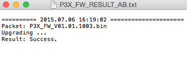
  
  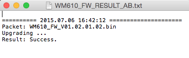

## Map View 설정

### 1. 프레임워크와 라이브러리 Import하기

위에 과정을 마치고 나면, application을 시작할 수 있다. 이전 튜토리얼([**Creating a Camera Application**](../../iOS/FPVDemo/FPVDemo_en.md))에서 DJI Mobile SDK를 Xcode 프로젝트로 import하고 활성화 시키는지 배웠다. 이전 자료를 보지 못했다면, 한 번 살펴보도록 하자. 이런 과정을 다 수행했다면 map view를 설정을 진행한다. 

**1**.  Xcode에 새로운 프로젝트를 생성하고 "**GSDemo**"라고 이름 붙인다. **DJISDK.framework**를 Xcode 프로젝트 폴더에 복사한다. 다음으로 project target을 선택하고 Build Phases -> Link Binary With Libraries로 이동한다. 밑에 있는 "+" 버튼을 클릭하고 2개 라이브러리를 프로젝트에 추가한다.(libstdc++.6.0.9.dylib 과 libz.dylib) 스크린샷은 아래와 같다:

  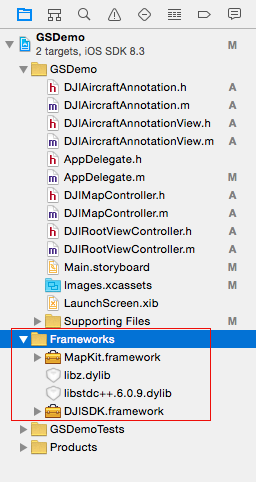

### 2. Map View 생성
**ViewController.h**와 **ViewController.m** 파일을 삭제하자. 프로젝트를 생성할 때, Xcode에서 자동으로 생성한 것이다. "**DJIRootViewController**"라는 viewController를 생성하고 Main.storyboard에 **Root View Controller**로 설정한다. Object Library에서 **MKMapView**를 **DJIRootViewController**로 드래그한다. 여기서 AutoLayout constraints를 설정하고 delegate로 **DJIRootViewController**를 지정한다. 아래와 같다:
   
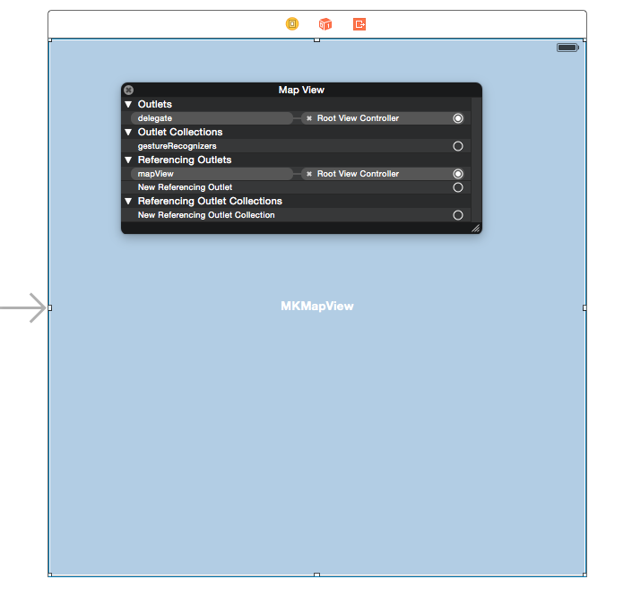

이후, **DJIRootViewController.h** 파일을 열고 MKMapView을 위해 IBOutlet를 생성하고 "**mapView**"라고 이름 붙이고 **Main.storyboard**내부에 MKMapView에 링크를 걸어준다. 아래 header 파일을 import하고 MKMapView의 delegate 메소드를 구현한다:

~~~objc
#import <DJISDK/DJISDK.h>
#import <MapKit/MapKit.h>

@interface DJIRootViewController : UIViewController<MKMapViewDelegate>

@property (weak, nonatomic) IBOutlet MKMapView *mapView;

@end
~~~

자 이제, 프로젝트를 빌드하고 실행해보자. 만약 제대로 잘 따라왔다면 아래와 같은 화면을 보게 된다:

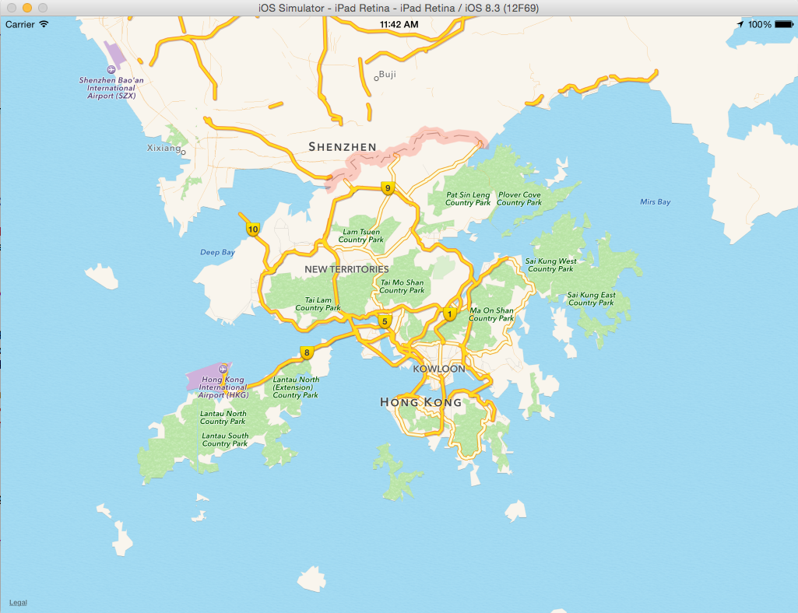

### 3. MapView에 Annotation 추가하기

현재까지 map view는 단순했다. 재밌는 것을 추가해 보도록 하자. **DJIMapController**이라는 새로운 **NSObject** 파일을 만들자. 이것으로 지도 상에서 logic을 MKAnnotation으로 처리하는데 사용된다. **DJIMapController.h** 파일을 열고 다음과 같은 코드를 추가한다 :

~~~objc
#import <UIKit/UIKit.h>
#import <MapKit/MapKit.h>

@interface DJIMapController : NSObject

@property (strong, nonatomic) NSMutableArray *editPoints;

/**
 *  Add Waypoints in Map View
 */
- (void)addPoint:(CGPoint)point withMapView:(MKMapView *)mapView;

/**
 *  Clean All Waypoints in Map View
 */
- (void)cleanAllPointsWithMapView:(MKMapView *)mapView;

/**
 *  Current Edit Points
 *
 *  @return Return an NSArray contains multiple CCLocation objects
 */
- (NSArray *)wayPoints;

@end
~~~

여기서 waypoint 객체를 저장하기 위해서 **editPoints**라는 NSMutableArray를 생성한다. **Add** 와 **Remove** waypoints를 구현하기 위해서 2개 메소드를 추가한다. 마지막 메소드는 array내에서 지도상에 있는 현재 waypoint 객체를 반환하는데 사용할 것이다.

**DJIMapController.m** 파일로 가서 원래 코드를 다음 코드로 교체하자:

~~~objc
#import "DJIMapController.h"

@implementation DJIMapController

- (instancetype)init
{
    if (self = [super init]) {
        self.editPoints = [[NSMutableArray alloc] init];
    }
    return self;
}

- (void)addPoint:(CGPoint)point withMapView:(MKMapView *)mapView
{
    CLLocationCoordinate2D coordinate = [mapView convertPoint:point toCoordinateFromView:mapView];
    CLLocation *location = [[CLLocation alloc] initWithLatitude:coordinate.latitude longitude:coordinate.longitude];
    [_editPoints addObject:location];
    MKPointAnnotation* annotation = [[MKPointAnnotation alloc] init];
    annotation.coordinate = location.coordinate;
    [mapView addAnnotation:annotation];
}

- (void)cleanAllPointsWithMapView:(MKMapView *)mapView
{
    [_editPoints removeAllObjects];
    NSArray* annos = [NSArray arrayWithArray:mapView.annotations];
    for (int i = 0; i < annos.count; i++) {
        id<MKAnnotation> ann = [annos objectAtIndex:i];
        [mapView removeAnnotation:ann];
    }   
}

- (NSArray *)wayPoints
{
    return self.editPoints;
}

@end
~~~
먼저, **init** 메소드에서 **editPoints** array를 초기화한다.그런 다음 **CGPoint**로부터 **MKPointAnnotation** 객체를 생성하고 **mapView**에 추가한다. 마지막으로 **cleanAllPointsWithMapView**을 구현해서 **eidtPoints** array와 mapview에 있는 annotation을 정리(cleanup)한다.

**DJIRootViewController.h** 파일로 돌아가서, DJIMapController.h 헤더 파일을 import하고 **mapController**이름의 **DJIMapController** property를 생성한다.map을 두드려서 annotation 핀을 추가하려고 하므로 "**tapGesture**"라는 이름의 **UITapGestureRecognizer**를 생성한다. 마지막으로 **UIButton**를 **Main.storyboard**내부에 있는 **DJIRootViewController** scene에 추가한다. "**editBtn**"라는 이름으로 IBOutlet을 설정한다. "**editBtnAction**" 이름의 IBAction 메소드를 추가한다. 아래와 같다:

~~~objc
@property (nonatomic, strong) DJIMapController *mapController;
@property (nonatomic, strong) UITapGestureRecognizer *tapGesture;
@property (weak, nonatomic) IBOutlet UIButton *editBtn;

- (IBAction)editBtnAction:(id)sender;
~~~

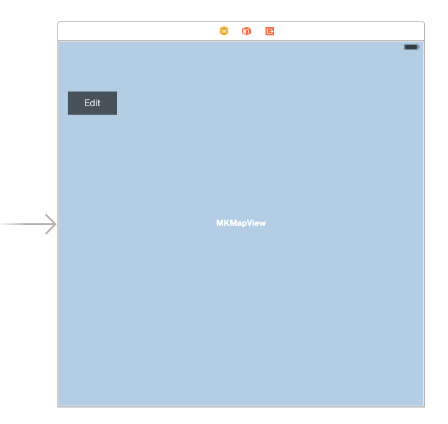

일단 완료하면, **DJIMapController.m** 파일을 열고  **mapController** 와 **tapGesture** 변수를 초기화한다. **tapGesture**를 mapView에 추가해서 waypoint를 추가할 수 있다. 추가로 "**isEditingPoints**"라는 boolean 변수가 필요하다. 수정한 waypoint 상태를 저장하는 용도이며, **editBtn**의 타이틀을 변경할 것이다. 마지막으로 tapGesture의 action 메소드 **addWayPoints**를 구현한다. 아래와 같다 :

~~~objc
#import "DJIRootViewController.h"

@interface DJIRootViewController ()
@property (nonatomic, assign)BOOL isEditingPoints;
@end

@implementation DJIRootViewController
- (void)viewDidLoad {
    [super viewDidLoad];
    
    self.mapController = [[DJIMapController alloc] init];
    self.tapGesture = [[UITapGestureRecognizer alloc] initWithTarget:self action:@selector(addWaypoints:)];
    [self.mapView addGestureRecognizer:self.tapGesture];
    
    [[NSNotificationCenter defaultCenter] addObserver:self selector:@selector(registerAppSuccess:) name:@"RegisterAppSuccess" object:nil];
}

#pragma mark Custom Methods

- (void)registerAppSuccess:(NSNotification *)notification
{

}

- (void)addWaypoints:(UITapGestureRecognizer *)tapGesture
{
    CGPoint point = [tapGesture locationInView:self.mapView];
    
    if(tapGesture.state == UIGestureRecognizerStateEnded){

        if (self.isEditingPoints) {
            [self.mapController addPoint:point withMapView:self.mapView];
        }
    }
}

- (IBAction)editBtnAction:(id)sender {

    if (self.isEditingPoints) {
        [self.mapController cleanAllPointsWithMapView:self.mapView];
        [self.editBtn setTitle:@"Edit" forState:UIControlStateNormal];
    }else
    {
        [self.editBtn setTitle:@"Reset" forState:UIControlStateNormal];
    }
    
    self.isEditingPoints = !self.isEditingPoints;
    
}

#pragma mark MKMapViewDelegate Method
- (MKAnnotationView *)mapView:(MKMapView *)mapView viewForAnnotation:(id <MKAnnotation>)annotation
{
    if ([annotation isKindOfClass:[MKPointAnnotation class]]) {
        MKPinAnnotationView* pinView = [[MKPinAnnotationView alloc] initWithAnnotation:annotation reuseIdentifier:@"Pin_Annotation"];
        pinView.pinColor = MKPinAnnotationColorPurple;
        return pinView;
        
    }
    
    return nil;
}

~~~

위 코드에서 NSNotification observer를 추가해서 DJI Mobile SDK 상태를 검사해서 성공적으로 등록되었는지 확인한다. 동시에 DJIMapController를 호출해서 **addWaypoints** gesture action을 구현한다. 

     - (void)addPoint:(CGPoint)point withMapView:(MKMapView *)mapView
map에 waypoint를 추가하는 메소드. 다음으로 IBAction 메소인 **editBtn**를 구현하여 button의 title을 업데이트하고 **isEditingPoints** 기반으로 waypoint를 지운다. 마지막으로 pin색상을 보라색으로 바꾸기 위해서 MKMapViewDelegate의 메소드를 구현한다.

위에 있는 모든 단계를 마쳤으면 프로젝트를 빌드하고 실행해서 waypoint를 map에 추가해 보자. 모든 것이 정상이라면 다음과 같이 보일 것이다 :

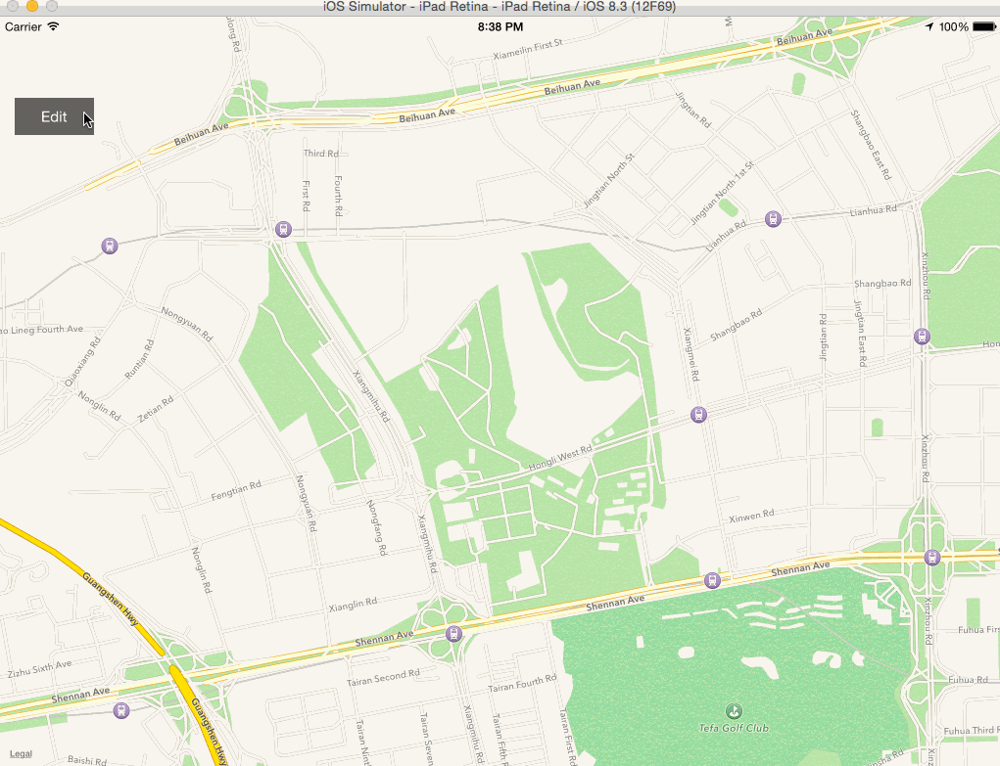

### 4. Focus The MKMapView

You may be wondering why the map's location is different from your current location and why it is difficult to find your location on the map. Focusing the map to your current location quickly would be helpful for the application. To implement that feature, we need to use **CLLocationManager**.

Open the **DJIRootViewController.h** file and import CoreLocation's header file. Create a **CLLocationManager** property named "**locationManager**". Then create a **CLLocationCoordinate2D** property named "**userLocation**" to store the user's location data. Next, implement **CLLocationManager**'s **CLLocationManagerDelegate** protocol in the class, as shown below:

~~~objc
#import <DJISDK/DJISDK.h>
#import <MapKit/MapKit.h>
#import <CoreLocation/CoreLocation.h>

@interface DJIRootViewController : UIViewController<MKMapViewDelegate, CLLocationManagerDelegate>

@property (nonatomic, weak) IBOutlet MKMapView *mapView;
@property (nonatomic, strong) CLLocationManager* locationManager;
@property (nonatomic, assign) CLLocationCoordinate2D userLocation;
@property (nonatomic, strong) UITapGestureRecognizer *tapGesture;
@property (nonatomic, weak) IBOutlet UIButton *editBtn;

- (IBAction)editBtnAction:(id)sender;
- (IBAction)focusMapAction:(id)sender;

@end
~~~

In the code above, we also added a UIButton named "**Focus Map**" in DJIRootViewController's scene in **Main.storyboard** and added an IBAction method named as "**focusMapAction**". Here is the screenshot of the scene from **Main.storyboard**:

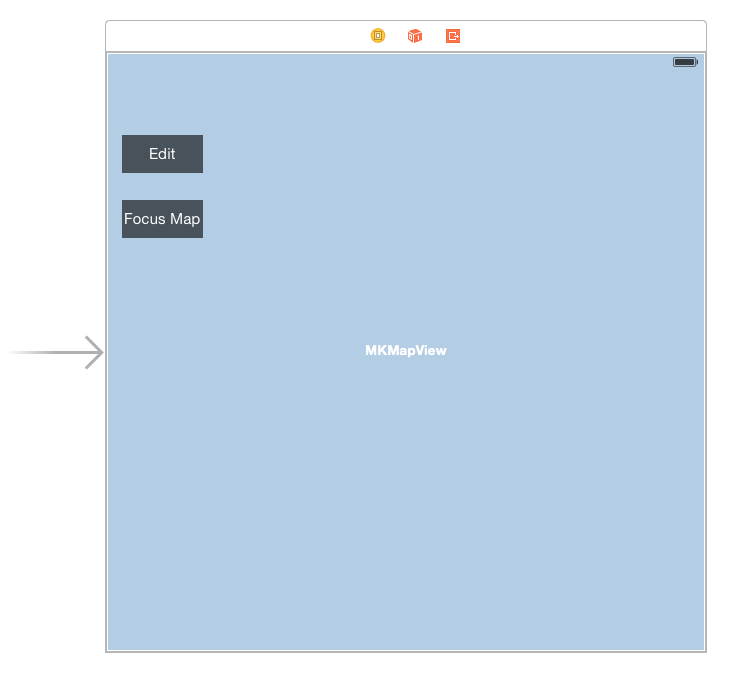

Once you are done, go to **DJIRootViewController.m** file and add the following code:

~~~objc
- (void)viewWillAppear:(BOOL)animated
{
    [super viewWillAppear:animated];
    [self startUpdateLocation];
}

- (void)viewWillDisappear:(BOOL)animated
{
    [super viewWillDisappear:animated];
    [self.locationManager stopUpdatingLocation];
}

- (void)viewDidLoad {
    [super viewDidLoad];
    
    self.userLocation = kCLLocationCoordinate2DInvalid;
    
    self.mapController = [[DJIMapController alloc] init];
    self.tapGesture = [[UITapGestureRecognizer alloc] initWithTarget:self action:@selector(addWaypoints:)];
    [self.mapView addGestureRecognizer:self.tapGesture];
    
    [[NSNotificationCenter defaultCenter] addObserver:self selector:@selector(registerAppSuccess:) name:@"RegisterAppSuccess" object:nil];
    
}

#pragma mark CLLocation Methods
-(void) startUpdateLocation
{
    if ([CLLocationManager locationServicesEnabled]) {
        if (self.locationManager == nil) {
            self.locationManager = [[CLLocationManager alloc] init];
            self.locationManager.delegate = self;
            self.locationManager.desiredAccuracy = kCLLocationAccuracyBest;
            self.locationManager.distanceFilter = 0.1;
            if ([self.locationManager respondsToSelector:@selector(requestAlwaysAuthorization)]) {
                [self.locationManager requestAlwaysAuthorization];
            }
            [self.locationManager startUpdatingLocation];
        }
    }else
    {
        UIAlertView *alert = [[UIAlertView alloc] initWithTitle:@"Location Service is not available" message:@"" delegate:self cancelButtonTitle:@"OK" otherButtonTitles:nil];
        [alert show];
    }
}

- (IBAction)focusMapAction:(id)sender {
{
    if (CLLocationCoordinate2DIsValid(self.userLocation)) {
        MKCoordinateRegion region = {0};
        region.center = self.userLocation;
        region.span.latitudeDelta = 0.001;
        region.span.longitudeDelta = 0.001;
        
        [self.mapView setRegion:region animated:YES];
    }
}

#pragma mark - CLLocationManagerDelegate
- (void)locationManager:(CLLocationManager *)manager didUpdateLocations:(NSArray *)locations
{
    CLLocation* location = [locations lastObject];
    self.userLocation = location.coordinate;
}

~~~

First, we initialize **userLocation** data to kCLLocationCoordinate2DInvalid in the viewDidLoad method. Then we add a new method named as **startUpdateLocation** to initialize **locationManger**, set its properties and start updating location. If the Location Service is not available, we add an UIAlertView to display the warning. The **startUpdateLocation** is called in **viewWillAppear** method and is stopped in the **viewWillDisappear** method. Moreover, we need to implement CLLocationManagerDelegate method to update **userLocation** property. Finally, we implement the **focusMapAction** method to focus **mapView** to the user's current location.

In iOS8, we must call **locationManager**'s **requestAlwaysAuthorization** first, which was done in **startUpdateLocation** method. Next, add a NSLocationAlwaysUsageDescription or NSLocationWhenInUseUsageDescription key to your project’s Info.plist containing the message to be displayed to the user when a UIAlert asking whether or not they want to allow the application to use their location. We set the messages empty here:

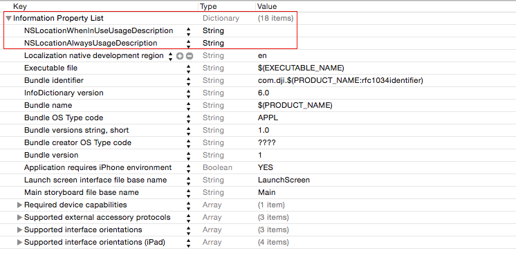

It's time to build and run the project to check the focus map feature. When you launch the app for the first time, a pop up alert asking for your permission to access your location will appear. Select **Allow** and press the **Focus Map** button. If the map view animates to your current location like the following animation, congratulations, you have finished the **Focus Map** feature!

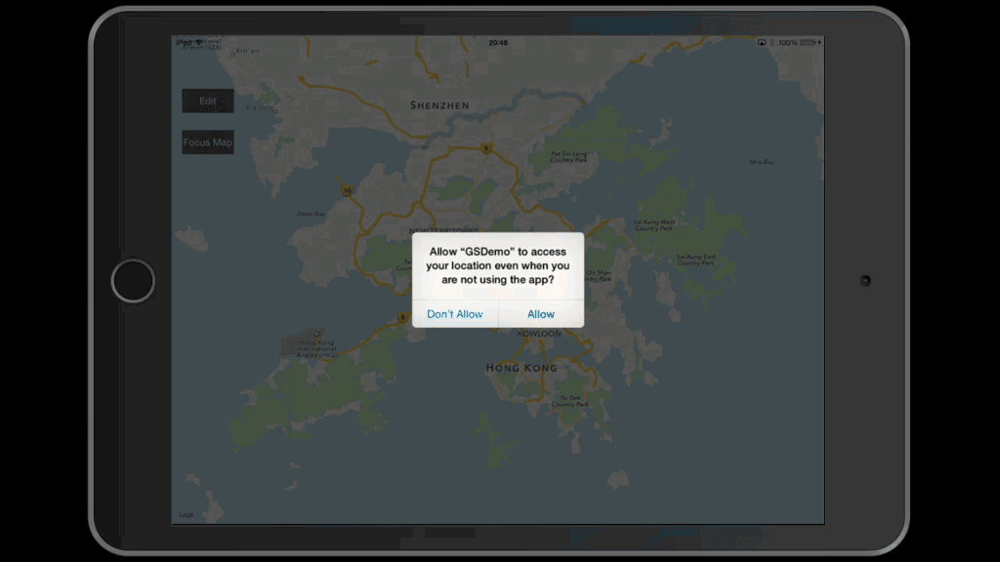

### 5. Show The Aircraft on Map View

Now, we can focus the mapView to our current location, which is a good start! However, let's do something more interesting. We're going to simulate the aircraft's GPS location using the DJI PC Simulator and show it on our map view.

You may know how to setup the DJI PC Simulator, and its basic usage. If you want to place the aircraft in your current GPS location on Map View, you can set the latitude and longitude values in the **Simulator Config** to yours. We take the simulator's initial values in the following example.

Let's come back to the code. Create a new subclass of **MKAnnotationView** named "DJIAircraftAnnotationView" and a new subclass of **NSObject** named **DJIAircraftAnnotation**. Below is the code:

- DJIAircraftAnnotationView.h

~~~objc
#import <MapKit/MapKit.h>

@interface DJIAircraftAnnotationView : MKAnnotationView

-(void) updateHeading:(float)heading;

@end
~~~

- DJIAircraftAnnotationView.m

~~~objc
#import "DJIAircraftAnnotationView.h"

@implementation DJIAircraftAnnotationView

- (instancetype)initWithAnnotation:(id <MKAnnotation>)annotation reuseIdentifier:(NSString *)reuseIdentifier
{
    self = [super initWithAnnotation:annotation reuseIdentifier:reuseIdentifier];
    if (self) {
        self.enabled = NO;
        self.draggable = NO;
        self.image = [UIImage imageNamed:@"aircraft.png"];
    }
    
    return self;
}

-(void) updateHeading:(float)heading
{
    self.transform = CGAffineTransformIdentity;
    self.transform = CGAffineTransformMakeRotation(heading);
}

@end

~~~

In the code above, we create a MKAnnotationView for the aircraft, add a method named **updateHeading** to change the aircraft's rotation, and set its image to "**aircraft.png**"(You can get the image from this tutorial's demo project.) in the init method. Also, we disable the DJIAircraftAnnotationView's draggable property. Take a look at the code below:

- DJIAircraftAnnotation.h

~~~objc
#import <MapKit/MapKit.h>
#import "DJIAircraftAnnotationView.h"

@interface DJIAircraftAnnotation : NSObject<MKAnnotation>

@property(nonatomic, readonly) CLLocationCoordinate2D coordinate;
@property(nonatomic, weak) DJIAircraftAnnotationView* annotationView;

-(id) initWithCoordiante:(CLLocationCoordinate2D)coordinate;

-(void)setCoordinate:(CLLocationCoordinate2D)newCoordinate;

-(void) updateHeading:(float)heading;

@end
~~~

- DJIAircraftAnnotation.m

~~~objc
#import "DJIAircraftAnnotation.h"

@implementation DJIAircraftAnnotation

-(id) initWithCoordiante:(CLLocationCoordinate2D)coordinate
{
    self = [super init];
    if (self) {
        _coordinate = coordinate;
    }   
    return self;
}

- (void)setCoordinate:(CLLocationCoordinate2D)newCoordinate
{
    _coordinate = newCoordinate;
}

-(void)updateHeading:(float)heading
{
    if (self.annotationView) {
        [self.annotationView updateHeading:heading];
    }
}
@end
~~~

The **DJIAircraftAnnotation** class implements the **MKAnnotation** protocol. It's used to store and update a CLLocationCoordinate2D property. Also, we can update DJIAircraftAnnotationView's heading with the **updateHeading** method.

Once you're done with that, open the **DJIMapController.h** file and import the **DJIAircraftAnnotation.h** file:

~~~objc
#import "DJIAircraftAnnotation.h"
~~~

Then create a property of an instance of DJIAircraftAnnotation and name it **aircraftAnnotation**. 

~~~objc
@property (nonatomic, strong) DJIAircraftAnnotation* aircraftAnnotation;
~~~

Furthermore, add two new methods to update the aircraft's location and it's heading on the map.

~~~objc
/**
 *  Update Aircraft's location in Map View
 */
-(void)updateAircraftLocation:(CLLocationCoordinate2D)location withMapView:(MKMapView *)mapView;

/**
 *  Update Aircraft's heading in Map View
 */
-(void)updateAircraftHeading:(float)heading;
~~~

Next, let's come back to the **DJIMapController.m** file and implement the two methods we just added:

~~~objc
-(void)updateAircraftLocation:(CLLocationCoordinate2D)location withMapView:(MKMapView *)mapView
{
    if (self.aircraftAnnotation == nil) {
        self.aircraftAnnotation = [[DJIAircraftAnnotation alloc] initWithCoordiante:location];
        [mapView addAnnotation:self.aircraftAnnotation];
    }
    
    [self.aircraftAnnotation setCoordinate:location];
}

-(void)updateAircraftHeading:(float)heading
{
    if (self.aircraftAnnotation) {
        [self.aircraftAnnotation updateHeading:heading];
    }
}
~~~

Also, since we don't want the **aircraftAnnotation** removed by the **cleanAllPointsWithMapView** method in the DJIMapController.m file, we need to modify it, as shown below:

~~~objc
- (void)cleanAllPointsWithMapView:(MKMapView *)mapView
{
    [_editPoints removeAllObjects];
    NSArray* annos = [NSArray arrayWithArray:mapView.annotations];
    for (int i = 0; i < annos.count; i++) {
        id<MKAnnotation> ann = [annos objectAtIndex:i];
        if (![ann isEqual:self.aircraftAnnotation]) {
            [mapView removeAnnotation:ann];
        }
       
    }   
}
~~~
We add an if statement to check if the annotation of the map view is equal to the **aircraftAnnotation** property, and if it is not, we remove it. By doing so, we can prevent the Aircraft's annotation from being removed.

To provide a better user experience, we need to add a status view on top of the mapView to show the aircraft's flight mode type, current GPS satellite count, vertical and horizontal flight speed and the flight altitude. Let's add the UI in **Main.storyboard**'s RootViewController Scene, as seen below:

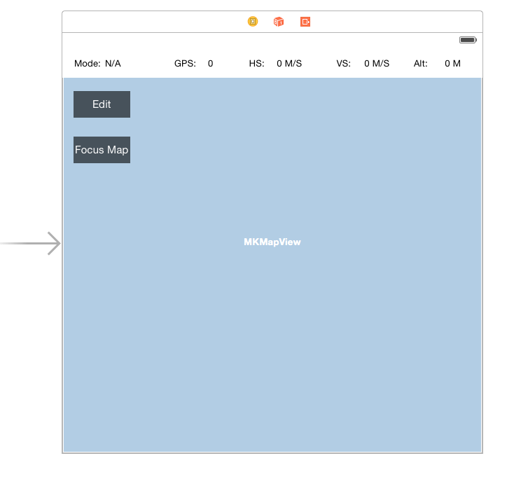

Once that's done, open **DJIRootViewController.h** file, create IBOutlets for the above UI elements and import DJISDK's header file and implement **DJIDroneDelegate** and **DJIMainControllerDelegate** protocols. Here we use Inspire 1 for the demo, so we need to create two properties, one of type **DJIDrone** and another of type **DJIInspireMainController**'s property. Also, we need to create a **CLLocationCoordinate2D** property named **droneLocation** to record the aircraft's location, as shown below:

~~~objc
#import <DJISDK/DJISDK.h>
@interface DJIRootViewController : UIViewController<MKMapViewDelegate, CLLocationManagerDelegate, DJIDroneDelegate, DJIMainControllerDelegate>

@property(nonatomic, strong) IBOutlet UILabel* modeLabel;
@property(nonatomic, strong) IBOutlet UILabel* gpsLabel;
@property(nonatomic, strong) IBOutlet UILabel* hsLabel;
@property(nonatomic, strong) IBOutlet UILabel* vsLabel;
@property(nonatomic, strong) IBOutlet UILabel* altitudeLabel;

@property(nonatomic, strong) DJIDrone* inspireDrone;
@property(nonatomic, strong) DJIInspireMainController* inspireMainController;
@property(nonatomic, assign) CLLocationCoordinate2D droneLocation;
~~~

Now, let's move on to the **DJIRootViewController.m** file and initialize the UI elements' values in a method called **initUI**. Also, add an **initDrone** method to initialize the properties for **inspireDrone**. Call the **initUI** and **initDrone** methods in the **viewDidLoad** method:

~~~objc

-(void) initUI
{
    self.modeLabel.text = @"N/A";
    self.gpsLabel.text = @"0";
    self.vsLabel.text = @"0.0 M/S";
    self.hsLabel.text = @"0.0 M/S";
    self.altitudeLabel.text = @"0 M";
}

- (void)initDrone
{
    self.inspireDrone = [[DJIDrone alloc] initWithType:DJIDrone_Inspire];
    self.inspireMainController = (DJIInspireMainController*)self.inspireDrone.mainController;
    self.inspireDrone.delegate = self;
    self.inspireMainController.mcDelegate = self;
}
~~~

The **DJIInspireMainController** subclass from **DJIMainController** is a mainController to control the aircraft and get the DJIMCSystemState during take off, landing, and etc. You can check its header file in the SDK for more info. In the **initDrone** method, we set **inspireDrone** and **inspireMainController** delegates as self.

Remember the **registerAppSuccess** method we've added previously? Let's have it look like this:

~~~objc
#pragma mark NSNotification Selector Method
- (void)registerAppSuccess:(NSNotification *)notification
{
    [self.inspireDrone connectToDrone];
    [self.inspireMainController startUpdateMCSystemState];
}
~~~

In the method above, when the app is registerd successfully, we can call DJIDrone's **connectToDrone** method to connect to the aircraft, and call **startUpdateMCSystemState** method to start updating the aircraft's system state, which is information we need to update our aircraft's location and heading. Moreover, in the **viewWillDisappear** method, we need to disconnect from the drone, as shown below:

~~~objc
- (void)viewWillDisappear:(BOOL)animated
{
    [super viewWillDisappear:animated];

    [self.locationManager stopUpdatingLocation];
    [self.inspireDrone disconnectToDrone];
}
~~~

In the **viewDidLoad** method, assign the **droneLocation** property's value as kCLLocationCoordinate2DInvalid. 

~~~objc
    self.droneLocation = kCLLocationCoordinate2DInvalid;
~~~

Also, update the **focusMapAction** method to set **droneLocation** as the center of the map view's region, as shown below:

~~~objc
- (IBAction)focusMapAction:(id)sender {

    if (CLLocationCoordinate2DIsValid(self.droneLocation)) {
        MKCoordinateRegion region = {0};
        region.center = self.droneLocation;
        region.span.latitudeDelta = 0.001;
        region.span.longitudeDelta = 0.001;
        [self.mapView setRegion:region animated:YES];
    }

}
~~~

Next, We need to modify the **MKMapViewDelegate** method to what is shown below. It will check the annotation variable's class and set its annotationView as a **DJIAircraftAnnotationView** Class type object:

~~~objc
- (MKAnnotationView *)mapView:(MKMapView *)mapView viewForAnnotation:(id <MKAnnotation>)annotation
{
    if ([annotation isKindOfClass:[MKPointAnnotation class]]) {
        MKPinAnnotationView* pinView = [[MKPinAnnotationView alloc] initWithAnnotation:annotation reuseIdentifier:@"Pin_Annotation"];
        pinView.pinColor = MKPinAnnotationColorPurple;
        return pinView;
        
    }else if ([annotation isKindOfClass:[DJIAircraftAnnotation class]])
    {
        DJIAircraftAnnotationView* annoView = [[DJIAircraftAnnotationView alloc] initWithAnnotation:annotation reuseIdentifier:@"Aircraft_Annotation"];
        ((DJIAircraftAnnotation*)annotation).annotationView = annoView;
        return annoView;
    }
    
    return nil;
}
~~~

Furthermore, let's implement the **DJIMainControllerDelegate** method:

~~~objc
#pragma mark - DJIMainControllerDelegate Method

-(void) mainController:(DJIMainController*)mc didUpdateSystemState:(DJIMCSystemState*)state
{
    self.droneLocation = state.droneLocation;
    DJIInspireMCSystemState* inspireState = (DJIInspireMCSystemState*)state;
    if (!inspireState.canIOCWork) {
        [self.inspireMainController setFlightModeSwitchable:YES withResult:nil];
    }
    if (inspireState.isIOCWorking) {
        [self.inspireMainController setIOCWorking:NO withResult:nil];
    }
    
     self.modeLabel.text = inspireState.flightModeString;
    self.gpsLabel.text = [NSString stringWithFormat:@"%d", inspireState.satelliteCount];
    self.vsLabel.text = [NSString stringWithFormat:@"%0.1f M/S",inspireState.velocityZ];
    self.hsLabel.text = [NSString stringWithFormat:@"%0.1f M/S",(sqrtf(inspireState.velocityX*inspireState.velocityX + inspireState.velocityY*inspireState.velocityY))];
    self.altitudeLabel.text = [NSString stringWithFormat:@"%0.1f M",inspireState.altitude];
        
    [self.mapController updateAircraftLocation:self.droneLocation withMapView:self.mapView];
    double radianYaw = (state.attitude.yaw * M_PI / 180.0);
    [self.mapController updateAircraftHeading:radianYaw];
    
}
~~~

First, it will update the **droneLocation** with the aircraft's current location. Then, it will disable the inspireMainController's IOC function.

***
**Important**: Since there are conflicts between DJI Mobile SDK's GroundStation and IOC, you cannot use them at the same time. Please make sure to close the IOC feature before using GroundStation. Otherwise, you will run into errors.
***

Next, update the text for the status labels from the DJIMCSystemState. Furthermore, update the aircraft's location and heading by calling the related methods from **DJIMapController**.

Finally, let's implement the DJIDroneDelegate Method, as shown below:

~~~objc
#pragma mark - DJIDroneDelegate Method
-(void) droneOnConnectionStatusChanged:(DJIConnectionStatus)status
{
    if (status == ConnectionSuccessed) {
        [self.inspireMainController enterNavigationModeWithResult:^(DJIError *error) {
            if (error.errorCode != ERR_Successed) {
                NSString* message = [NSString stringWithFormat:@"Enter navigation mode failed:%@", error.errorDescription];
                UIAlertView* alertView = [[UIAlertView alloc] initWithTitle:@"Enter Navigation Mode" message:message delegate:self cancelButtonTitle:@"Cancel" otherButtonTitles:@"Retry", nil];
                alertView.tag = kEnterNaviModeFailedAlertTag;
                [alertView show];
            }
        }];
    }
    
}
~~~

If it succeeds to connect to the aircraft, call **DJIInspireMainController**'s **enterNavigationModeWithResult** method to check if the aircraft entered navigation mode successfully. If not, just show a UIAlertView to the user. We need to implement UIAlertView's delegate method as shown below:

~~~objc
#pragma mark - UIAlertViewDelegate

- (void)alertView:(UIAlertView *)alertView clickedButtonAtIndex:(NSInteger)buttonIndex
{
    if (alertView.tag == 1002) {
        if (buttonIndex == 1) {
            [self.inspireMainController enterNavigationModeWithResult:^(DJIError *error) {
                if (error.errorCode != ERR_Successed) {
                    NSString* message = [NSString stringWithFormat:@"Enter navigation mode failed:%@", error.errorDescription];
                    UIAlertView* alertView = [[UIAlertView alloc] initWithTitle:@"Enter Navigation Mode" message:message delegate:self cancelButtonTitle:@"Cancel" otherButtonTitles:@"Retry", nil];
                    alertView.tag = kEnterNaviModeFailedAlertTag;
                    [alertView show];
                }
            }];
        }
    }
}
~~~

Let's test the application! 
Build and run the project to install the app onto your mobile device. After that, please connect the aircraft to your PC or Virtual Machine running Windows via a Micro USB cable, and then power on the aircraft and the remote controller. Click Display Simulator. You can type in your current location's latitude and longitude data in the Simulator Config, if you would like. 

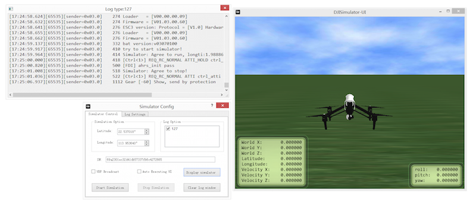

Then, run the app and connect your mobile device to the remote controller using Apple's lighting cable. You may see the following screenshot:

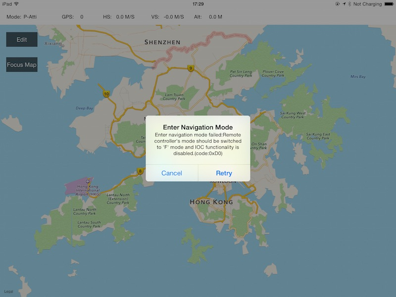

**Important**: To fix this problem, please switch the Remote Controller's mode selection to the **F** position (which used to be the A position in the previous version) and press **Retry** button. If the mode selection bar is in the F position when the autopilot is powered on, the user must toggle back and forth between **F** and another position and then press the **Retry** button again.

You are required to be in the **F** position when using the Ground Station, Hotpoint and Joystick functions in the DJI Mobile SDK.

Next, let's go to the DJI PC Simulator on your PC and press the **Start Simulation** button. If you check the application now, a tiny red aircraft will be shown on the map as seen below:

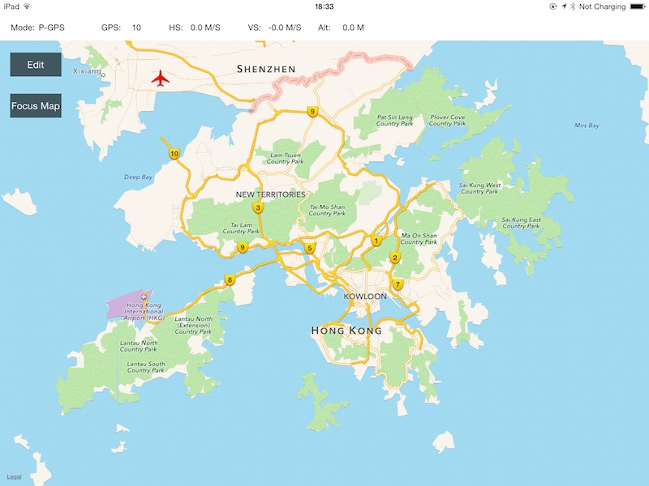

If you cannot find the aircraft, press the "**Focus Map**" button and the map view will zoom in to center the aircraft on the center of the map view region as shown below:

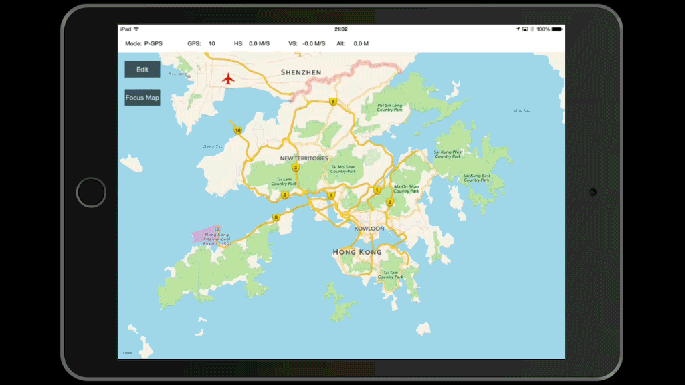

Now, if you press the **Stop Simulation** button on the Simulator Config, the aircraft will disappear on the map, since the simulator stops providing GPS data to the aircraft.

## Refactor the UI

As you seen, the project's code structure was simple and not robust. In order to develop it further in this tutorial, it will need to be refactored and we will need to add more UI elements. 

### 1. Add & Handle The New UIButtons
First, we will create a new file named **DJIGSButtonController**, which will be subclass of **UIViewController**. Make sure the check box saying **Also create XIB file** is selected when creating the file. Then open the **DJIGSButtonController.xib** file and set its size to **Freeform** under the **Size** dropdown in the **Simulated Metrics** section. In the view section, change the width to **110** and height to **260**. Take a look at the changes made below:

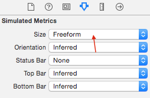
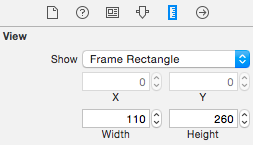

Next, drag six UIButtons to the view and change their names to **Edit**, **Back**, **Clear**, **Focus Map**, **Start** and **Stop**. **Edit** will sit on top of **Back**, and **Focus Map** will sit on top of **Clear**. Make sure to hide the **Back**, **Clear**, **Start** and **Stop** buttons.

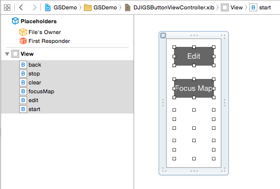

 Then add IBOutlets and IBActions for each of the six buttons in the **DJIGSButtonViewController.h** file. Also, we will add an Enum named **DJIGSViewMode** with the two different modes the application could be in. Next, we add serveral delegate methods to be implemented by the delegate viewcontroller when IBAction methods for the buttons are trigger. Lastly, add the method **- (void)switchToMode:(DJIGSViewMode)mode inGSButtonVC:(DJIGSButtonViewController *)GSBtnVC;** to update the state of the buttons when the **DJIGSViewMode** changed. Take a look at the code below:
 
 ~~~objc
 #import <UIKit/UIKit.h>
 
 typedef NS_ENUM(NSUInteger, DJIGSViewMode) {
    DJIGSViewMode_ViewMode,
    DJIGSViewMode_EditMode,
};

@class DJIGSButtonViewController;

@protocol DJIGSButtonViewControllerDelegate <NSObject>

- (void)stopBtnActionInGSButtonVC:(DJIGSButtonViewController *)GSBtnVC;
- (void)clearBtnActionInGSButtonVC:(DJIGSButtonViewController *)GSBtnVC;
- (void)focusMapBtnActionInGSButtonVC:(DJIGSButtonViewController *)GSBtnVC;
- (void)startBtnActionInGSButtonVC:(DJIGSButtonViewController *)GSBtnVC;

- (void)switchToMode:(DJIGSViewMode)mode inGSButtonVC:(DJIGSButtonViewController *)GSBtnVC;
@end

@interface DJIGSButtonViewController : UIViewController

@property (weak, nonatomic) IBOutlet UIButton *backBtn;
@property (weak, nonatomic) IBOutlet UIButton *stopBtn;
@property (weak, nonatomic) IBOutlet UIButton *clearBtn;
@property (weak, nonatomic) IBOutlet UIButton *focusMapBtn;
@property (weak, nonatomic) IBOutlet UIButton *editBtn;
@property (weak, nonatomic) IBOutlet UIButton *startBtn;

@property (assign, nonatomic) DJIGSViewMode mode;
@property (weak, nonatomic) id <DJIGSButtonViewControllerDelegate> delegate;

- (IBAction)backBtnAction:(id)sender;
- (IBAction)stopBtnAction:(id)sender;
- (IBAction)clearBtnAction:(id)sender;
- (IBAction)focusMapBtnAction:(id)sender;
- (IBAction)editBtnAction:(id)sender;
- (IBAction)startBtnAction:(id)sender;

@end
 ~~~
 
 Once you've taken care of that, open the **DJIGSButtonViewController.m** file to replace all the code in the file with the following code:
 
 ~~~objc
 #import "DJIGSButtonViewController.h"

@implementation DJIGSButtonViewController

- (void)viewDidLoad {
    [super viewDidLoad];
    [self setMode:DJIGSViewMode_ViewMode];
}

- (void)didReceiveMemoryWarning {
    [super didReceiveMemoryWarning];
    // Dispose of any resources that can be recreated.
}

#pragma mark - Property Method
- (void)setMode:(DJIGSViewMode)mode
{
    _mode = mode;
    [_editBtn setHidden:(mode == DJIGSViewMode_EditMode)];
    [_focusMapBtn setHidden:(mode == DJIGSViewMode_EditMode)];
    [_backBtn setHidden:(mode == DJIGSViewMode_ViewMode)];
    [_clearBtn setHidden:(mode == DJIGSViewMode_ViewMode)];
    [_startBtn setHidden:(mode == DJIGSViewMode_ViewMode)];
    [_stopBtn setHidden:(mode == DJIGSViewMode_ViewMode)];
}

#pragma mark - IBAction Methods
- (IBAction)backBtnAction:(id)sender {
    [self setMode:DJIGSViewMode_ViewMode];
    if ([_delegate respondsToSelector:@selector(switchToMode:inGSButtonVC:)]) {
        [_delegate switchToMode:self.mode inGSButtonVC:self];
    }
}

- (IBAction)stopBtnAction:(id)sender {
 
    if ([_delegate respondsToSelector:@selector(stopBtnActionInGSButtonVC:)]) {
        [_delegate stopBtnActionInGSButtonVC:self];
    }
}

- (IBAction)clearBtnAction:(id)sender {
    
    if ([_delegate respondsToSelector:@selector(clearBtnActionInGSButtonVC:)]) {
        [_delegate clearBtnActionInGSButtonVC:self];
    }
}

- (IBAction)focusMapBtnAction:(id)sender {
    
    if ([_delegate respondsToSelector:@selector(focusMapBtnActionInGSButtonVC:)]) {
        [_delegate focusMapBtnActionInGSButtonVC:self];
    }
}

- (IBAction)editBtnAction:(id)sender {
    
    [self setMode:DJIGSViewMode_EditMode];
    if ([_delegate respondsToSelector:@selector(switchToMode:inGSButtonVC:)]) {
        [_delegate switchToMode:self.mode inGSButtonVC:self];
    }
}

- (IBAction)startBtnAction:(id)sender {
    
    if ([_delegate respondsToSelector:@selector(startBtnActionInGSButtonVC:)]) {
        [_delegate startBtnActionInGSButtonVC:self];
    }
}

@end
 ~~~
 
 With those changes, the code structure will look cleaner and more robust, which will help in its maintainence later on.
 
 Now, let's go to the **DJIRootViewController.h** file and delete the **editButton** IBOutlet, the **resetPointsAction** method, and the **focusMapAction** method. After making those deletions, create an UIView IBOutlet named "topBarView" and link it to the **Main.storyboard**'s RootViewController's  view, as seen below:
 
 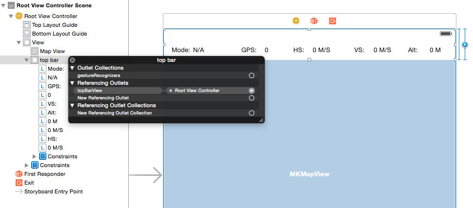
 
 Then, open the **DJIRootViewController.m** file, import the **DJIGSButtonViewController.h** header file. Create a property of type **DJIGSButtonViewController** named **gsButtonVC** and implement **DJIGSButtonViewController**'s **DJIGSButtonViewControllerDelegate** protocol within the class, as shown below:
 
~~~objc
#import "DJIRootViewController.h"
#import "DJIGSButtonViewController.h"

#define kEnterNaviModeFailedAlertTag 1001

@interface DJIRootViewController ()<DJIGSButtonViewControllerDelegate>
@property (nonatomic, assign)BOOL isEditingPoints;
@property (nonatomic, strong)DJIGSButtonViewController *gsButtonVC;
@end
~~~

Furthermore, initialize the **gsButtonVC** property in the **initUI** method and move the original **focusMapAction** method's content to a new method named **focusMap**, as shown below:

~~~objc
self.gsButtonVC = [[DJIGSButtonViewController alloc] initWithNibName:@"DJIGSButtonViewController" bundle:[NSBundle mainBundle]];
[self.gsButtonVC.view setFrame:CGRectMake(0, self.topBarView.frame.origin.y + self.topBarView.frame.size.height, self.gsButtonVC.view.frame.size.width, self.gsButtonVC.view.frame.size.height)];
self.gsButtonVC.delegate = self;
[self.view addSubview:self.gsButtonVC.view];
~~~

~~~objc
- (void)focusMap
{
    if (CLLocationCoordinate2DIsValid(self.droneLocation)) {
        MKCoordinateRegion region = {0};
        region.center = self.droneLocation;
        region.span.latitudeDelta = 0.001;
        region.span.longitudeDelta = 0.001;
        
        [self.mapView setRegion:region animated:YES];
    }
}
~~~

Finally, implement **DJIGSButtonViewController**'s delegate methods, as shown below:

~~~objc
#pragma mark - DJIGSButtonViewController Delegate Methods
- (void)stopBtnActionInGSButtonVC:(DJIGSButtonViewController *)GSBtnVC
{
}

- (void)clearBtnActionInGSButtonVC:(DJIGSButtonViewController *)GSBtnVC
{
    [self.mapController cleanAllPointsWithMapView:self.mapView];
}

- (void)focusMapBtnActionInGSButtonVC:(DJIGSButtonViewController *)GSBtnVC
{
    [self focusMap];
}

- (void)startBtnActionInGSButtonVC:(DJIGSButtonViewController *)GSBtnVC
{
}

- (void)switchToMode:(DJIGSViewMode)mode inGSButtonVC:(DJIGSButtonViewController *)GSBtnVC
{
    if (mode == DJIGSViewMode_EditMode) {
         self.isEditingPoints = YES;
        [self focusMap];
    }else
    {
         self.isEditingPoints = No;
    }
}
~~~

In the **- (void)switchToMode:(DJIGSViewMode)mode inGSButtonVC:(DJIGSButtonViewController *)GSBtnVC** delegate method, we call the **focusMap** method. By doing this, we can focus the map view to the aircraft's location when the edit button is pressed, making it user friendly by preventing the user from having to zoom in to edit. Moreover, when the application is in edit mode, the  **isEditingPoints** property value is set to **YES**. 

Now, let's build and run the project and try to press the **Edit** and **Back** Buttons. Here are the animation when you press them:

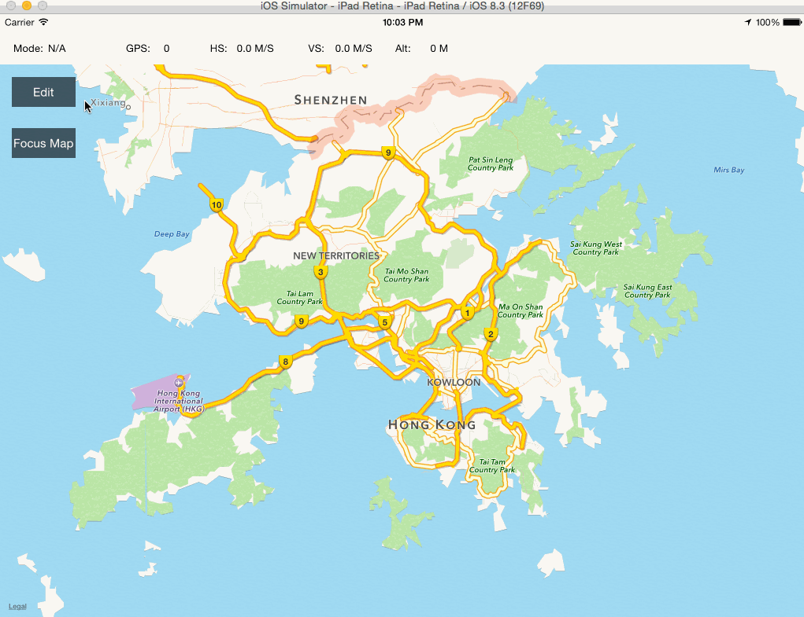

## Configure the Navigation Task

### 1. DJIGroundStationWaypoint

Let's go to **DJIGroundStationWaypoint.h** file and check it out. For example, you can use: 

~~~objc
-(id) initWithCoordinate:(CLLocationCoordinate2D)coordinate;
~~~
to create a waypoint object with a specific coordinate. Once you create a waypoint, you can add a **DJIWaypointAction** to it by calling:

~~~objc
-(BOOL) addWaypointAction:(DJIWaypointAction*)action;
~~~

Moreover, with waypoints, you have the ability to set the coordinate, altitude, heading, horizontalVelocity and much more. For more details, please check the **DJIGroundStationWaypoint.h** header file.

### 2. DJIGroundStationTask

A **DJIGroundStationTask** is used when you want to start a GroundStation Waypoint task. You can call its class method **+(id) newTask;** directly to create a new task. Once you create the task, you can add waypoints of type **DJIGroundStationWaypoint** using the method: 

~~~objc
-(void) addWaypoint:(DJIGroundStationWaypoint*)waypoint;
~~~

On the contrary, you can also delete waypoints from a task by using the method: 

~~~objc
-(void) removeWaypoint:(DJIGroundStationWaypoint*)waypoint;
~~~
 method.
 
 Moreover, you can set the **isLoop** property of a **DJIGroundStationTask** to decide whether to execute the task looply. Also, you can set the **finishedAction** property which is of **DJIGSTaskFinishedAction** enum type to configure what the aircraft does when the task is finished. Finally, you can set the **headingMode** property which is a **DJIGSHeadingMode** enum type to configure what the aircraft's heading is while executing a task. Below, you can find some parts of the header file:
 
~~~objc
/**
 *  Action of task when finished
 */
typedef NS_ENUM(NSUInteger, DJIGSTaskFinishedAction){
    /**
     *  No action. aircraft will stay at the last waypoint
     */
    GSTaskFinishedNoAction,
    /**
     *  Aircraft will go home
     */
    GSTaskFinishedGoHome,
    /**
     *  Aircraft will auto landing
     */
    GSTaskFinishedAutoLanding,
    /**
     *  Aircraft will go to the first waypoint
     */
    GSTaskFinishedGoFirstWaypoint
};

/**
 *  Heading mode
 */
typedef NS_ENUM(NSUInteger, DJIGSHeadingMode){
    /**
     *  Aircraft's heading toward to the next waypoint
     */
    GSHeadingTowardNexWaypoint,
    /**
     *  Aircraft's heading using the initial direction
     */
    GSHeadingUsingInitialDirection,
    /**
     *  Aircraft's heading control by the remote controller
     */
    GSHeadingControlByRemoteController,
    /**
     *  Aircraft's heading using the waypoint's heading value
     */
    GSHeadingUsingWaypointHeading,
};

/**
 *  Whether execute task looply. Default is NO
 */
@property(nonatomic, assign) BOOL isLoop;

/**
 *  Action for the aircraft while the task finished
 */
@property(nonatomic, assign) DJIGSTaskFinishedAction finishedAction;

/**
 *  How the aircraft heading while executing task
 */
@property(nonatomic, assign) DJIGSHeadingMode headingMode;

/**
 *  Create new task
 *
 */
+(id) newTask;

/**
 *  Add waypoint
 *
 *  @param waypoint
 */
-(void) addWaypoint:(DJIGroundStationWaypoint*)waypoint;

/**
 *  Remove one waypoint
 *
 *  @param waypoint Waypoint will be removed
 */
-(void) removeWaypoint:(DJIGroundStationWaypoint*)waypoint;

~~~
 
For more details, please check the **DJIGroundStationTask.h** header file in the DJI Mobile SDK.

### 3. Create The DJIWaypointConfigViewController

For this demo, we will assume that the parameters of each waypoint being added to the map view are the same. 

Now, let's create a new ViewController that will let the user to set the parameters of waypoints. Go to Xcode’s project navigator, right click on the **GSDemo** folder, select **New File...**, set its subclass to **UIViewController**, named it **DJIWaypointConfigViewController**, and make sure "Also create XIB file" is selected. Next, open the **DJIWaypointConfigViewController.xib** file and implement the UI, as you see it below:

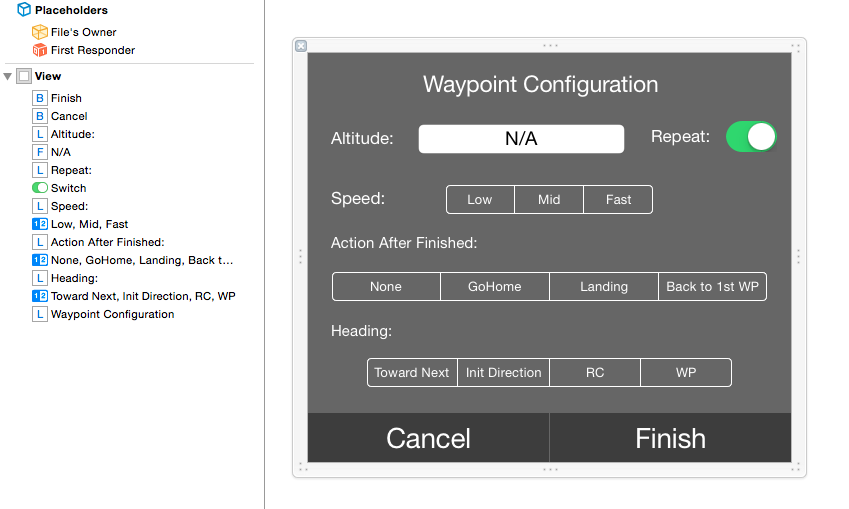

In the Waypoint Configuration ViewController, we use a UITextField to let the user set the **altitude** property of a **DJIGroundStationWaypoint** object. Then, there is a UISwitcher to configure the **isLoop** property of a **DJIGroundStationTask** object, which will let you turn on/off whether the task repeats. Next, there are three UISegmentedControls to configure the **horizontalVelocity** property of a **DJIGroundStationWaypoint** object, the **finishedAction** property of a **DJIGroundStationTask** object, and the **headingMode** property of a **DJIGroundStationTask** object. 

At the bottom, we add two UIButtons for the **Cancel** and **Finish** actions. For more details about the settings, such as frame's position, frame's size, and background color of each UI element, please check the **DJIWaypointConfigViewController.xib** file in the downloaded project source code.

Now, let's create IBOutlets and IBActions for each of the UI elements in the **DJIWaypointConfigViewController.h** file, as shown below:

~~~objc
#import <UIKit/UIKit.h>

@class DJIWaypointConfigViewController;

@protocol DJIWaypointConfigViewControllerDelegate <NSObject>

- (void)cancelBtnActionInDJIWaypointConfigViewController:(DJIWaypointConfigViewController *)waypointConfigVC;
- (void)finishBtnActionInDJIWaypointConfigViewController:(DJIWaypointConfigViewController *)waypointConfigVC;

@end

@interface DJIWaypointConfigViewController : UIViewController

@property (weak, nonatomic) IBOutlet UITextField *altitudeTextField;
@property (weak, nonatomic) IBOutlet UISwitch *repeatSwitcher;
@property (weak, nonatomic) IBOutlet UISegmentedControl *speedSegmentedControl;
@property (weak, nonatomic) IBOutlet UISegmentedControl *actionSegmentedControl;
@property (weak, nonatomic) IBOutlet UISegmentedControl *headingSegmentedControl;

@property (weak, nonatomic) id <DJIWaypointConfigViewControllerDelegate>delegate;

- (IBAction)cancelBtnAction:(id)sender;
- (IBAction)finishBtnAction:(id)sender;

@end
~~~

Here, we also create two **DJIWaypointConfigViewControllerDelegate** delegate methods that are called when **Cancel** and **Finish** buttons are pressed.

Next, let's replace the code in the ** DJIWaypointConfigViewController.m** file with the following code:

~~~objc
#import "DJIWaypointConfigViewController.h"

@interface DJIWaypointConfigViewController ()

@end

@implementation DJIWaypointConfigViewController

- (void)viewDidLoad {
    [super viewDidLoad];

    [self initUI];   
}

- (void)didReceiveMemoryWarning {
    [super didReceiveMemoryWarning];
    // Dispose of any resources that can be recreated.
}

- (void)initUI
{
    self.altitudeTextField.text = @"50";
    [self.repeatSwitcher setOn:NO animated:YES]; //Turn off it to cancel execute GroundStation Task looply
    [self.speedSegmentedControl setSelectedSegmentIndex:1]; //Set the horizontal speed to Mid
    [self.actionSegmentedControl setSelectedSegmentIndex:1]; //Set the finishAction to GSTaskFinishedGoHome
    [self.headingSegmentedControl setSelectedSegmentIndex:0]; //Set the headingMode to GSHeadingTowardNexWaypoint
    
}

- (IBAction)cancelBtnAction:(id)sender {
 
    if ([_delegate respondsToSelector:@selector(cancelBtnActionInDJIWaypointConfigViewController:)]) {
        [_delegate cancelBtnActionInDJIWaypointConfigViewController:self];
    }
}

- (IBAction)finishBtnAction:(id)sender {
    
    if ([_delegate respondsToSelector:@selector(finishBtnActionInDJIWaypointConfigViewController:)]) {
        [_delegate finishBtnActionInDJIWaypointConfigViewController:self];
    }
}

@end
~~~

In the code above, we create an **initUI** method, which is called in the **viewDidload** method, to initialize the UI controls with some default data. For example, we set the default text for the **altitudeTextField** to **50**, so there is no need for the user to type in a custom altitude value in the textField when the application is first opened. They will be able to press the **Finish** button right away instead of having to change the settings before they start.

## Setup The GroundStation Task

### 1. Add The DJIWaypointConfigViewController to DJIRootViewController
Now,let's go to **DJIRootViewController.m** file, add the **DJIWaypointConfigViewController.h** header file at the top, and create a property of type **DJIWaypointConfigViewController** with the name **waypointConfigVC**. Then, implement the **DJIWaypointConfigViewControllerDelegate** protocol, as shown below:

~~~objc
#import "DJIRootViewController.h"
#import "DJIGSButtonViewController.h"
#import "DJIWaypointConfigViewController.h"

#define kEnterNaviModeFailedAlertTag 1001

@interface DJIRootViewController ()<DJIGSButtonViewControllerDelegate, DJIWaypointConfigViewControllerDelegate>
@property (nonatomic, assign)BOOL isEditingPoints;
@property (nonatomic, strong)DJIGSButtonViewController *gsButtonVC;
@property (nonatomic, strong)DJIWaypointConfigViewController *waypointConfigVC;
@end
~~~

Next, let's add some code to initialize the **waypointConfigVC** instance variable and set its delegate as **DJIRootViewController** at the bottom of the **initUI** method:

~~~objc
-(void) initUI
{
    self.modeLabel.text = @"N/A";
    self.gpsLabel.text = @"0";
    self.vsLabel.text = @"0.0 M/S";
    self.hsLabel.text = @"0.0 M/S";
    self.altitudeLabel.text = @"0 M";
    
    self.gsButtonVC = [[DJIGSButtonViewController alloc] initWithNibName:@"DJIGSButtonViewController" bundle:[NSBundle mainBundle]];
    [self.gsButtonVC.view setFrame:CGRectMake(0, self.topBarView.frame.origin.y + self.topBarView.frame.size.height, self.gsButtonVC.view.frame.size.width, self.gsButtonVC.view.frame.size.height)];
    self.gsButtonVC.delegate = self;
    [self.view addSubview:self.gsButtonVC.view];
    
    self.waypointConfigVC = [[DJIWaypointConfigViewController alloc] initWithNibName:@"DJIWaypointConfigViewController" bundle:[NSBundle mainBundle]];
    self.waypointConfigVC.view.alpha = 0;
    self.waypointConfigVC.view.center = self.view.center;
    self.waypointConfigVC.delegate = self;
    [self.view addSubview:self.waypointConfigVC.view];
    
}
~~~

In the code above, we set the **alpha** property of the **waypointConfigVC**'s view to 0 to initially hide the view. Then, center its location to the center of **DJIRootViewController**'s view.

Furthermore, implement the **DJIWaypointConfigViewControllerDelegate** methods, as shown below:

~~~objc
#pragma mark - DJIWaypointConfigViewControllerDelegate Methods

- (void)cancelBtnActionInDJIWaypointConfigViewController:(DJIWaypointConfigViewController *)waypointConfigVC
{
    __weak DJIRootViewController *weakSelf = self;
    
    [UIView animateWithDuration:0.25 animations:^{
        weakSelf.waypointConfigVC.view.alpha = 0;
    }];
}

- (void)finishBtnActionInDJIWaypointConfigViewController:(DJIWaypointConfigViewController *)waypointConfigVC
{
    __weak DJIRootViewController *weakSelf = self;
    
    [UIView animateWithDuration:0.25 animations:^{
        weakSelf.waypointConfigVC.view.alpha = 0;
    }];

}
~~~

In the first delegate method, we use a class method from UIView to animate the changing **alpha** value of **waypointConfigVC**'s view:

~~~objc
+ (void)animateWithDuration:(NSTimeInterval)duration animations:(void (^)(void))animations NS_AVAILABLE_IOS(4_0);
~~~

In the second delegate method, we do the same thing as we did in the first delegate method.

Lastly, replace the code in the

~~~objc
- (void)startBtnActionInGSButtonVC:(DJIGSButtonViewController *)GSBtnVC;
~~~
method with the following code to show the **waypointConfigVC**'s view when the user presses the **start** button:

~~~objc
- (void)startBtnActionInGSButtonVC:(DJIGSButtonViewController *)GSBtnVC
{
    __weak DJIRootViewController *weakSelf = self;

    [UIView animateWithDuration:0.25 animations:^{
        weakSelf.waypointConfigVC.view.alpha = 1.0;
    }];
        
}
~~~

Once that's done, let's build and run the project. Try to show the **waypointConfigVC**'s view by pressing the **Edit** button and **Start** button:

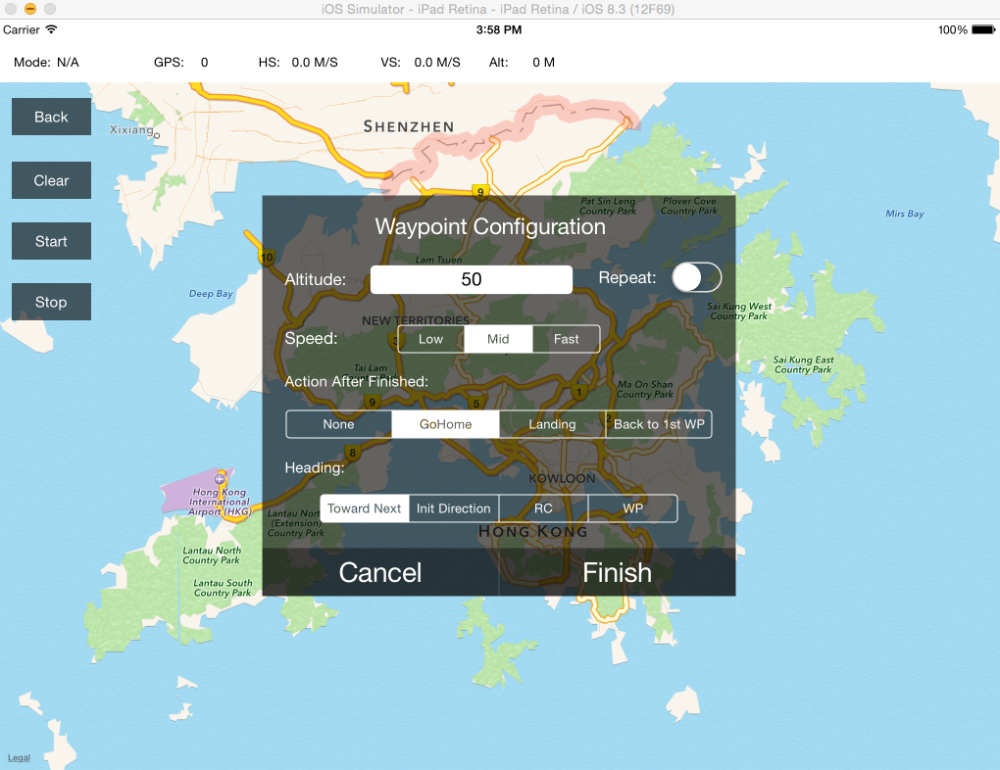

### 2. Handle The GroundStation Task

Now let's go back to **DJIRootViewController.h** file. First, implement the **GroundStationDelegate** and **DJINavigationDelegate** protocols in the interface. Then, create a property of type **DJIGroundStationTask** and named it as **gsTask**. Also, create a property of type **UIAlertView** and named it **uploadProgressView**. The UIAlertView will be used to show the status of GroundStation task. The complete header file of **DJIRootViewController** will look as shown below:

~~~objc
#import <UIKit/UIKit.h>
#import <DJISDK/DJISDK.h>
#import "DJIMapController.h"
#import <MapKit/MapKit.h>
#import <CoreLocation/CoreLocation.h>

@interface DJIRootViewController : UIViewController<MKMapViewDelegate, CLLocationManagerDelegate, DJIDroneDelegate, DJIMainControllerDelegate, GroundStationDelegate, DJINavigationDelegate>

@property (nonatomic, strong) DJIMapController *mapController;
@property (weak, nonatomic) IBOutlet MKMapView *mapView;
@property(nonatomic, strong) CLLocationManager* locationManager;
@property(nonatomic, assign) CLLocationCoordinate2D userLocation;
@property(nonatomic, assign) CLLocationCoordinate2D droneLocation;
@property (nonatomic, strong) UITapGestureRecognizer *tapGesture;

@property (weak, nonatomic) IBOutlet UIView *topBarView;

@property(nonatomic, strong) IBOutlet UILabel* modeLabel;
@property(nonatomic, strong) IBOutlet UILabel* gpsLabel;
@property(nonatomic, strong) IBOutlet UILabel* hsLabel;
@property(nonatomic, strong) IBOutlet UILabel* vsLabel;
@property(nonatomic, strong) IBOutlet UILabel* altitudeLabel;

@property(nonatomic, strong) DJIDrone* inspireDrone;
@property(nonatomic, strong) DJIInspireMainController* inspireMainController;

@property(nonatomic, strong) DJIGroundStationTask* gsTask;
@property(nonatomic, strong) UIAlertView* uploadProgressView;

@end
~~~

Next, go to **DJIRootViewController.m** file and set **inspireMainController** instance variable's **groundStationDelegate** and **navigationDelegate** to **DJIRootViewController** as shown below:

~~~objc
- (void)initDrone
{
    self.inspireDrone = [[DJIDrone alloc] initWithType:DJIDrone_Inspire];
    self.inspireMainController = (DJIInspireMainController*)self.inspireDrone.mainController;
    self.inspireDrone.delegate = self;
    self.inspireMainController.mcDelegate = self;
    self.inspireMainController.groundStationDelegate = self;
    self.inspireMainController.navigationDelegate = self;
}
~~~

Moreover, add the following code to the bottom of the **startBtnActionInGSButtonVC** delegate method:

~~~objc
- (void)startBtnActionInGSButtonVC:(DJIGSButtonViewController *)GSBtnVC
{
    __weak DJIRootViewController *weakSelf = self;

    [UIView animateWithDuration:0.25 animations:^{
        weakSelf.waypointConfigVC.view.alpha = 1.0;
    }];
    
    NSArray* wayPoints = self.mapController.wayPoints;
    if (wayPoints == nil || wayPoints.count == 0) {
        UIAlertView *alert = [[UIAlertView alloc] initWithTitle:@"No waypoint for mission" message:@"" delegate:self cancelButtonTitle:@"OK" otherButtonTitles:nil];
        [alert show];
        return;
    }

    self.gsTask = [DJIGroundStationTask newTask];
    for (int i = 0; i < wayPoints.count; i++) {
        CLLocation* location = [wayPoints objectAtIndex:i];
        if (CLLocationCoordinate2DIsValid(location.coordinate)) {
            DJIGroundStationWaypoint* waypoint = [[DJIGroundStationWaypoint alloc] initWithCoordinate:location.coordinate];
            [self.gsTask addWaypoint:waypoint];
        }
    }
    
}
~~~

In the code being added above, we create a local **NSArray** variable named **wayPoints** and assign its value as the **mapController**'s **wayPoints** array. Next, check whether or not the array exists or whether or not it's empty. If it is empty or does not exist, show a UIAlertView letting the user know there are no waypoints for the mission. 

**Important**: For safety, it's important to add logic to check the GPS satellite count, which was discussed in Part 1 of this tutorial, before the start of the mission. If the satellite count is less than 6, you should prevent the user from starting the ground station mission and show a warning. Since we are using the DJI PC Simulator here, we are testing the application under a perfect situation, where the GPS satellite count is always 10.

Next, we initialize the **gsTask** instance variable by calling the **newTask** class method of **DJIGroundStationTask**. Furthermore, we use a for loop to get the **CLLocation** for each waypoint from the **wayPoints** array and check if its **coordinate** is valid by using the method:

~~~objc
BOOL CLLocationCoordinate2DIsValid(CLLocationCoordinate2D coord);
~~~

Finally, if the coordinate is valid, we create a waypoint of type **DJIGroundStationWaypoint** and add it to the **gsTask** by calling the method:

~~~objc
-(void) addWaypoint:(DJIGroundStationWaypoint*)waypoint;
~~~

Once that is complete, let's go to DJIWaypointConfigViewController's delegate method **finishBtnActionInDJIWaypointConfigViewController** and add the following code related to **gsTask** at the bottom of the method, as shown below:

~~~objc
- (void)finishBtnActionInDJIWaypointConfigViewController:(DJIWaypointConfigViewController *)waypointConfigVC
{
    __weak DJIRootViewController *weakSelf = self;
    
    [UIView animateWithDuration:0.25 animations:^{
        weakSelf.waypointConfigVC.view.alpha = 0;
    }];
    
    for (int i = 0; i < self.gsTask.waypointCount; i++) {
        DJIGroundStationWaypoint* waypoint = [self.gsTask waypointAtIndex:i];
        waypoint.altitude = [self.waypointConfigVC.altitudeTextField.text floatValue];
        waypoint.horizontalVelocity = self.waypointConfigVC.speedSegmentedControl.selectedSegmentIndex * 3 + 3;
    }
    
    self.gsTask.isLoop = self.waypointConfigVC.repeatSwitcher.isOn;
    self.gsTask.headingMode = (DJIGSHeadingMode)self.waypointConfigVC.headingSegmentedControl.selectedSegmentIndex;
    self.gsTask.finishedAction = (DJIGSTaskFinishedAction)self.waypointConfigVC.actionSegmentedControl.selectedSegmentIndex;
    
    [self.inspireMainController uploadGroundStationTask:self.gsTask];
}
~~~

Above, we use a for loop to set the **altitude** and **horizontalVelocity** properties of each **DJIGroundStationWaypoint** in the **gsTask** waypoint array based on the settings that are set in the **DJIWaypointConfigViewController**. After that is complete, we update the **isLoop**, **headingMode** and **finishedAction** properties of **gsTask**. Finally, we call the **uploadGroundStationTask** method of **DJIInspireMainController**(since we are using the Inspire in this tutorial) to upload the groundStation task.

Furthermore, let's create a new method named **hideProgressView** that will hide the **uploadProgressView** and implement it in the **GroundStationDelegate** methods to update the Mission Status, as shown below:

~~~objc
-(void) hideProgressView
{
    if (self.uploadProgressView) {
        [self.uploadProgressView dismissWithClickedButtonIndex:-1 animated:YES];
    }
}

#pragma mark - GroundStationDelegate
-(void) groundStation:(id<DJIGroundStation>)gs didExecuteWithResult:(GroundStationExecuteResult*)result
{
    if (result.currentAction == GSActionStart) {
        if (result.executeStatus == GSExecStatusFailed) {
            [self hideProgressView];
            NSLog(@"Mission Start Failed...");
        }
    }
    if (result.currentAction == GSActionUploadTask) {
        if (result.executeStatus == GSExecStatusFailed) {
            [self hideProgressView];
            NSLog(@"Upload Mission Failed");
        }
    }
}

-(void) groundStation:(id<DJIGroundStation>)gs didUploadWaypointMissionWithProgress:(uint8_t)progress
{
    if (self.uploadProgressView == nil) {
        self.uploadProgressView = [[UIAlertView alloc] initWithTitle:@"Mission Uploading" message:@"" delegate:nil cancelButtonTitle:nil otherButtonTitles:nil];
        [self.uploadProgressView show];
    }
    
    NSString* message = [NSString stringWithFormat:@"%d%%", progress];
    [self.uploadProgressView setMessage:message];
}
~~~

Above, the first delegate method is used to get the ground station result when it's executed. We call the **hideProgressView** method to hide the **uploadProgressView** after we check **currentAction** and **executeStatus** in **GroundStationExecuteResult**.

The second delegate method is used to check the progress of uploading the waypoint mission. Here, we initialize the **uploadProgressView** instance variable and set its **message** property to the **progress** variable of the delegate method. For more details, please check the **DJIGroundStation.h** file.

Finally, let's implement the **DJINavigationDelegate** methods as shown below:

~~~objc
-(void) onNavigationMissionStatusChanged:(DJINavigationMissionStatus*)missionStatus
{
}

-(void) onNavigationPostMissionEvents:(DJINavigationEvent*)event
{
        if (event.eventType == NavigationEventMissionUploadFinished) {
        DJINavigationMissionUploadFinishedEvent* finishedEvent = (DJINavigationMissionUploadFinishedEvent*)event;
        [self.uploadProgressView setTitle:@"Mission Upload Finished"];
        if (!finishedEvent.isMissionValid) {
            [self.uploadProgressView setMessage:@"Mission Invalid!"];
        }
        else
        {
            [self.uploadProgressView setMessage:[NSString stringWithFormat:@"Estimate Time:%d s", (int)finishedEvent.eatimateTime]];
            [self.inspireMainController startGroundStationTask];
        }
        
        [self performSelector:@selector(hideProgressView) withObject:nil afterDelay:3.0];
    }
    else if (event.eventType == NavigationEventMissionExecuteFinished)
    {
        UIAlertView *alert = [[UIAlertView alloc] initWithTitle:@"Mission Finished" message:@"" delegate:self cancelButtonTitle:@"OK" otherButtonTitles:nil];
        [alert show];

    }
}
~~~

The first delegate is used to check the mission status. You can check the type of the mission by accessing the **missionStatus** variable's **missionType** property, which is defined in the **DJINavigation.h**, as shown in the enum of type **DJINavigationMissionType**:

~~~objc
typedef NS_ENUM(uint8_t, DJINavigationMissionType)
{
    /**
     *  No mission
     */
    NavigationMissionNone,
    /**
     *  Waypoint mission
     */
    NavigationMissionWaypoint,
    /**
     *  Hotpoint mission
     */
    NavigationMissionHotpoint,
    /**
     *  Followme mission, Not support now
     */
    NavigationMissionFollowme,
    /**
     *  Unknown mission
     */
    NavigationMissionUnknown
};
~~~

The second delegate method is used to check the current mission event. You can check the **event** variable's **eventType** property to obtain what event the mission is currently in. The **DJINavigationEventType** is defined in the **DJINavigation.h** header file, as shown below:

~~~objc
/**
 *  Navigation event type
 */
typedef NS_ENUM(uint8_t, DJINavigationEventType){
    /**
     *  Mission upload finished event
     */
    NavigationEventMissionUploadFinished,
    /**
     *  Mission execute finished event
     */
    NavigationEventMissionExecuteFinished,
    /**
     *  Aircraft reach target waypoint event
     */
    NavigationEventWaypointReached,
};
~~~
In the second delegate method, when the eventType is equal to **NavigationEventMissionUploadFinished**, since **DJINavigationMissionUploadFinishedEvent** is a subclass of **DJINavigationEvent**, we create a **DJINavigationMissionUploadFinishedEvent** variable by casting the method's **event** variable. Then update the **uploadProgressView**'s title with "Mission Upload Finished". After that, if the **finishedEvent**'s **isMissionValid** bool value is false, we set the **message** of **uploadProgressView** to "Mission Invalid!". Otherwise, we set the **message** of **uploadProgressView** to a formatted **NSString** object using the **eatimateTime** property of the **finishedEvent** object. 

Next, call the **startGroundStationTask** method of the **inspireMainController** to start the waypoint ground station task! After that, we call the **performSelector** method and pass in **hideProgressView** to hide the progress view after 3 second delay.

When the eventType is equal to **NavigationEventMissionExecuteFinished**, we show an **UIAlertView** to tell the user that the waypoint ground station mission is finished!

Finally, let's implement the **stopBtnActionInGSButtonVC** method, which is a  **DJIGSButtonViewController** delegate method to stop the ground station task, as shown below:

~~~objc
- (void)stopBtnActionInGSButtonVC:(DJIGSButtonViewController *)GSBtnVC
{
    [self.inspireMainController stopGroundStationTask];
}
~~~

## Test The Application

You've come a long way in this tutorial, and it's time to test the whole application.

**Important**: Make sure the battery level of your aircraft is more than 10%, otherwise the ground station mission may fail!

Build and run the project to install the application into your mobile device. After that, please connect the aircraft to your PC or Virtual Machine running Windows via a Micro USB cable. Then, power on the remote controller and the aircraft, in that order. Next, press the **Display Simulator** button in the DJI PC Simulator and feel free to type in your current location's latitude and longitude data into the simulator.

Then connect your mobile device to the remote controller using Apple's lighting cable and run the application. You may see the following screenshot:

If you encounter this issue, check the solution to this problem in Part 1 of this tutorial. Next, let's come back to the DJI PC Simulator on your PC and press the **Start Simulation** button. A tiny red aircraft will appear on the map in your application, as seen below:

Press the "**Edit**" button, and the map view will zoom in to the region you are in and will center the aircraft:

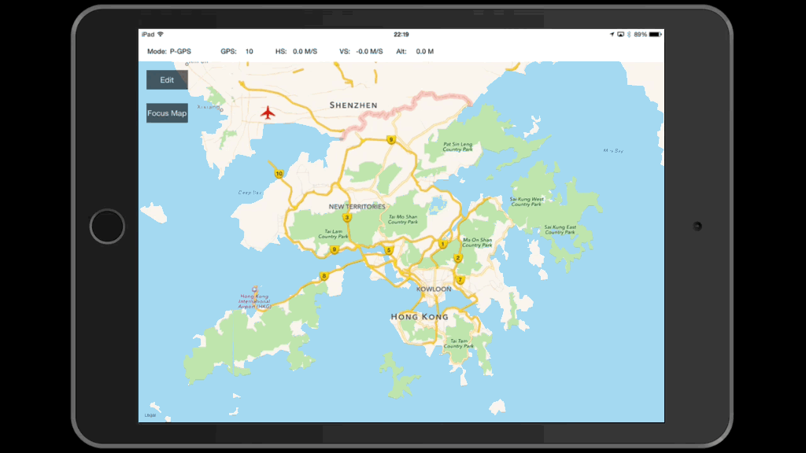

Next, test the waypoint feature by tapping wherever you'd like on the map view. Wherever you do tap, a waypoint will be added and a purple pin will appear exactly at the location of the waypoint, as shown below:

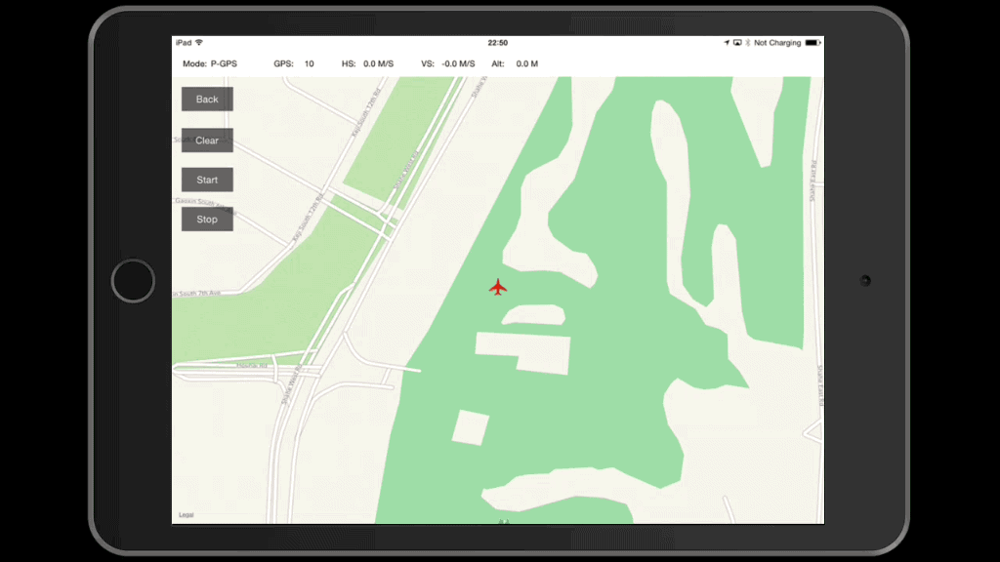

Once you press the **Start** button, the **Waypoint Configuration** view will appear. After you're satisfied with the changes, press the **Finish** button. The waypoint mission will start to upload and when it finishes, the mission will start to be processed. You will start to see the aircraft move towards the waypoints you set previously on the map view, as shown below:

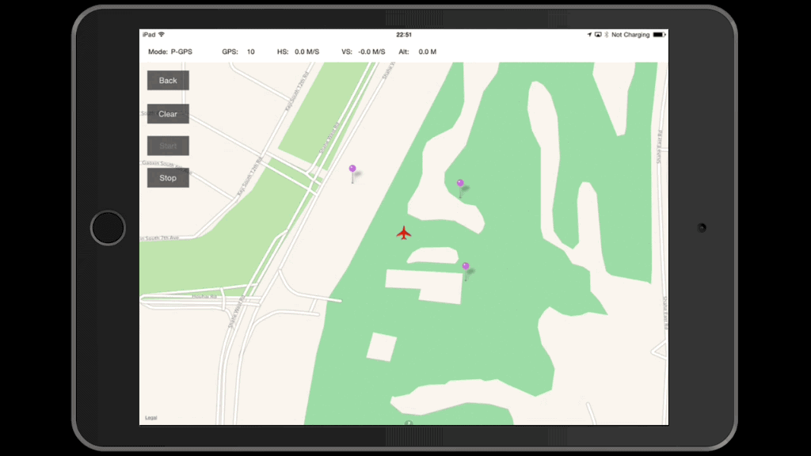

At the same time, you will be able to see the Inspire 1 take off and start to fly automatically in the DJI PC Simulator.

![takeOff] (../../images/iOS/GSDemo/takeOff.gif)

When the waypoint mission finishes, an alert view titled **Mission Finished** will appear, and the Inspire 1 will start to go home!

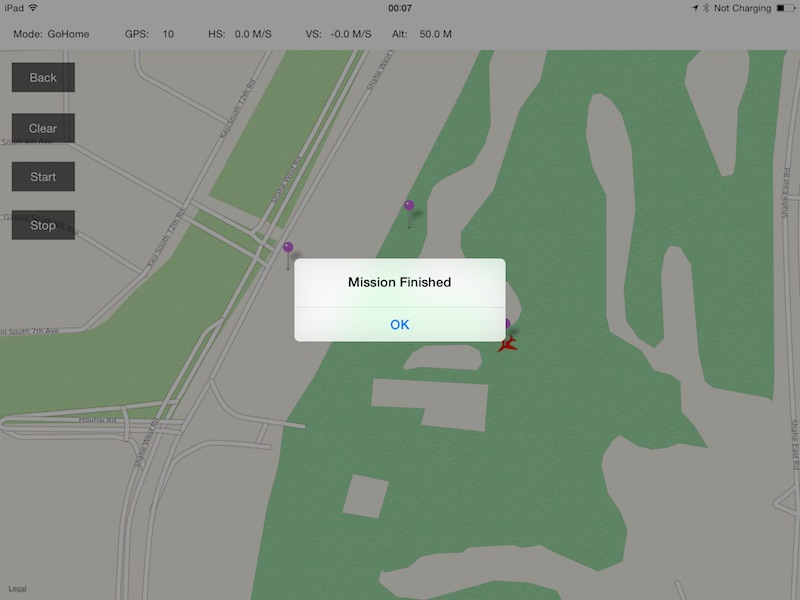 

The remote controller will start beeping, and the **Go Home** button on the remote controller will start to flash a white light. Let's take a look at the DJI PC Simulator now:

 
The inspire 1 will eventually go home, land, and the beeping from the remote controller will stop. The application will go back to its normal status. If you press the **Clear** button, all the waypoints you previously set will be cleared and another waypoint waypoint mission will be started. During the mission, if you'd ever like to stop the groundStation task, you can do so by pressing the **Stop** button.

## Summary
   
   In this tutorial, you’ve learned how to setup and use the DJI PC Simulator to test your groundStation application, upgrade your aircraft's firmware to the developer version, use the DJI Mobile SDK to create a simple map view, modify annotations of the map view, show the aircraft on the map view by using GPS data from the DJI PC Simulator. Moreover, you've learned how to configure both **DJIGroundStationWaypoint** and **DJIGroundStationTask**, how to use DJIGroundStationTask to add waypoints, how to use **upload**, **start** and **stop** methods to configure the ground station task, which are the methods from DJIInspireMainController(since we're using an Inspire 1). Lastly, you learned how to use the **DJINavigationDelegate** and **GroundStationDelegate** methods to obtain information from the ground station task.
      
   Congratulations! Now that you've finished the demo project, you can build on what you've learned and start to build your own ground station application. You can improve the way waypoints are added(such as drawing a line on the map and generating waypoints automatically), play around with the properties of a waypoint (such as heading, horizontal speed, etc.), and adding more functionality. In order to make a cool ground station application, you still have a long way to go. Good luck and hope you enjoy this tutorial!
   
   
   