# 사진 및 비디오 재생 앱 만들기
<!-- toc -->

*주의: 이 튜토리얼의 코드는 iPad에서 실행되도록 작성되었다. 해당 코드를 iPad나 iPad simulator에서 실행하도록 하자. 이 튜토리얼은 Phantom 3 Professional와 Inspire 1에 해당된다.

이 튜토리얼에서 비행체 카메라의 SD카드 내에 있는 미디어 리소스에 접근하기 위해서 DJI Mobile SDK 사용하는 방법을 배운다. 이 튜토리얼의 마지막에는 사진 미리보기, 비디오 재생, 파일을 다운받고 삭제하는 앱이 완성될 것이다.

사진과 비디오를 관리하는 앱을 위해서 먼저 촬영하는 기능이 필요하다. 운좋게 이전 튜토리얼 [Creating a Camera Application](../../../iOS/FPVDemo/FPVDemo_kr.md)에서 **Capture**와 **Record** 기능을 구현하는 방법을 보여주낟. 진행하기 전에 먼저 튜토리얼을 읽도록 하자.

이 튜토리얼과 관련된 데모 프로젝트를 다운로드할 수 있다: <https://github.com/DJI-Mobile-SDK/iOS-PlaybackDemo.git>

자 이제 시작해 보자!

## 사진 및 비디오 미리보기

### 1. Framework와 라이브러리 Import하기

  Xcode에 "**PlaybackDemo**" 이름의 새로운 프로젝트를 생성하고, **DJISDK.framework**를 Xcode 프로젝트의 폴더에 복사하자. 다음으로 다운받은 SDK에 "VideoPreviewer" 폴더를 찾자. 전체 "VideoPreviewer" 폴더를 여러분의 Xcode 프로젝트의 "ThirdParty" 폴더에 복사한다. **Build Settings**에서 **FFMPEG**를 위해 **Header Search Paths** 와 **Library Search Paths**를 설정한다. 잘 모르겠다면 이전 튜토리얼 [**Creating a Camera Application**](../../../iOS/FPVDemo/FPVDemo_kr.md)을 확인하자. 다음으로 프로젝트 타겟을 선택하고 Build Phases -> Link Binary With Libraries로 이동한다. 밑에 있는 "+" 버튼을 클릭하고 2개 라이브러리 **libstdc++.6.0.9.dylib** 와 **libz.dylib**를 추가한다. 아래 스크린 샷을 보자 :

  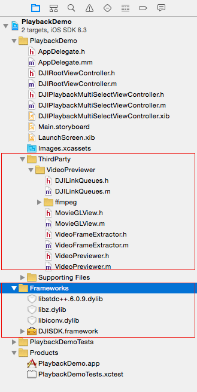
  
### 2. 재생 모드 전환

  이제 **ViewController.h** 와 **ViewController.m** 파일을 삭제한다. 여러분이 프로젝트를 생성할 때 Xcode에서 생성된 것들이다. 다음으로 "DJIRootViewController"라는 viewController를 생성하고 **Main.storyboard**내에서 **Root View Controller**로 설정하자. 이 데모에서 코드는 iPad용으로 작성되었다. 따라서 **Main.storyboard**의 UX를 조정할 수 있다. **Root View Controller**의 프레임을 변경한다. **Simulated Metrics**섹션에서 **Size** 드롭다운아래 **Freeform**에 대한 크기를 설정할 수 있다. view센셕에서 폭을 **1024**로 높이는 **768**로 변경한다. 아래와 같이 변경한다:

  
  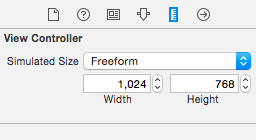
  
**Root View Controller** 내부로 UIView를 추가하고 **fpvPreviewView**라는 IBOutlet로 설정한다. 2개 UIButton과 View Control의 밑에 UISegmentedControl을 추가하고 IBOutlets와 IBActions를 설정한다. UISegmentedControl에 3개 세그먼트를 설정한다: **Capture**, **Record**, **Playback**. 마지막으로 UILabel을 맨 위로 드래그하고 view controller에 수평으로 중심에 위치시키고 숨긴다. 

  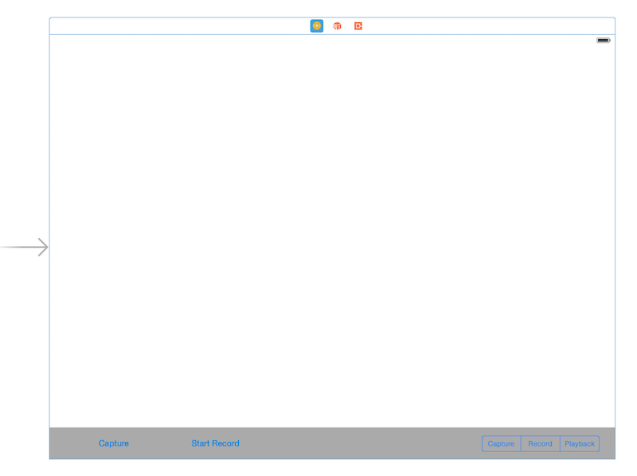
  
 완려되면, **DJIRootViewController.m** 파일에 들어가고 **DJISDK**와 **VideoPreviewer** 헤더 파일을 import시킨다. **DJIDrone** 클래스의 속성을 생성하고 **DJICamera** 클래스의 하나 그리고 클래스 확장에서 protocol을 구현한다. 다음으로 2개 **UIButtons**을 추가하고 **UISegmentedControl**와 **UILabel**의 IBOutlet 속성을 추가한다.  record 상태로 체크를 검사하기 위해서 "isRecording" 이라는 boolean 속성을 추가한다. 모든 UI control을 위해 마지막으로 IBAction 메소드를 추가한다:

~~~objc
#import "DJIRootViewController.h"
#import <DJISDK/DJISDK.h>
#import "VideoPreviewer.h"

@interface DJIRootViewController ()<DJICameraDelegate, DJIDroneDelegate, DJIAppManagerDelegate>
@property (strong, nonatomic) DJIDrone *drone;
@property (strong, nonatomic) DJIInspireCamera* camera;
@property (weak, nonatomic) IBOutlet UIButton *recordBtn;
@property (weak, nonatomic) IBOutlet UISegmentedControl *changeWorkModeSegmentControl;
@property (weak, nonatomic) IBOutlet UIView *fpvPreviewView;
@property (weak, nonatomic) IBOutlet UILabel *currentRecordTimeLabel;
@property (assign, nonatomic) BOOL isRecording;

- (IBAction)captureAction:(id)sender;
- (IBAction)recordAction:(id)sender;
- (IBAction)changeWorkModeAction:(id)sender;

~~~

데이터 초기화를 위해서 **initData**라는 새로운 메소드를 생성하고 ViewDidLoad 메소드에서 이것을 호출한다. 다음으로 **DJIDrone** 인스턴스를 생성하고 **DJIDrone_Inspire**(가지고 있는 UAV에 맞게 변경)로서 타입을 설정한다. **drone**과 **camera** 인스턴스의 delegate를 **self**로 설정한다. "registerApp"라는 새로운 메소드를 생성하고 viewDidLoad내에서 호출한다. app 등록이 성공한 이후에 초기화 설정을 하기 위해서 DJIAppManagerDelegate를 구현한다:

~~~objc
- (void)viewDidLoad {
    [super viewDidLoad];
    [self initData];     
    [self registerApp];
}

- (void)initData
{
    self.drone = [[DJIDrone alloc] initWithType:DJIDrone_Inspire];
    self.drone.delegate = self;
    self.camera = (DJIInspireCamera *)self.drone.camera;
    self.camera.delegate = self;
}

- (void)registerApp
{
    NSString *appKey = @"Enter Your App Key Here";
    [DJIAppManager registerApp:appKey withDelegate:self];
}

#pragma mark DJIAppManagerDelegate Method
-(void)appManagerDidRegisterWithError:(int)error
{
    NSString* message = @"Register App Successed!";
    if (error != RegisterSuccess) {
        message = @"Register App Failed! Please enter your App Key and check the network.";
    }else
    {
        NSLog(@"registerAppSuccess");
        [_drone connectToDrone];
        [_camera startCameraSystemStateUpdates];
        [[VideoPreviewer instance] start];
        
    }
    UIAlertView* alertView = [[UIAlertView alloc] initWithTitle:@"Register App" message:message delegate:nil cancelButtonTitle:@"OK" otherButtonTitles:nil];
    [alertView show];
}

~~~

 viewWillAppear 메소드에서 **fpvPreviewView** 인스턴스를 **VideoPreviewer**의 View로 설정한다. 이것은 Video Stream을 보여주기 위해서고 viewWillDisappear 메소드에서 nil로 리셋한다. 또 동일한 메소드에 있는 DJIDrone 클래스의 **destroy** 메소드를 호출한다:
 
~~~objc

- (void)viewWillAppear:(BOOL)animated
{
    [super viewWillAppear:animated];
    [[VideoPreviewer instance] setView:self.fpvPreviewView];
    
}

- (void)viewWillDisappear:(BOOL)animated
{
    
    [super viewWillDisappear:animated];
    [self.camera stopCameraSystemStateUpdates];
    [self.drone.mainController stopUpdateMCSystemState];
    [self.drone disconnectToDrone];
    [self.drone destroy];
    [[VideoPreviewer instance] setView:nil];
    
}
~~~

  **DJICameraDelegate** 메소드를 구현한다. 다음과 같다:
  
~~~objc
#pragma mark - DJICameraDelegate

-(void) camera:(DJICamera*)camera didReceivedVideoData:(uint8_t*)videoBuffer length:(int)length
{
    uint8_t* pBuffer = (uint8_t*)malloc(length);
    memcpy(pBuffer, videoBuffer, length);
    [[VideoPreviewer instance].dataQueue push:pBuffer length:length];
}

-(void) camera:(DJICamera*)camera didUpdateSystemState:(DJICameraSystemState*)systemState
{
     if (self.drone.droneType == DJIDrone_Inspire) {
        
        //Update currentRecordTimeLabel State
        self.isRecording = systemState.isRecording;
        [self.currentRecordTimeLabel setHidden:!self.isRecording];
        [self.currentRecordTimeLabel setText:[self formattingSeconds:systemState.currentRecordingTime]];
        
        //Update recordBtn State
        if (self.isRecording) {
            [self.recordBtn setTitle:@"Stop Record" forState:UIControlStateNormal];
        }else
        {
            [self.recordBtn setTitle:@"Start Record" forState:UIControlStateNormal];
        }
        
        //Update UISegmented Control's state
        if (systemState.workMode == CameraWorkModeCapture) {
            [self.changeWorkModeSegmentControl setSelectedSegmentIndex:0];
        }else if (systemState.workMode == CameraWorkModeRecord){
            [self.changeWorkModeSegmentControl setSelectedSegmentIndex:1];
        }else if (systemState.workMode == CameraWorkModePlayback){
            [self.changeWorkModeSegmentControl setSelectedSegmentIndex:2];
        }
    }
}

-(void) droneOnConnectionStatusChanged:(DJIConnectionStatus)status
{
    if (status == ConnectionSuccessed) {
        NSLog(@"Connection Successed");
    }
    else if(status == ConnectionStartConnect)
    {
        NSLog(@"Start Reconnect");
    }
    else if(status == ConnectionBroken)
    {
        NSLog(@"Connection Broken");
    }
    else if (status == ConnectionFailed)
    {
        NSLog(@"Connection Failed");
    }
}

- (NSString *)formattingSeconds:(int)seconds
{
    NSDate *date = [NSDate dateWithTimeIntervalSince1970:seconds];
    NSDateFormatter *formatter = [[NSDateFormatter alloc] init];
    [formatter setDateFormat:@"mm:ss"];
    [formatter setTimeZone:[NSTimeZone timeZoneForSecondsFromGMT:0]];
    
    NSString *formattedTimeString = [formatter stringFromDate:date];
    return formattedTimeString;
}

~~~
      
  Lastly, implement the IBAction methods as shown below:
  
~~~objc
- (IBAction)captureAction:(id)sender {
    __weak DJIRootViewController *weakSelf = self;
    [self.camera startTakePhoto:CameraSingleCapture withResult:^(DJIError *error) {
        if (error.errorCode != ERR_Successed) {
            UIAlertView *errorAlert = [[UIAlertView alloc] initWithTitle:@"Take Photo Error" message:error.errorDescription delegate:weakSelf cancelButtonTitle:@"OK" otherButtonTitles:nil];
            [errorAlert show];
        }
    }];
}

- (IBAction)recordAction:(id)sender {
    __weak DJIRootViewController *weakSelf = self;
    if (self.isRecording) {
        [self.camera stopRecord:^(DJIError *error) {
            if (error.errorCode != ERR_Successed) {
                UIAlertView *errorAlert = [[UIAlertView alloc] initWithTitle:@"Stop Record Error" message:error.errorDescription delegate:weakSelf cancelButtonTitle:@"OK" otherButtonTitles:nil];
                [errorAlert show];
            }
        }];
    }else
    {
        [self.camera startRecord:^(DJIError *error) { 
            if (error.errorCode != ERR_Successed) {
                UIAlertView *errorAlert = [[UIAlertView alloc] initWithTitle:@"Start Record Error" message:error.errorDescription delegate:weakSelf cancelButtonTitle:@"OK" otherButtonTitles:nil];
                [errorAlert show];
            }
        }];
    }
}

- (IBAction)changeWorkModeAction:(id)sender {
    DJIInspireCamera* inspireCamera = (DJIInspireCamera*)self.camera;
    __weak DJIRootViewController *weakSelf = self;
    UISegmentedControl *segmentControl = (UISegmentedControl *)sender;
    if (segmentControl.selectedSegmentIndex == 0) { //CaptureMode
        [inspireCamera setCameraWorkMode:CameraWorkModeCapture withResult:^(DJIError *error) {
            if (error.errorCode != ERR_Successed) {
                UIAlertView *errorAlert = [[UIAlertView alloc] initWithTitle:@"Set CameraWorkModeCapture Failed" message:error.errorDescription delegate:weakSelf cancelButtonTitle:@"OK" otherButtonTitles:nil];
                [errorAlert show];
            }
        }];
    }else if (segmentControl.selectedSegmentIndex == 1){ //RecordMode
        [inspireCamera setCameraWorkMode:CameraWorkModeRecord withResult:^(DJIError *error) {
            if (error.errorCode != ERR_Successed) {
                UIAlertView *errorAlert = [[UIAlertView alloc] initWithTitle:@"Set CameraWorkModeRecord Failed" message:error.errorDescription delegate:weakSelf cancelButtonTitle:@"OK" otherButtonTitles:nil];
                [errorAlert show];
            }
        }];
        
    }else if (segmentControl.selectedSegmentIndex == 2){  //PlaybackMode 
        [inspireCamera setCameraWorkMode:CameraWorkModePlayback withResult:^(DJIError *error) {
            if (error.errorCode != ERR_Successed) {
                UIAlertView *errorAlert = [[UIAlertView alloc] initWithTitle:@"Set CameraWorkModeRecord Failed" message:error.errorDescription delegate:weakSelf cancelButtonTitle:@"OK" otherButtonTitles:nil];
                [errorAlert show];
            }
        }];
    }
}

~~~

  **Playback** work mode 메소드를 구현했고 **DJIInspireCamera** 클래스의 **setCameraWorkMode**를 호출하고 **CameraWorkModePlayback** 값을 여기에 전달한다. error가 있는 경우 alertView를 보여준다. 
   
  지금까지 Xcode에 프로젝트를 빌드하고 실행한다. 사진을 찍고 비디오를 촬영하기 위해서 **Capture**와 **Record**를 사용하자. 다음으로 UISegmentControl를 두드려서 **Camera Mode**를 전환하며, 마지막 촬영한 사진이나 비디오를 보기 위해서 **Playback** 모드로 전환한다. 여기 스크린샷은 playback모드이다:
  
 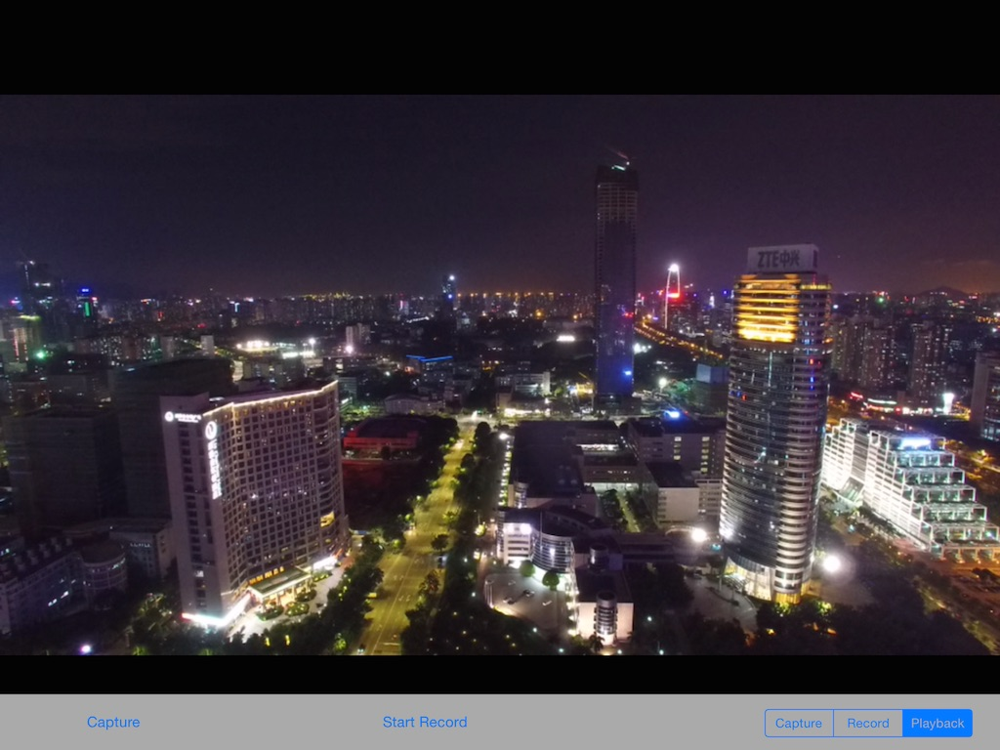
  
### 3. 단일 파일 미리보기

이제 **Playback** 모드로 전환할 수 있다. 2개 **UISwipeGestureRecognizer**를 추가해서 SD 카드에 있는 이전과 다음 미디어 파일을 미리보기 하자.

**DJIRootViewController.m** 파일을 열고, **UISwipeGestureRecognizer**의 2개 속성을 생성하고 확장 클래스에서 이름을 **swipeLeftGesture** 와 **swipeRightGesture**라고 붙인다. **initData** 메소드에서 초기화한다:

~~~objc

- (void)initData
{
    self.drone = [[DJIDrone alloc] initWithType:DJIDrone_Inspire];
    self.drone.delegate = self;
    self.camera = (DJIInspireCamera *)self.drone.camera;
    self.camera.delegate = self;
    
    self.swipeLeftGesture = [[UISwipeGestureRecognizer alloc] initWithTarget:self action:@selector(swipeLeftGestureAction:)];
    self.swipeLeftGesture.direction = UISwipeGestureRecognizerDirectionLeft;
    self.swipeRightGesture = [[UISwipeGestureRecognizer alloc] initWithTarget:self action:@selector(swipeRightGestureAction:)];
    self.swipeRightGesture.direction = UISwipeGestureRecognizerDirectionRight;

    [self.view addGestureRecognizer:self.swipeLeftGesture];
    [self.view addGestureRecognizer:self.swipeRightGesture];
}

~~~

gesture 동작 셀렉터 메소드 구현하기:

~~~objc 
- (void)swipeLeftGestureAction:(UISwipeGestureRecognizer *)gesture
{
     [self.camera singlePreviewNextPage];
}

- (void)swipeRightGestureAction:(UISwipeGestureRecognizer *)gesture
{
     [self.camera singlePreviewPreviousPage];
}
~~~

위에 코드는 이전과 다음 파일을 미리보기 하기 위해서 DJIInspireCamera 클래스의 **singlePreviewNextPage**와 **singlePreviewPreviousPage** 메소드를 사용한다. SD카드에 미디어 파일의 2가지 타입으로 **Photo**와 **Video**가 있기 때문에, 비디오 재생 기능을 구현해야만 한다.

**Main.storyboard** 열고 UIVIew 객체를 드래그해서 viewController의 맨위에 위치시킨다. UIButton를 좀전에 추가한 view에 추가한다.
Open **Main.storyboard**, drag a UIView object and position it on the top of the viewController, then drag a UIButton to the view you just added as subview and named **Stop**. Next, drag a UIButton object to the center of the viewController, set its image as "playVideo"(You can get this image file from the project source code, in the Images.xcassets folder).

 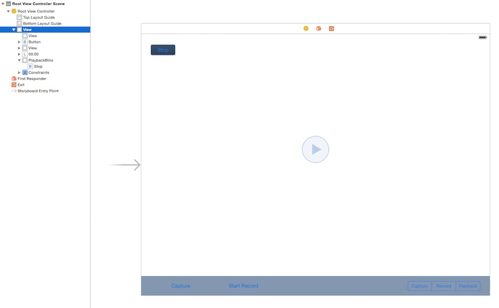
 
 Here we hide the **Stop** and the **playVideo** buttons. Now let's go to **DJIRootViewController.m** and create IBOutlets and IBActions for the newly added UIs:
 
~~~objc
@property (nonatomic, strong) IBOutlet UIView* playbackBtnsView;
@property (weak, nonatomic) IBOutlet UIButton *playVideoBtn;

- (IBAction)playVideoBtnAction:(id)sender;
- (IBAction)stopVideoBtnAction:(id)sender; 
~~~

Moreover, before implementing the IBAction methods, we'll add two new properties of the DJICameraSystemState class and the DJICameraPlaybackState class and named them as **cameraSystemState** and **cameraPlaybackState** respectively in the class extension as shown below:

~~~objc
@property (strong, nonatomic) DJICameraSystemState* cameraSystemState;
@property (strong, nonatomic) DJICameraPlaybackState* cameraPlaybackState;
~~~

These properties are used to save the current camera system state and the playback state. Let's update the **cameraSystemState** property value and hide the **playbackBtnsView** based on **DJICameraSystemState**'s workMode in the "-(void) camera:(DJICamera*)camera didUpdateSystemState:(DJICameraSystemState*)systemState" delegate method:

~~~objc
-(void) camera:(DJICamera*)camera didUpdateSystemState:(DJICameraSystemState*)systemState
{
    if (self.drone.droneType == DJIDrone_Inspire) {
        
        self.cameraSystemState = systemState; //Update camera system state

        //Update currentRecordTimeLabel State
        self.isRecording = systemState.isRecording;
        [self.currentRecordTimeLabel setHidden:!self.isRecording];
        [self.currentRecordTimeLabel setText:[self formattingSeconds:systemState.currentRecordingTime]];
        
        //Update playbackBtnsView state
        BOOL isPlayback = (systemState.workMode == CameraWorkModePlayback) || (systemState.workMode == CameraWorkModeDownload);
        self.playbackBtnsView.hidden = !isPlayback;
        
        //Update recordBtn State
        if (self.isRecording) {
            [self.recordBtn setTitle:@"Stop Record" forState:UIControlStateNormal];
        }else
        {
            [self.recordBtn setTitle:@"Start Record" forState:UIControlStateNormal];
        }
        //Update UISegmented Control's state
        if (systemState.workMode == CameraWorkModeCapture) {
            [self.changeWorkModeSegmentControl setSelectedSegmentIndex:0];
        }else if (systemState.workMode == CameraWorkModeRecord){
            [self.changeWorkModeSegmentControl setSelectedSegmentIndex:1];
        }else if (systemState.workMode == CameraWorkModePlayback){
            [self.changeWorkModeSegmentControl setSelectedSegmentIndex:2];
        }
    }
}
~~~

Additionally, implement the **-(void) camera:(DJICamera *)camera didUpdatePlaybackState:(DJICameraPlaybackState *)playbackState** delegate method as shown below:

~~~objc
-(void) camera:(DJICamera *)camera didUpdatePlaybackState:(DJICameraPlaybackState *)playbackState
{
    if (self.cameraSystemState.workMode == CameraWorkModePlayback) {
        self.cameraPlaybackState = playbackState;
        [self updateUIWithPlaybackState:playbackState];
    }else
    {
        [self.playVideoBtn setHidden:YES];
    }
}

- (void)updateUIWithPlaybackState:(DJICameraPlaybackState *)playbackState
{
    if (playbackState.playbackMode == SingleFilePreview) {
        if (playbackState.mediaFileType == MediaFileJPEG || playbackState.mediaFileType == MediaFileDNG) { //Photo Type            
            [self.playVideoBtn setHidden:YES];
        }else if (playbackState.mediaFileType == MediaFileVIDEO) //Video Type
        {
            [self.playVideoBtn setHidden:NO];
        }
    }else if (playbackState.playbackMode == SingleVideoPlaybackStart){ //Playing Video
        [self.playVideoBtn setHidden:YES];
    }else if (playbackState.playbackMode == MultipleFilesPreview){
        [self.playVideoBtn setHidden:YES];
    }
}
~~~

As you can see, we have updated the **cameraPlaybackState** property's value in the **-(void) camera:(DJICamera *)camera didUpdatePlaybackState:(DJICameraPlaybackState *)playbackState** delegate method, and have also updated the **playVideoBtn**'s hidden state based on the DJICameraSystemState's **workMode** and the DJICameraPlaybackState's **playbackMode**.

Finally, we can implement the **IBAction** methods as follows:

~~~objc
- (IBAction)playVideoBtnAction:(id)sender {
    if (self.cameraPlaybackState.mediaFileType == MediaFileVIDEO) {
        [self.camera startVideoPlayback];
    }
}

- (IBAction)stopVideoBtnAction:(id)sender {
    if (self.cameraPlaybackState.mediaFileType == MediaFileVIDEO) {
        if (self.cameraPlaybackState.videoPlayProgress > 0) {
            [self.camera stopVideoPlayback];
        }
    }
}
~~~

In the **playVideoBtnAction** and **stopVideoBtnAction** methods, we check if the media type is video, then call the **startVideoPlayback** and the **stopVideoPlayback** methods of the **DJIInspireCamera** class to start and stop playing the video. 

Once it's done, build and run the project. Try swiping left and right in playbackMode to navigate through your photos and videos. If you see the play button at the center of the screen, press it to play the video.

Playing your video through the playback app:

 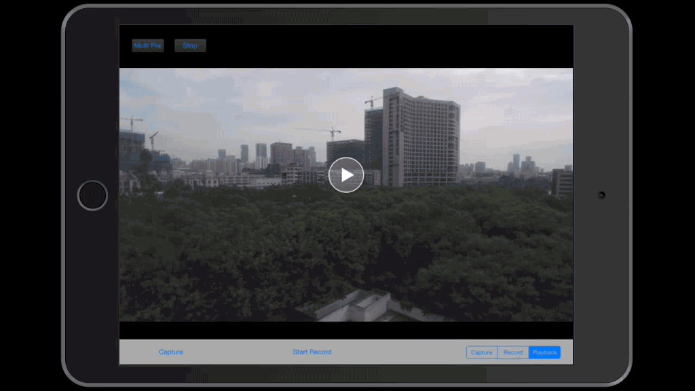

### 4. Previewing Multiple Files

Before we move forward, let's explain the **Playback mode**. There are multiple playback modes in the camera, and we can check the **CameraPlaybackMode** enum type in the **DJICameraPlaybackState.h** file as follows:

~~~objc
/**
 *  Playback mode
 */
typedef NS_ENUM(uint8_t, CameraPlaybackMode){
    /**
     *  Single file preview
     */
    SingleFilePreview,
    /**
     *  Single photo zoomed
     */
    SinglePhotoZoomMode,
    /**
     *  Single video play start
     */
    SingleVideoPlaybackStart,
    /**
     *  Single video play stop
     */
    SingleVideoPlaybackStop,
    /**
     *  Multiple file edit
     */
    MultipleFilesEdit,
    /**
     *  Multiple file preview
     */
    MultipleFilesPreview,
    /**
     *  Download file
     */
    MediaFilesDownload,
    /**
     *  Mode error
     */
    PlaybackModeError = 0xFF,
};
~~~

As shown in the code above, we can preview files in two ways: **Single Preview** and **Multiple Preview**. We can also zoom into out of photos, play videos, delete photos and videos and even download them. 

We will learn how to preview multiple files here. Here is what **Multiple Preview** looks like:

 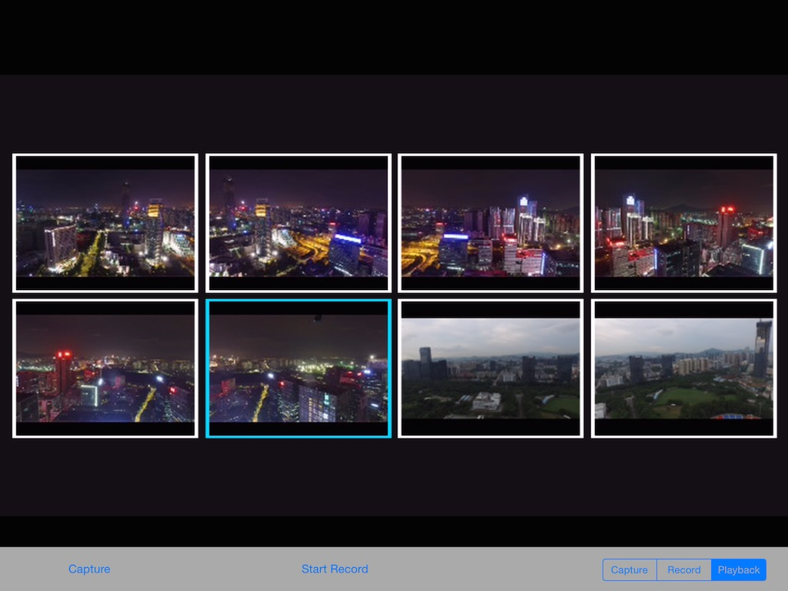
 
You can preview at most eight files at the same time. Since the preview images are shown in the **fpvPreviewView**, you cannot interact with them yet. Let's add buttons and swipe gestures to interact with them.

First, we will create a new file named **DJIPlaybackMultiSelectViewController**, which will be a subclass of **UIViewController**. Make sure the check box for **Also create XIB file** is selected when creating the file. Then open the **DJIPlaybackMultiSelectViewController.xib** file and, under the **Size** dropdown in the **Simulated Metrics** section, set its size to **Freeform** . In the view section, change the width to **1024** and height to **768**. Take a look at the changes made below:

  
  
  
Then drag a **UIView** object to the viewController as subview and set its name to **Buttons View**. Next set its frame as follows:

  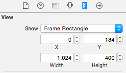
  
Moreover, drag eight **UIButton** objects to the **Buttons View** as subviews and position them as follows(You can check the demo project's **DJIPlaybackMultiSelectViewController.xib** file to get the details on how to setup these buttons's frame):

  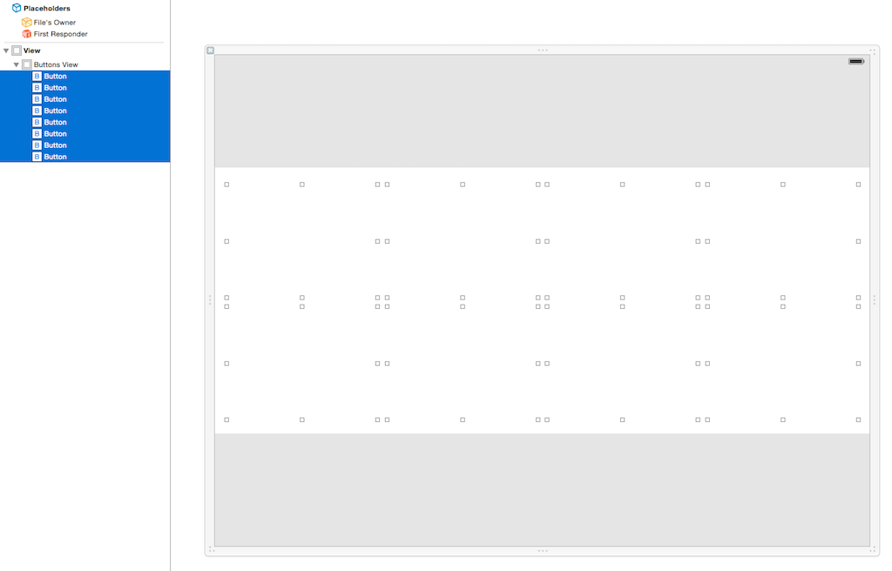

These buttons represent eight media files when you are in the **Multiple Preview Mode**. Pressing any of these buttons will enter **Single Preview Mode**. 

Now let's open the **DJIPlaybackMultiSelectViewController.h** file and create two block properties as follows:

~~~objc
#import <UIKit/UIKit.h>

@interface DJIPlaybackMultiSelectViewController : UIViewController

@property (copy, nonatomic) void (^selectItemBtnAction)(int index);
@property (copy, nonatomic) void (^swipeGestureAction)(UISwipeGestureRecognizerDirection direction);

@end
~~~

The first block is used to check the selected button action with index, the second one is used to check the swipe gesture action.

Then go to **DJIPlaybackMultiSelectViewController.m** file and create four **UISwipeGestureRecognizer** properties to represent the **left**, **right**, **up** and **down** swipe gestures. Additionally, create eight IBAction methods and link them to the UIButton objects in the **DJIPlaybackMultiSelectViewController.xib** file:

~~~objc
#import "DJIPlaybackMultiSelectViewController.h"

@interface DJIPlaybackMultiSelectViewController()

@property(nonatomic, strong) UISwipeGestureRecognizer *swipeLeftGesture;
@property(nonatomic, strong) UISwipeGestureRecognizer *swipeRightGesture;
@property(nonatomic, strong) UISwipeGestureRecognizer *swipeUpGesture;
@property(nonatomic, strong) UISwipeGestureRecognizer *swipeDownGesture;

- (IBAction)selectFirstItemBtnAction:(id)sender;
- (IBAction)selectSecondItemBtnAction:(id)sender;
- (IBAction)selectThirdItemBtnAction:(id)sender;
- (IBAction)selectFourthItemBtnAction:(id)sender;
- (IBAction)selectFifthItemBtnAction:(id)sender;
- (IBAction)selectSixthItemBtnAction:(id)sender;
- (IBAction)selectSeventhItemBtnAction:(id)sender;
- (IBAction)selectEighthItemBtnAction:(id)sender;

@end
~~~

Init the swipe gestures properties in the viewDidLoad method and implement the action methods as shown below:

~~~objc
- (void)viewDidLoad {
    [super viewDidLoad];

    self.swipeLeftGesture = [[UISwipeGestureRecognizer alloc] initWithTarget:self action:@selector(swipeLeftGestureAction:)];
    self.swipeLeftGesture.direction = UISwipeGestureRecognizerDirectionLeft;
    self.swipeRightGesture = [[UISwipeGestureRecognizer alloc] initWithTarget:self action:@selector(swipeRightGestureAction:)];
    self.swipeRightGesture.direction = UISwipeGestureRecognizerDirectionRight;
    self.swipeUpGesture = [[UISwipeGestureRecognizer alloc] initWithTarget:self action:@selector(swipeUpGestureAction:)];
    self.swipeUpGesture.direction = UISwipeGestureRecognizerDirectionUp;
    self.swipeDownGesture = [[UISwipeGestureRecognizer alloc] initWithTarget:self action:@selector(swipeDownGestureAction:)];
    self.swipeDownGesture.direction = UISwipeGestureRecognizerDirectionDown;
    
    [self.view addGestureRecognizer:self.swipeLeftGesture];
    [self.view addGestureRecognizer:self.swipeRightGesture];
    [self.view addGestureRecognizer:self.swipeUpGesture];
    [self.view addGestureRecognizer:self.swipeDownGesture];

}

#pragma mark UIGestureAction Methods
- (void)swipeLeftGestureAction:(UISwipeGestureRecognizer *)gesture
{
    if (self.swipeGestureAction) {
        self.swipeGestureAction(UISwipeGestureRecognizerDirectionLeft);
    }
}

- (void)swipeRightGestureAction:(UISwipeGestureRecognizer *)gesture
{
    if (self.swipeGestureAction) {
        self.swipeGestureAction(UISwipeGestureRecognizerDirectionRight);
    }
}

- (void)swipeUpGestureAction:(UISwipeGestureRecognizer *)gesture
{
    if (self.swipeGestureAction) {
        self.swipeGestureAction(UISwipeGestureRecognizerDirectionUp);
    }
}

- (void)swipeDownGestureAction:(UISwipeGestureRecognizer *)gesture
{
    if (self.swipeGestureAction) {
        self.swipeGestureAction(UISwipeGestureRecognizerDirectionDown);
    }
}

~~~ 

These four swipe gestures are for single and multiple files preview. Swipe left or right to preview files in **Single Preview Mode**, swipe up or down to preview files in **Multiple Preview Mode**. We invoke the **swipeGestureAction** block inside the swipe action method with a **UISwipeGestureRecognizerDirection** value.

Next, implement the IBAction methods for the eight UIButtons as follows:

~~~objc
#pragma mark UIButton Action Methods
- (IBAction)selectFirstItemBtnAction:(id)sender {
    if (self.selectItemBtnAction) {
        self.selectItemBtnAction(0);
    }
}

- (IBAction)selectSecondItemBtnAction:(id)sender {
    if (self.selectItemBtnAction) {
        self.selectItemBtnAction(1);
    }
}

- (IBAction)selectThirdItemBtnAction:(id)sender {
    if (self.selectItemBtnAction) {
        self.selectItemBtnAction(2);
    }
}

- (IBAction)selectFourthItemBtnAction:(id)sender {
    if (self.selectItemBtnAction) {
        self.selectItemBtnAction(3);
    }
}

- (IBAction)selectFifthItemBtnAction:(id)sender {
    if (self.selectItemBtnAction) {
        self.selectItemBtnAction(4);
    }
}

- (IBAction)selectSixthItemBtnAction:(id)sender {
    if (self.selectItemBtnAction) {
        self.selectItemBtnAction(5);
    }
}

- (IBAction)selectSeventhItemBtnAction:(id)sender {
    if (self.selectItemBtnAction) {
        self.selectItemBtnAction(6);
    }
}

- (IBAction)selectEighthItemBtnAction:(id)sender {
    if (self.selectItemBtnAction) {
        self.selectItemBtnAction(7);
    }
}
~~~

We invoke the **selectItemBtnAction** block inside the IBAction methods with related button index. The index starts from 0 here because the file index counted in Playback Multiple Preview Mode starts from 0.

Now, go back to **DJIRootViewController.m** file. Since we have added the swipe left and swipe right gestures in the DJIPlaybackMultiSelectViewController.m file, let's delete the **swipeLeftGesture** and **swipeRightGesture** properties and their related codes in the DJIRootViewController.m file to refactor the code structure. 

Then import the DJIPlaybackMultiSelectViewController.h header file and create a property of DJIPlaybackMultiSelectViewController named **playbackMultiSelectVC**. Next, we create a new method named **initPlaybackMultiSelectVC** and implement it in the **viewDidLoad** method:

~~~objc
- (void)viewDidLoad {
    [super viewDidLoad];
    [[NSNotificationCenter defaultCenter] addObserver:self selector:@selector(registerAppSuccess:) name:@"RegisterAppSuccess" object:nil];
    [self initData];
    [self registerApp];
    [self initPlaybackMultiSelectVC];

}

- (void)initPlaybackMultiSelectVC
{
    self.playbackMultiSelectVC = [[DJIPlaybackMultiSelectViewController alloc] initWithNibName:@"DJIPlaybackMultiSelectViewController" bundle:[NSBundle mainBundle]];
    [self.playbackMultiSelectVC.view setFrame:self.view.frame];
    [self.fpvPreviewView addSubview:self.playbackMultiSelectVC.view];
    __weak DJIRootViewController *weakSelf = self;
    [self.playbackMultiSelectVC setSelectItemBtnAction:^(int index) {
        if (weakSelf.cameraPlaybackState.playbackMode == MultipleFilesPreview) {
            [weakSelf.camera enterSinglePreviewModeWithIndex:index];
        }
    }];
    
    [self.playbackMultiSelectVC setSwipeGestureAction:^(UISwipeGestureRecognizerDirection direction) {
        
        if (weakSelf.cameraPlaybackState.playbackMode == SingleFilePreview) {
            if (direction == UISwipeGestureRecognizerDirectionLeft) {
                [weakSelf.camera singlePreviewNextPage];
            }else if (direction == UISwipeGestureRecognizerDirectionRight){
                [weakSelf.camera singlePreviewPreviousPage];
            }
        }else if(weakSelf.cameraPlaybackState.playbackMode == MultipleFilesPreview){
            if (direction == UISwipeGestureRecognizerDirectionUp) {
                [weakSelf.camera multiplePreviewNextPage];
            }else if (direction == UISwipeGestureRecognizerDirectionDown){
                [weakSelf.camera multiplePreviewPreviousPage];
            }
        }
    }];
}
~~~

So in the **initPlaybackMultiSelectVC** method, we init the **playbackMultiSelectVC** property first, and then we invoke the **selectItemBtnAction** block's setter method and implement the **enterSinglePreviewModeWithIndex** method of the **DJIInspireCamera** with selected index. This way, we can switch to Single Preview Mode from Multiple Preview Mode. 

Furthermore, we invoke the **swipeGestureAction** block's setter method and implement the preview files feature based on the **UISwipeGestureRecognizerDirection** value.

Once this is done, go to **Main.storyboard** and drag a **UIButton** object to the **playbackBtnsView** as subView, naming it as **Multi Pre** and positioning it as follows:

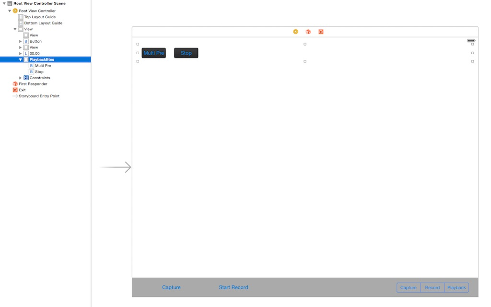

Finally, create an IBAction method named **multiPreviewButtonClicked** and link it to the above UIButton in the **Main.storyboard**. Implement the method as shown below to enter Multiple Preview Mode:

~~~objc
- (IBAction)multiPreviewButtonClicked:(id)sender {
    [self.camera enterMultiplePreviewMode];
}
~~~

Let's build and run the project and try to enter Multiple Preview Mode. Use the swipe up and down gestures to preview files. Switch to the Single Preview Mode by pressing any of the eight preview images. Here is a screenshot:

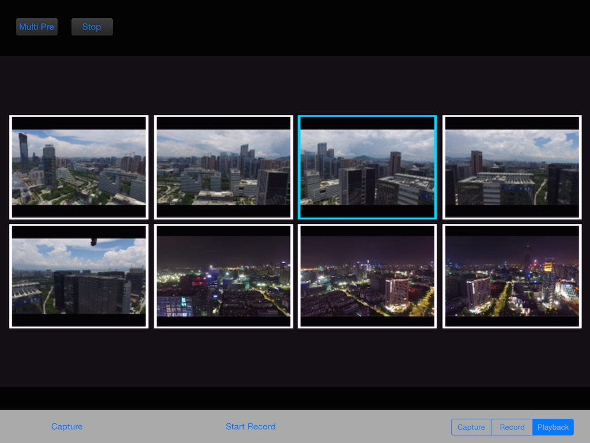

## Deleting Photos and Videos

You can now preview photos and videos in Single Preview Mode and Multiple Preview Mode. But what if you want to delete a file you don't like? Let's implement the delete files feature!

Go to Main.storyboard and drag three UIButtons to the **playbackBtnsView** as subviews and named them **Select**, **Select All** and **Delete**. We hide the "Select" and "Select All" buttons here. Then go to the **DJIRootViewController.m** file and create two IBOutlets for the "Select" and "Select All" buttons, and also the three IBAction methods for the three buttons as follows:

~~~objc
@property (weak, nonatomic) IBOutlet UIButton *selectBtn;
@property (weak, nonatomic) IBOutlet UIButton *selectAllBtn;

- (IBAction)selectButtonAction:(id)sender;
- (IBAction)deleteButtonAction:(id)sender;
- (IBAction)selectAllBtnAction:(id)sender;
~~~

Next, implement the IBAction methods as shown below:

~~~objc
- (IBAction)selectButtonAction:(id)sender {
    if (self.cameraPlaybackState.playbackMode == MultipleFilesEdit) {
        [self.camera exitMultipleEditMode];
    }else
    {
        [self.camera enterMultipleEditMode];
    }
}

- (IBAction)selectAllBtnAction:(id)sender {
    
    if (self.cameraPlaybackState.isAllFilesInPageSelected) {
        [self.camera unselectAllFilesInPage];
    }
    else
    {
        [self.camera selectAllFilesInPage];
    }
}
~~~

The above code implements the selectButtonAction method to enter and exit MultipleEditMode by calling the DJIInspireCamera class's **exitMultipleEditMode** and **enterMultipleEditMode** methods. Then in selectAllBtnAction IBAction method, we use an if statement to check if all the files in the page are selected and invoke the **selectAllFilesInPage** and **unselectAllFilesInPage** methods of DJIInspireCamera.

Moreover, update the **selectBtn** and **selectAllBtn** buttons' hidden values in the following method:

~~~objc
- (void)updateUIWithPlaybackState:(DJICameraPlaybackState *)playbackState
{
    if (playbackState.playbackMode == SingleFilePreview) {
        
        [self.selectBtn setHidden:YES];
        [self.selectAllBtn setHidden:YES];
        
        if (playbackState.mediaFileType == MediaFileJPEG || playbackState.mediaFileType == MediaFileDNG) { //Photo Type
            
            [self.playVideoBtn setHidden:YES];
            
        }else if (playbackState.mediaFileType == MediaFileVIDEO) //Video Type
        {
            [self.playVideoBtn setHidden:NO];
        }
        
    }else if (playbackState.playbackMode == SingleVideoPlaybackStart){ //Playing Video
        
        [self.selectBtn setHidden:YES];
        [self.selectAllBtn setHidden:YES];
        [self.playVideoBtn setHidden:YES];
        
    }else if (playbackState.playbackMode == MultipleFilesPreview){
        
        [self.selectBtn setHidden:NO];
        [self.selectBtn setTitle:@"Select" forState:UIControlStateNormal];
        [self.selectAllBtn setHidden:NO];
        [self.playVideoBtn setHidden:YES];
        
    }else if (playbackState.playbackMode == MultipleFilesEdit){
    
        [self.selectBtn setHidden:NO];
        [self.selectBtn setTitle:@"Cancel" forState:UIControlStateNormal];
        [self.selectAllBtn setHidden:NO];
        [self.playVideoBtn setHidden:YES];

    }   
}
~~~ 

Before implementing the **deleteButtonAction** method, let's create two new properties in the class extension as follows:

~~~objc
@property (strong, nonatomic) UIAlertView* statusAlertView;
@property (assign, nonatomic) int selectedFileCount;
~~~

Here, we create an **int** property named **selectedFileCount** to count the number of files currently selected in the Multiple Preview Mode. We also create a **UIAlertView** property named as **statusAlertView** to show alerts when deleting files.

Create the following three methods to **show**, **dismiss** and **update** the alertView:

~~~objc
-(void) showStatusAlertView
{
    if (self.statusAlertView == nil) {
        self.statusAlertView = [[UIAlertView alloc] initWithTitle:@"" message:@"" delegate:nil cancelButtonTitle:nil otherButtonTitles:nil];
        [self.statusAlertView show];
    }
}

-(void) dismissStatusAlertView
{
    if (self.statusAlertView) {
        [self.statusAlertView dismissWithClickedButtonIndex:0 animated:YES];
        self.statusAlertView = nil;
    }       
}

- (void)updateStatusAlertContentWithTitle:(NSString *)title message:(NSString *)message shouldDismissAfterDelay:(BOOL)dismiss
{
    if (self.statusAlertView) {
        [self.statusAlertView setTitle:title];
        [self.statusAlertView setMessage:message];
        
        if (dismiss) {
            [self performSelector:@selector(dismissStatusAlertView) withObject:nil afterDelay:2.0];
        }
    }   
}
~~~

Furthermore, implement the **deleteButtonAction** action method as shown below:

~~~objc
- (IBAction)deleteButtonAction:(id)sender {
    
    self.selectedFileCount = self.cameraPlaybackState.numbersOfSelected;
    
    if (self.cameraPlaybackState.playbackMode == MultipleFilesEdit) {

        if (self.selectedFileCount == 0) {
            [self showStatusAlertView];
            [self updateStatusAlertContentWithTitle:@"Please select files to delete!" message:@"" shouldDismissAfterDelay:YES];
            return;
        }else
        {
            NSString *title;
            if (self.selectedFileCount == 1) {
                title = @"Delete Selected File?";
            }else
            {
                title = @"Delete Selected Files?";
            }
            UIAlertView *deleteAllSelFilesAlert = [[UIAlertView alloc] initWithTitle:title message:@"" delegate:self cancelButtonTitle:@"NO" otherButtonTitles:@"YES", nil];
            deleteAllSelFilesAlert.tag = kDeleteAllSelFileAlertTag;
            [deleteAllSelFilesAlert show];
        }

    }else if (self.cameraPlaybackState.playbackMode == SingleFilePreview){
        
        UIAlertView *deleteCurrentFileAlert = [[UIAlertView alloc] initWithTitle:@"Delete The Current File?" message:@"" delegate:self cancelButtonTitle:@"NO" otherButtonTitles:@"YES", nil];
        deleteCurrentFileAlert.tag = kDeleteCurrentFileAlertTag;
        [deleteCurrentFileAlert show];
    }
    
}
~~~

The above code updates the **selectedFileCount** property value with **cameraPlaybackState**'s "numbersOfSelected" value. It then checks the **playbackMode** value of cameraPlaybackState to show alertViews in the "MultipleFilesEdit" and "SingleFilePreview" mode. Here we use macro definition for the UIAlertView's tag property:

~~~objc
#define kDeleteAllSelFileAlertTag 100
#define kDeleteCurrentFileAlertTag 101
~~~

Finally, let's implement the UIAlertView delegate method as follows to call the DJIInspireCamera's **deleteAllSelectedFiles** and **deleteCurrentPreviewFile** methods to delete files and update selectBtn's title:

~~~objc 
#pragma mark UIAlertView Delegate Method
- (void)alertView:(UIAlertView *)alertView clickedButtonAtIndex:(NSInteger)buttonIndex
{
    if (alertView.tag == kDeleteAllSelFileAlertTag) {
        if (buttonIndex == 1) {
            [self.camera deleteAllSelectedFiles];
            [self.selectBtn setTitle:@"Select" forState:UIControlStateNormal];
        }
    }else if (alertView.tag == kDeleteCurrentFileAlertTag){
        if (buttonIndex == 1) {
            [self.camera deleteCurrentPreviewFile];
            [self.selectBtn setTitle:@"Select" forState:UIControlStateNormal];
        }   
    }
}
~~~

Build and run the project, and try the select multiple files, delete single and multiple files features. Here's what it should look like:

* Deleting a  Single File:

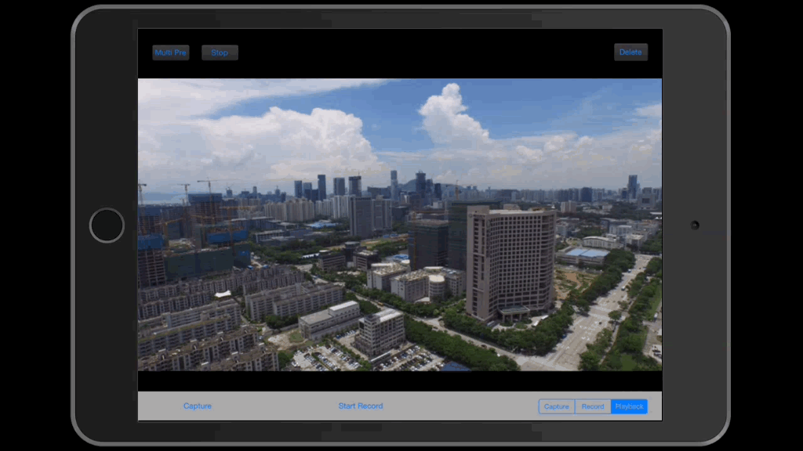

* Deleting Multiple Files:

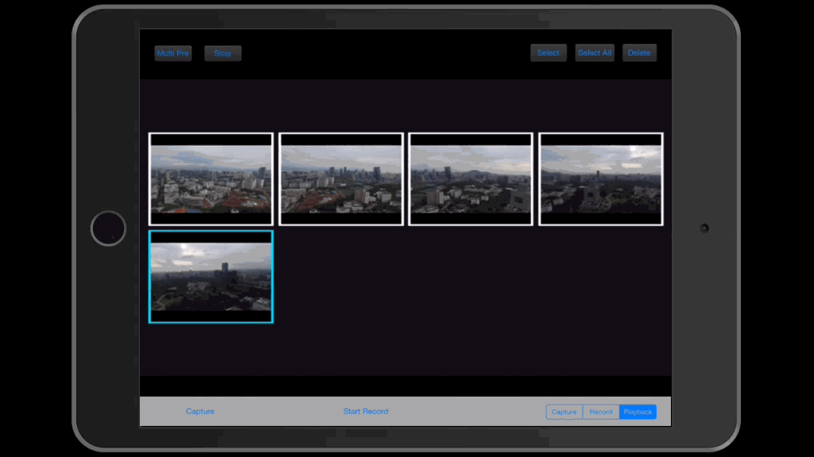

## Downloading And Saving Photos

### 1. Downloading Photos

Let's implement the download photo feature now. First, go to the **Main.storyboard** file and drag a **UIButton** object to the **playbackBtnsView** and name it "Download". Then position it as shown below:

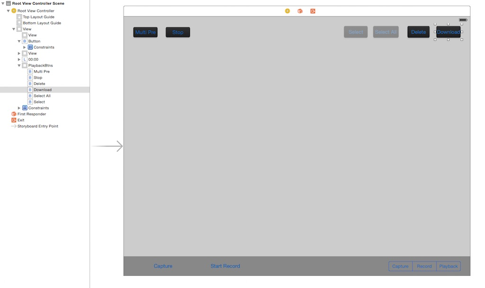

Then go to **DJIRootViewController.m** file and create the following property objects and IBAction methods in the class extension:

~~~objc
@property (strong, nonatomic) NSMutableData *downloadedImageData;
@property (strong, nonatomic) NSTimer *updateImageDownloadTimer;
@property (strong, nonatomic) NSError *downloadImageError;
@property (strong, nonatomic) NSString* targetFileName;
@property (assign, nonatomic) long totalFileSize;
@property (assign, nonatomic) long currentDownloadSize;
@property (assign, nonatomic) int downloadedFileCount;

- (IBAction)downloadButtonAction:(id)sender;
~~~

Lets briefly explain what each of these properties is for.

- **downloadedImageData** is used to store the downloaded image's **NSData**
- **updateImageDownloadTimer** is used to update the download progress status
- **downloadImageError** is for NSError storage
- **targetFileName** is used to store the current downloaded image file name
- **totalFileSize** is for storing the total file size of each downloading image
- **currentDownloadSize** is used to store the downloaded size of the image
- **downloadedFileCount** is used to store the downloaded file count

Let's init the **downloadedImageData** property in the **initData** method as follows:

~~~objc
- (void)initData
{
    self.drone = [[DJIDrone alloc] initWithType:DJIDrone_Inspire];
    self.drone.delegate = self;
    self.camera = (DJIInspireCamera *)self.drone.camera;
    self.camera.delegate = self;

    self.downloadedImageData = [NSMutableData data];
}
~~~

Before moving forward, we need to first explain the following method in **DJIInspireCamera** class:

~~~objc
/**
 *  Download the selected files. The camera's work mode will be auto changed to CameraWorkModeDownload
 *
 *  @param prepareBlock File prepare for download callback
 *  @param dataBlock    File data downloaded callback
 *  @param completion   File download completed callback
 */
 
-(void) downloadAllSelectedFilesWithPreparingBlock:(DJIFileDownloadPreparingBlock)prepareBlock dataBlock:(DJIFileDownloadingBlock)dataBlock completionBlock:(DJIFileDownloadCompletionBlock)completion;
~~~

This method has three params, the first param **prepareBlock** is a file download preparing block. You can do some download initialization work here like showing an alertView to clarify the download file's file name, file size, etc. The second param **dataBlock** is a download data update block, you can append the downloaded data here and increase the downloaded size data. The third param **completion** is a download complete block, you can save the downloaded image to the Photo Album here.

**Important**: we cannot update the download file status UI in the **dataBlock** block, since it will slow down the file download speed. So we should use the **downloadedImageData** property to append downloaded data and use the **updateImageDownloadTimer** to update the UI.

So let's create three new methods here to set up the **updateImageDownloadTimer**:

~~~objc
- (void)updateDownloadProgress:(NSTimer *)updatedTimer
{
    if (self.downloadImageError) {
        
        [self stopTimer];
        [self.selectBtn setTitle:@"Select" forState:UIControlStateNormal];
        [self updateStatusAlertContentWithTitle:@"Download Error" message:[NSString stringWithFormat:@"%@", self.downloadImageError] shouldDismissAfterDelay:YES];
        
    }
    else
    {
        NSString *title = [NSString stringWithFormat:@"Download (%d/%d)", self.downloadedFileCount + 1, self.selectedFileCount];
        NSString *message = [NSString stringWithFormat:@"FileName:%@, FileSize:%0.1fKB, Downloaded:%0.1fKB", self.targetFileName, self.totalFileSize / 1024.0, self.currentDownloadSize / 1024.0];
        [self updateStatusAlertContentWithTitle:title message:message shouldDismissAfterDelay:NO];
    }
    
}

- (void)startUpdateTimer
{
    if (self.updateImageDownloadTimer == nil) {
        self.updateImageDownloadTimer = [NSTimer scheduledTimerWithTimeInterval:0.5 target:self selector:@selector(updateDownloadProgress:) userInfo:nil repeats:YES];
    }
}

- (void)stopTimer
{
    if (self.updateImageDownloadTimer != nil) {
        [self.updateImageDownloadTimer invalidate];
        self.updateImageDownloadTimer = nil;
    }
}
~~~

As you can see, we use the startUpdateTimer and stopTimer methods to start and stop the **updateImageDownloadTimer**. Then we implement the **updateDownloadProgress** selector method to update the **statusAlertView**'s title and message value.

Next, create a new method name **resetDownloadData** to reset all the download related property values:

~~~objc
- (void)resetDownloadData
{
    self.downloadImageError = nil;
    self.totalFileSize = 0;
    self.currentDownloadSize = 0;
    self.downloadedFileCount = 0;
    
    [self.downloadedImageData setData:nil];
}
~~~

Furthermore, define two UIAlertView constant tag objects, implement the **downloadButtonAction** method and improve the UIAlertView Delegate Method with the following code:

~~~objc

#define kDownloadAllSelFileAlertTag 102
#define kDownloadCurrentFileAlertTag 103

- (IBAction)downloadButtonAction:(id)sender {
    
    self.selectedFileCount = self.cameraPlaybackState.numbersOfSelected;
    
    if (self.cameraPlaybackState.playbackMode == MultipleFilesEdit) {
        
        if (self.selectedFileCount == 0) {
            [self showStatusAlertView];
            [self updateStatusAlertContentWithTitle:@"Please select files to Download!" message:@"" shouldDismissAfterDelay:YES];
            return;
        }else
        {
            NSString *title;
            if (self.selectedFileCount == 1) {
                title = @"Download Selected File?";
            }else
            {
                title = @"Download Selected Files?";
            }
            UIAlertView *downloadSelFileAlert = [[UIAlertView alloc] initWithTitle:title message:@"" delegate:self cancelButtonTitle:@"NO" otherButtonTitles:@"YES", nil];
            downloadSelFileAlert.tag = kDownloadAllSelFileAlertTag;
            [downloadSelFileAlert show];
        }
        
    }else if (self.cameraPlaybackState.playbackMode == SingleFilePreview){
        
        UIAlertView *downloadCurrentFileAlert = [[UIAlertView alloc] initWithTitle:@"Download The Current File?" message:@"" delegate:self cancelButtonTitle:@"NO" otherButtonTitles:@"YES", nil];
        downloadCurrentFileAlert.tag = kDownloadCurrentFileAlertTag;
        [downloadCurrentFileAlert show];
    }
}

#pragma mark UIAlertView Delegate Method
- (void)alertView:(UIAlertView *)alertView clickedButtonAtIndex:(NSInteger)buttonIndex
{
    if (alertView.tag == kDeleteAllSelFileAlertTag) {
    
        if (buttonIndex == 1) {
            [self.camera deleteAllSelectedFiles];
            [self.selectBtn setTitle:@"Select" forState:UIControlStateNormal];
        }
        
    }else if (alertView.tag == kDeleteCurrentFileAlertTag){
    
        if (buttonIndex == 1) {
            [self.camera deleteCurrentPreviewFile];
            [self.selectBtn setTitle:@"Select" forState:UIControlStateNormal];
        }
        
    }else if (alertView.tag == kDownloadAllSelFileAlertTag){
    
        if (buttonIndex == 1) {
            [self downloadFiles];
        }
    }else if (alertView.tag == kDownloadCurrentFileAlertTag){
        if (buttonIndex == 1) {
            [self downloadFiles];
        }
    }
    
}
~~~

In **downloadButtonAction** method, we update the **statusAlertView**'s title and message. And create two new **UIAlertView**s to ask users for permission to download files based on the **cameraPlaybackState**'s **playbackMode** value. Finally, in the UIAlertView delegate method, we just implement the **downloadFiles** method once the **OK** button of alertView is pressed. 

Lastly, implement the **downloadFiles** method as shown below:

~~~objc
-(void) downloadFiles
{
    [self resetDownloadData];
    
    if (self.cameraPlaybackState.playbackMode == SingleFilePreview) {
        self.selectedFileCount = 1;
    }

    __weak DJIRootViewController *weakSelf = self;
    [self.camera downloadAllSelectedFilesWithPreparingBlock:^(NSString *fileName, NSUInteger fileSize, BOOL *skip) {

        [weakSelf startUpdateTimer];
        weakSelf.totalFileSize = (long)fileSize;
        weakSelf.targetFileName = fileName;

        [weakSelf showStatusAlertView];
        NSString *title = [NSString stringWithFormat:@"Download (%d/%d)", weakSelf.downloadedFileCount + 1, self.selectedFileCount];
        NSString *message = [NSString stringWithFormat:@"FileName:%@, FileSize:%0.1fKB, Downloaded:0.0KB", fileName, weakSelf.totalFileSize / 1024.0];
        [weakSelf updateStatusAlertContentWithTitle:title message:message shouldDismissAfterDelay:NO];
        
    } dataBlock:^(NSData *data, NSError *error) {
        /**
         *  Important: Don't update Download Progress UI here, it will slow down the download file speed.
         */
        
        [weakSelf.downloadedImageData appendData:data];
        weakSelf.currentDownloadSize += data.length;
        weakSelf.downloadImageError = error;
        
    } completionBlock:^{
        
         NSLog(@"Completed Download");
        weakSelf.downloadedFileCount++;
        
        UIImage *downloadImage = [[UIImage alloc] initWithData:self.downloadedImageData];
        
        [weakSelf.downloadedImageData setData:nil]; //Reset DownloadedImageData when download one file finished
        weakSelf.currentDownloadSize = 0.0f; //Reset currentDownloadSize when download one file finished

        NSString *title = [NSString stringWithFormat:@"Download (%d/%d)", weakSelf.downloadedFileCount, weakSelf.selectedFileCount];
        [weakSelf updateStatusAlertContentWithTitle:title message:@"Completed" shouldDismissAfterDelay:NO];
        
    }];   
}
~~~ 

In this method, we call the **resetDownloadData** method to reset data first. We check if the playbackMode is **SingleFilePreview** and update the **selectedFileCount** variable's value. Then we call the following method of the **DJIInspireCamera** class:

~~~objc
-(void) downloadAllSelectedFilesWithPreparingBlock:(DJIFileDownloadPreparingBlock)prepareBlock dataBlock:(DJIFileDownloadingBlock)dataBlock completionBlock:(DJIFileDownloadCompletionBlock)completion;
~~~

In the first block prepareBlock, we call the **startUpdateTimer** method to start updateImageDownloadTimer. Then, we update the **totalFileSize** and **targetFileName** variables. Next, we show statusAlertView and update its title and message with the download image info.

In the second block dataBlock, we append the **downloadedImageData** with the downloaded image data and update the **currentDownloadSize** and **downloadImageError** variables' values.

In the third block completion, we increase the **downloadedFileCount** variable. We then create an UIImage object with **downloadedImageData**. Next, we reset downloadedImageData's data and currentDownloadSize's value. Moreover, we update **statusAlertView** with the image download info. 

### 2. Saving downloaded photos to Photo Album

Now, we have implemented the download photos features, but if we want to save the downloaded photos to the iOS Photo Album?

To do this, we will create a new property of NSMutableArray class and name it **downloadedImageArray** and initialize it in the **initData** method, also resetting it in the **resetDownloadData** method as follows:

~~~objc
- (void)initData
{
    self.drone = [[DJIDrone alloc] initWithType:DJIDrone_Inspire];
    self.drone.delegate = self;
    self.camera = (DJIInspireCamera *)self.drone.camera;
    self.camera.delegate = self;

    self.downloadedImageData = [NSMutableData data];
    self.downloadedImageArray = [NSMutableArray array];
}

- (void)resetDownloadData
{
    self.downloadImageError = nil;
    self.totalFileSize = 0;
    self.currentDownloadSize = 0;
    self.downloadedFileCount = 0;
    
    [self.downloadedImageData setData:nil];
    [self.downloadedImageArray removeAllObjects];
}
~~~

Once that's done, let's add two new methods as shown below:

~~~objc
- (void)saveDownloadImage
{
    if (self.downloadedImageArray && self.downloadedImageArray.count > 0)
    {
        UIImage *image = [self.downloadedImageArray lastObject];
        UIImageWriteToSavedPhotosAlbum(image, self, @selector(image:didFinishSavingWithError:contextInfo:), nil);
        [self.downloadedImageArray removeLastObject];
    }
}

- (void)image:(UIImage *)image didFinishSavingWithError:(NSError *)error contextInfo:(void *)contextInfo
{

    if (error != NULL)
    {
        // Show message when image saved failed
        [self updateStatusAlertContentWithTitle:@"Save Image Failed!" message:[NSString stringWithFormat:@"%@", error] shouldDismissAfterDelay:NO];
    }
    else
    {
        // Show message when image successfully saved
        if (self.downloadedImageArray)
        {
            [self saveDownloadImage];
            
            if (self.downloadedImageArray.count == 0)
            {
                [self updateStatusAlertContentWithTitle:@"Stored to Photos Album" message:@"" shouldDismissAfterDelay:YES];
            }
            
        }s       
    }
    
}
~~~

In the saveDownloadImage method, we check if **downloadedImageArray** is empty and get its last UIImage, assigning it to the **image** variable. Then we use the **UIImageWriteToSavedPhotosAlbum()** method to save the image to the Photo Album and remove the last object from the downloadedImageArray.

Next, in the selector method, we check if an error has occurred and invoke the **saveDownloadImage** method until the **downloadedImageArray** is empty. At the same time, we update the **statusAlertView** with related titles and messages.

At the end, add the downloaded image object to downloadedImageArray, and call the stopTimer method and the saveDownloadImage method in the **completion** block of the **downloadFiles** method:

~~~objc

completionBlock:^{
        
        NSLog(@"Completed Download");
        weakSelf.downloadedFileCount++;
        
        UIImage *downloadImage = [[UIImage alloc] initWithData:self.downloadedImageData];
        [weakSelf.downloadedImageArray addObject:downloadImage];
        
        [weakSelf.downloadedImageData setData:nil]; //Reset DownloadedImageData when download one file finished
        weakSelf.currentDownloadSize = 0.0f; //Reset currentDownloadSize when download one file finished

        NSString *title = [NSString stringWithFormat:@"Download (%d/%d)", weakSelf.downloadedFileCount, weakSelf.selectedFileCount];
        [weakSelf updateStatusAlertContentWithTitle:title message:@"Completed" shouldDismissAfterDelay:NO];
        
        if (weakSelf.downloadedFileCount == weakSelf.selectedFileCount) { //Downloaded all the selected files
            [weakSelf stopTimer];
            [weakSelf.selectBtn setTitle:@"Select" forState:UIControlStateNormal];
            [weakSelf saveDownloadImage];
        }
        
    }];

~~~

Let's build and run the project. Try to download photos in Single Preview Mode and Multiple Preview Mode. Once it's finished, go to the Photo Album to check if the downloaded photos exist:

* Selecting files and downloading them:

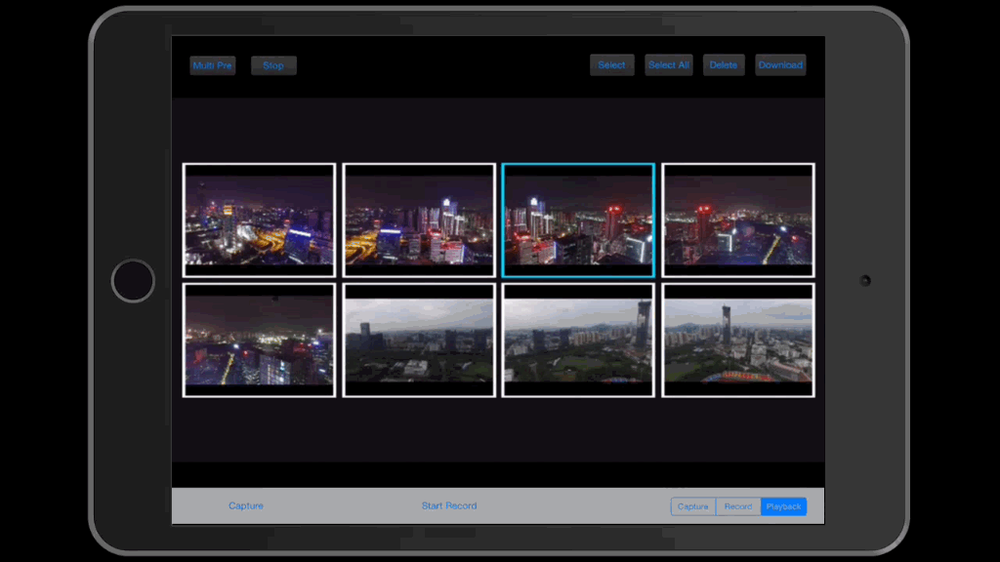

* Download completion and photos being saved to the Photo Album:

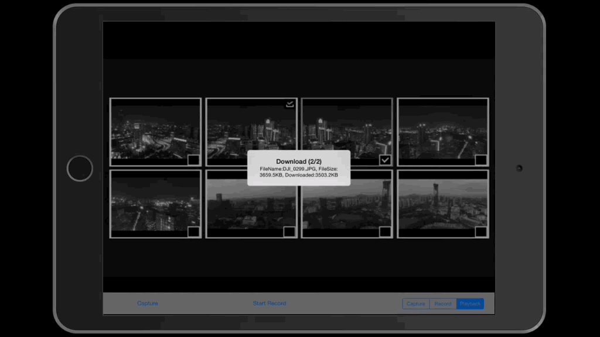

## Summary
   
   In this tutorial, you learned how to preview photos and videos in Single Preview Mode and Multiple Preview Mode, how to enter multiple edit mode and select files for deleting. You also learned how to download and save photos to the iOS Photo Album. 
   
   In the next tutorial, we will learn how to preview, edit and download photos and videos for Phantom 3 Advanced. Please move on to our next tutorial. Hope you enjoy it!
   
   