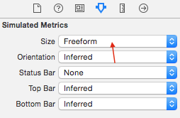

# 사진 및 비디오 재생 앱 만들기
<!-- toc -->

*주의: 이 튜토리얼의 코드는 iPad에서 실행되도록 작성되었다. 해당 코드를 iPad나 iPad simulator에서 실행하도록 하자. 이 튜토리얼은 Phantom 3 Professional와 Inspire 1에 해당된다.

이 튜토리얼에서 비행체 카메라의 SD카드 내에 있는 미디어 리소스에 접근하기 위해서 DJI Mobile SDK 사용하는 방법을 배운다. 이 튜토리얼의 마지막에는 사진 미리보기, 비디오 재생, 파일을 다운받고 삭제하는 앱이 완성될 것이다.

사진과 비디오를 관리하는 앱을 위해서 먼저 촬영하는 기능이 필요하다. 운좋게 이전 튜토리얼 [Creating a Camera Application](../../../iOS/FPVDemo/FPVDemo_kr.md)에서 **Capture**와 **Record** 기능을 구현하는 방법을 보여주낟. 진행하기 전에 먼저 튜토리얼을 읽도록 하자.

이 튜토리얼과 관련된 데모 프로젝트를 다운로드할 수 있다: <https://github.com/DJI-Mobile-SDK/iOS-PlaybackDemo.git>

자 이제 시작해 보자!

## 사진 및 비디오 미리보기

### 1. Framework와 라이브러리 Import하기

  Xcode에 "**PlaybackDemo**" 이름의 새로운 프로젝트를 생성하고, **DJISDK.framework**를 Xcode 프로젝트의 폴더에 복사하자. 다음으로 다운받은 SDK에 "VideoPreviewer" 폴더를 찾자. 전체 "VideoPreviewer" 폴더를 여러분의 Xcode 프로젝트의 "ThirdParty" 폴더에 복사한다. **Build Settings**에서 **FFMPEG**를 위해 **Header Search Paths** 와 **Library Search Paths**를 설정한다. 잘 모르겠다면 이전 튜토리얼 [**Creating a Camera Application**](../../../iOS/FPVDemo/FPVDemo_kr.md)을 확인하자. 다음으로 프로젝트 타겟을 선택하고 Build Phases -> Link Binary With Libraries로 이동한다. 밑에 있는 "+" 버튼을 클릭하고 2개 라이브러리 **libstdc++.6.0.9.dylib** 와 **libz.dylib**를 추가한다. 아래 스크린 샷을 보자 :

  
  
### 2. 재생 모드 전환

  이제 **ViewController.h** 와 **ViewController.m** 파일을 삭제한다. 여러분이 프로젝트를 생성할 때 Xcode에서 생성된 것들이다. 다음으로 "DJIRootViewController"라는 viewController를 생성하고 **Main.storyboard**내에서 **Root View Controller**로 설정하자. 이 데모에서 코드는 iPad용으로 작성되었다. 따라서 **Main.storyboard**의 UX를 조정할 수 있다. **Root View Controller**의 프레임을 변경한다. **Simulated Metrics**섹션에서 **Size** 드롭다운아래 **Freeform**에 대한 크기를 설정할 수 있다. view센셕에서 폭을 **1024**로 높이는 **768**로 변경한다. 아래와 같이 변경한다:

  
  
  
**Root View Controller** 내부로 UIView를 추가하고 **fpvPreviewView**라는 IBOutlet로 설정한다. 2개 UIButton과 View Control의 밑에 UISegmentedControl을 추가하고 IBOutlets와 IBActions를 설정한다. UISegmentedControl에 3개 세그먼트를 설정한다: **Capture**, **Record**, **Playback**. 마지막으로 UILabel을 맨 위로 드래그하고 view controller에 수평으로 중심에 위치시키고 숨긴다. 

  
  
 완려되면, **DJIRootViewController.m** 파일에 들어가고 **DJISDK**와 **VideoPreviewer** 헤더 파일을 import시킨다. **DJIDrone** 클래스의 속성을 생성하고 **DJICamera** 클래스의 하나 그리고 클래스 확장에서 protocol을 구현한다. 다음으로 2개 **UIButtons**을 추가하고 **UISegmentedControl**와 **UILabel**의 IBOutlet 속성을 추가한다.  record 상태로 체크를 검사하기 위해서 "isRecording" 이라는 boolean 속성을 추가한다. 모든 UI control을 위해 마지막으로 IBAction 메소드를 추가한다:

~~~objc
#import "DJIRootViewController.h"
#import <DJISDK/DJISDK.h>
#import "VideoPreviewer.h"

@interface DJIRootViewController ()<DJICameraDelegate, DJIDroneDelegate, DJIAppManagerDelegate>
@property (strong, nonatomic) DJIDrone *drone;
@property (strong, nonatomic) DJIInspireCamera* camera;
@property (weak, nonatomic) IBOutlet UIButton *recordBtn;
@property (weak, nonatomic) IBOutlet UISegmentedControl *changeWorkModeSegmentControl;
@property (weak, nonatomic) IBOutlet UIView *fpvPreviewView;
@property (weak, nonatomic) IBOutlet UILabel *currentRecordTimeLabel;
@property (assign, nonatomic) BOOL isRecording;

- (IBAction)captureAction:(id)sender;
- (IBAction)recordAction:(id)sender;
- (IBAction)changeWorkModeAction:(id)sender;

~~~

데이터 초기화를 위해서 **initData**라는 새로운 메소드를 생성하고 ViewDidLoad 메소드에서 이것을 호출한다. 다음으로 **DJIDrone** 인스턴스를 생성하고 **DJIDrone_Inspire**(가지고 있는 UAV에 맞게 변경)로서 타입을 설정한다. **drone**과 **camera** 인스턴스의 delegate를 **self**로 설정한다. "registerApp"라는 새로운 메소드를 생성하고 viewDidLoad내에서 호출한다. app 등록이 성공한 이후에 초기화 설정을 하기 위해서 DJIAppManagerDelegate를 구현한다:

~~~objc
- (void)viewDidLoad {
    [super viewDidLoad];
    [self initData];     
    [self registerApp];
}

- (void)initData
{
    self.drone = [[DJIDrone alloc] initWithType:DJIDrone_Inspire];
    self.drone.delegate = self;
    self.camera = (DJIInspireCamera *)self.drone.camera;
    self.camera.delegate = self;
}

- (void)registerApp
{
    NSString *appKey = @"Enter Your App Key Here";
    [DJIAppManager registerApp:appKey withDelegate:self];
}

#pragma mark DJIAppManagerDelegate Method
-(void)appManagerDidRegisterWithError:(int)error
{
    NSString* message = @"Register App Successed!";
    if (error != RegisterSuccess) {
        message = @"Register App Failed! Please enter your App Key and check the network.";
    }else
    {
        NSLog(@"registerAppSuccess");
        [_drone connectToDrone];
        [_camera startCameraSystemStateUpdates];
        [[VideoPreviewer instance] start];
        
    }
    UIAlertView* alertView = [[UIAlertView alloc] initWithTitle:@"Register App" message:message delegate:nil cancelButtonTitle:@"OK" otherButtonTitles:nil];
    [alertView show];
}

~~~

 viewWillAppear 메소드에서 **fpvPreviewView** 인스턴스를 **VideoPreviewer**의 View로 설정한다. 이것은 Video Stream을 보여주기 위해서고 viewWillDisappear 메소드에서 nil로 리셋한다. 또 동일한 메소드에 있는 DJIDrone 클래스의 **destroy** 메소드를 호출한다:
 
~~~objc

- (void)viewWillAppear:(BOOL)animated
{
    [super viewWillAppear:animated];
    [[VideoPreviewer instance] setView:self.fpvPreviewView];
    
}

- (void)viewWillDisappear:(BOOL)animated
{
    
    [super viewWillDisappear:animated];
    [self.camera stopCameraSystemStateUpdates];
    [self.drone.mainController stopUpdateMCSystemState];
    [self.drone disconnectToDrone];
    [self.drone destroy];
    [[VideoPreviewer instance] setView:nil];
    
}
~~~

  **DJICameraDelegate** 메소드를 구현한다. 다음과 같다:
  
~~~objc
#pragma mark - DJICameraDelegate

-(void) camera:(DJICamera*)camera didReceivedVideoData:(uint8_t*)videoBuffer length:(int)length
{
    uint8_t* pBuffer = (uint8_t*)malloc(length);
    memcpy(pBuffer, videoBuffer, length);
    [[VideoPreviewer instance].dataQueue push:pBuffer length:length];
}

-(void) camera:(DJICamera*)camera didUpdateSystemState:(DJICameraSystemState*)systemState
{
     if (self.drone.droneType == DJIDrone_Inspire) {
        
        //Update currentRecordTimeLabel State
        self.isRecording = systemState.isRecording;
        [self.currentRecordTimeLabel setHidden:!self.isRecording];
        [self.currentRecordTimeLabel setText:[self formattingSeconds:systemState.currentRecordingTime]];
        
        //Update recordBtn State
        if (self.isRecording) {
            [self.recordBtn setTitle:@"Stop Record" forState:UIControlStateNormal];
        }else
        {
            [self.recordBtn setTitle:@"Start Record" forState:UIControlStateNormal];
        }
        
        //Update UISegmented Control's state
        if (systemState.workMode == CameraWorkModeCapture) {
            [self.changeWorkModeSegmentControl setSelectedSegmentIndex:0];
        }else if (systemState.workMode == CameraWorkModeRecord){
            [self.changeWorkModeSegmentControl setSelectedSegmentIndex:1];
        }else if (systemState.workMode == CameraWorkModePlayback){
            [self.changeWorkModeSegmentControl setSelectedSegmentIndex:2];
        }
    }
}

-(void) droneOnConnectionStatusChanged:(DJIConnectionStatus)status
{
    if (status == ConnectionSuccessed) {
        NSLog(@"Connection Successed");
    }
    else if(status == ConnectionStartConnect)
    {
        NSLog(@"Start Reconnect");
    }
    else if(status == ConnectionBroken)
    {
        NSLog(@"Connection Broken");
    }
    else if (status == ConnectionFailed)
    {
        NSLog(@"Connection Failed");
    }
}

- (NSString *)formattingSeconds:(int)seconds
{
    NSDate *date = [NSDate dateWithTimeIntervalSince1970:seconds];
    NSDateFormatter *formatter = [[NSDateFormatter alloc] init];
    [formatter setDateFormat:@"mm:ss"];
    [formatter setTimeZone:[NSTimeZone timeZoneForSecondsFromGMT:0]];
    
    NSString *formattedTimeString = [formatter stringFromDate:date];
    return formattedTimeString;
}

~~~

  마지막으로 아래와 같이 IBAction 메소드를 구현한다.
  
~~~objc
- (IBAction)captureAction:(id)sender {
    __weak DJIRootViewController *weakSelf = self;
    [self.camera startTakePhoto:CameraSingleCapture withResult:^(DJIError *error) {
        if (error.errorCode != ERR_Successed) {
            UIAlertView *errorAlert = [[UIAlertView alloc] initWithTitle:@"Take Photo Error" message:error.errorDescription delegate:weakSelf cancelButtonTitle:@"OK" otherButtonTitles:nil];
            [errorAlert show];
        }
    }];
}

- (IBAction)recordAction:(id)sender {
    __weak DJIRootViewController *weakSelf = self;
    if (self.isRecording) {
        [self.camera stopRecord:^(DJIError *error) {
            if (error.errorCode != ERR_Successed) {
                UIAlertView *errorAlert = [[UIAlertView alloc] initWithTitle:@"Stop Record Error" message:error.errorDescription delegate:weakSelf cancelButtonTitle:@"OK" otherButtonTitles:nil];
                [errorAlert show];
            }
        }];
    }else
    {
        [self.camera startRecord:^(DJIError *error) { 
            if (error.errorCode != ERR_Successed) {
                UIAlertView *errorAlert = [[UIAlertView alloc] initWithTitle:@"Start Record Error" message:error.errorDescription delegate:weakSelf cancelButtonTitle:@"OK" otherButtonTitles:nil];
                [errorAlert show];
            }
        }];
    }
}

- (IBAction)changeWorkModeAction:(id)sender {
    DJIInspireCamera* inspireCamera = (DJIInspireCamera*)self.camera;
    __weak DJIRootViewController *weakSelf = self;
    UISegmentedControl *segmentControl = (UISegmentedControl *)sender;
    if (segmentControl.selectedSegmentIndex == 0) { //CaptureMode
        [inspireCamera setCameraWorkMode:CameraWorkModeCapture withResult:^(DJIError *error) {
            if (error.errorCode != ERR_Successed) {
                UIAlertView *errorAlert = [[UIAlertView alloc] initWithTitle:@"Set CameraWorkModeCapture Failed" message:error.errorDescription delegate:weakSelf cancelButtonTitle:@"OK" otherButtonTitles:nil];
                [errorAlert show];
            }
        }];
    }else if (segmentControl.selectedSegmentIndex == 1){ //RecordMode
        [inspireCamera setCameraWorkMode:CameraWorkModeRecord withResult:^(DJIError *error) {
            if (error.errorCode != ERR_Successed) {
                UIAlertView *errorAlert = [[UIAlertView alloc] initWithTitle:@"Set CameraWorkModeRecord Failed" message:error.errorDescription delegate:weakSelf cancelButtonTitle:@"OK" otherButtonTitles:nil];
                [errorAlert show];
            }
        }];
        
    }else if (segmentControl.selectedSegmentIndex == 2){  //PlaybackMode 
        [inspireCamera setCameraWorkMode:CameraWorkModePlayback withResult:^(DJIError *error) {
            if (error.errorCode != ERR_Successed) {
                UIAlertView *errorAlert = [[UIAlertView alloc] initWithTitle:@"Set CameraWorkModeRecord Failed" message:error.errorDescription delegate:weakSelf cancelButtonTitle:@"OK" otherButtonTitles:nil];
                [errorAlert show];
            }
        }];
    }
}

~~~

  **Playback** work mode 메소드를 구현했고 **DJIInspireCamera** 클래스의 **setCameraWorkMode**를 호출하고 **CameraWorkModePlayback** 값을 여기에 전달한다. error가 있는 경우 alertView를 보여준다. 
   
  지금까지 Xcode에 프로젝트를 빌드하고 실행한다. 사진을 찍고 비디오를 촬영하기 위해서 **Capture**와 **Record**를 사용하자. 다음으로 UISegmentControl를 두드려서 **Camera Mode**를 전환하며, 마지막 촬영한 사진이나 비디오를 보기 위해서 **Playback** 모드로 전환한다. 여기 스크린샷은 playback모드이다:
  
 
  
### 3. 단일 파일 미리보기

이제 **Playback** 모드로 전환할 수 있다. 2개 **UISwipeGestureRecognizer**를 추가해서 SD 카드에 있는 이전과 다음 미디어 파일을 미리보기 하자.

**DJIRootViewController.m** 파일을 열고, **UISwipeGestureRecognizer**의 2개 속성을 생성하고 확장 클래스에서 이름을 **swipeLeftGesture** 와 **swipeRightGesture**라고 붙인다. **initData** 메소드에서 초기화한다:

~~~objc

- (void)initData
{
    self.drone = [[DJIDrone alloc] initWithType:DJIDrone_Inspire];
    self.drone.delegate = self;
    self.camera = (DJIInspireCamera *)self.drone.camera;
    self.camera.delegate = self;
    
    self.swipeLeftGesture = [[UISwipeGestureRecognizer alloc] initWithTarget:self action:@selector(swipeLeftGestureAction:)];
    self.swipeLeftGesture.direction = UISwipeGestureRecognizerDirectionLeft;
    self.swipeRightGesture = [[UISwipeGestureRecognizer alloc] initWithTarget:self action:@selector(swipeRightGestureAction:)];
    self.swipeRightGesture.direction = UISwipeGestureRecognizerDirectionRight;

    [self.view addGestureRecognizer:self.swipeLeftGesture];
    [self.view addGestureRecognizer:self.swipeRightGesture];
}

~~~

gesture 동작 셀렉터 메소드 구현하기:

~~~objc 
- (void)swipeLeftGestureAction:(UISwipeGestureRecognizer *)gesture
{
     [self.camera singlePreviewNextPage];
}

- (void)swipeRightGestureAction:(UISwipeGestureRecognizer *)gesture
{
     [self.camera singlePreviewPreviousPage];
}
~~~

위에 코드는 이전과 다음 파일을 미리보기 하기 위해서 DJIInspireCamera 클래스의 **singlePreviewNextPage**와 **singlePreviewPreviousPage** 메소드를 사용한다. SD카드에 미디어 파일의 2가지 타입으로 **Photo**와 **Video**가 있기 때문에, 비디오 재생 기능을 구현해야만 한다.

**Main.storyboard** 열고 UIVIew 객체를 드래그해서 viewController의 맨위에 위치시킨다. UIButton를 좀전에 subview로 추가한 view에 추가하고 **Stop**이라 이름 붙인다. UIButton 객체를 viewController의 가운데로 드래그하고 이미지를 "playVideo"(프로젝트 소스 코드에서 image파일을 얻을 수 있으며 Images.xcassets 폴더에 있다)로 설정한다.

 
 
 **Stop**과 **playVideo** 버튼을 숨긴다. **DJIRootViewController.m**로 가서 새로 추가한 UI를 위해 IBOutlets와 IBActions을 생성한다:
 
~~~objc
@property (nonatomic, strong) IBOutlet UIView* playbackBtnsView;
@property (weak, nonatomic) IBOutlet UIButton *playVideoBtn;

- (IBAction)playVideoBtnAction:(id)sender;
- (IBAction)stopVideoBtnAction:(id)sender; 
~~~

IBAction 메소드를 구현하기 전에, DJICameraSystemState 클래스의 새로운 속성 2개와 DJICameraPlaybackState 클래스를 추가하고 클래스 확장에서 **cameraSystemState**와 **cameraPlaybackState**라고 이름 붙이다:

~~~objc
@property (strong, nonatomic) DJICameraSystemState* cameraSystemState;
@property (strong, nonatomic) DJICameraPlaybackState* cameraPlaybackState;
~~~

이런 속성들은 현재 카메라 시스템 상태와 재생 상태를 저장한다. **cameraSystemState** 속성 값을 업데이트하고 "-(void) camera:(DJICamera*)camera didUpdateSystemState:(DJICameraSystemState*)systemState" delegate 메소드에서 **DJICameraSystemState**의 workMode를 기반으로 **playbackBtnsView**를 숨긴다:

~~~objc
-(void) camera:(DJICamera*)camera didUpdateSystemState:(DJICameraSystemState*)systemState
{
    if (self.drone.droneType == DJIDrone_Inspire) {
        
        self.cameraSystemState = systemState; //Update camera system state

        //Update currentRecordTimeLabel State
        self.isRecording = systemState.isRecording;
        [self.currentRecordTimeLabel setHidden:!self.isRecording];
        [self.currentRecordTimeLabel setText:[self formattingSeconds:systemState.currentRecordingTime]];
        
        //Update playbackBtnsView state
        BOOL isPlayback = (systemState.workMode == CameraWorkModePlayback) || (systemState.workMode == CameraWorkModeDownload);
        self.playbackBtnsView.hidden = !isPlayback;
        
        //Update recordBtn State
        if (self.isRecording) {
            [self.recordBtn setTitle:@"Stop Record" forState:UIControlStateNormal];
        }else
        {
            [self.recordBtn setTitle:@"Start Record" forState:UIControlStateNormal];
        }
        //Update UISegmented Control's state
        if (systemState.workMode == CameraWorkModeCapture) {
            [self.changeWorkModeSegmentControl setSelectedSegmentIndex:0];
        }else if (systemState.workMode == CameraWorkModeRecord){
            [self.changeWorkModeSegmentControl setSelectedSegmentIndex:1];
        }else if (systemState.workMode == CameraWorkModePlayback){
            [self.changeWorkModeSegmentControl setSelectedSegmentIndex:2];
        }
    }
}
~~~

추가로 아래처럼 **-(void) camera:(DJICamera *)camera didUpdatePlaybackState:(DJICameraPlaybackState *)playbackState** delegate 메소드를 구현한다:

~~~objc
-(void) camera:(DJICamera *)camera didUpdatePlaybackState:(DJICameraPlaybackState *)playbackState
{
    if (self.cameraSystemState.workMode == CameraWorkModePlayback) {
        self.cameraPlaybackState = playbackState;
        [self updateUIWithPlaybackState:playbackState];
    }else
    {
        [self.playVideoBtn setHidden:YES];
    }
}

- (void)updateUIWithPlaybackState:(DJICameraPlaybackState *)playbackState
{
    if (playbackState.playbackMode == SingleFilePreview) {
        if (playbackState.mediaFileType == MediaFileJPEG || playbackState.mediaFileType == MediaFileDNG) { //Photo Type            
            [self.playVideoBtn setHidden:YES];
        }else if (playbackState.mediaFileType == MediaFileVIDEO) //Video Type
        {
            [self.playVideoBtn setHidden:NO];
        }
    }else if (playbackState.playbackMode == SingleVideoPlaybackStart){ //Playing Video
        [self.playVideoBtn setHidden:YES];
    }else if (playbackState.playbackMode == MultipleFilesPreview){
        [self.playVideoBtn setHidden:YES];
    }
}
~~~

**-(void) camera:(DJICamera *)camera didUpdatePlaybackState:(DJICameraPlaybackState *)playbackState** delegate 메소드에 **cameraPlaybackState** 속성 값을 업데이트했다. DJICameraSystemState의 **workMode**와 DJICameraPlaybackState의 **playbackMode**를 기반으로 **playVideoBtn**의 감춰진 상태를 업데이트 한다.

마지막으로 **IBAction** 메소든 아래와 같이 구현한다:

~~~objc
- (IBAction)playVideoBtnAction:(id)sender {
    if (self.cameraPlaybackState.mediaFileType == MediaFileVIDEO) {
        [self.camera startVideoPlayback];
    }
}

- (IBAction)stopVideoBtnAction:(id)sender {
    if (self.cameraPlaybackState.mediaFileType == MediaFileVIDEO) {
        if (self.cameraPlaybackState.videoPlayProgress > 0) {
            [self.camera stopVideoPlayback];
        }
    }
}
~~~

**playVideoBtnAction**와 **stopVideoBtnAction** 메소드에서 미디어 타입이 비디오인지를 검사하고 비디오 플레이를 시작하거나 멈추기 위해서 **DJIInspireCamera** 클래스의 **startVideoPlayback**와 **stopVideoPlayback** 메소드를 호출한다.

프로젝트를 빌드 및 실행한다. 사진과 비디오를 탐색하기 위해 playbackMode에서 왼쪽에서 오른쪽으로 스위핑한다. 스크린 중앙에 play 버튼이 보이면 비디오를 재생하기 위해 눌러보자.

playback app을 통해 비디오를 재생하기 :

 

### 4. 여러 파일 미리보기

진도를 나가기 전에 **Playback mode**에 대해 알아보자. 카메라에는 여러가지 재생 모드가 있다. **DJICameraPlaybackState.h** 파일내에 **CameraPlaybackMode** enum 타입을 확인해 보라:

~~~objc
/**
 *  Playback mode
 */
typedef NS_ENUM(uint8_t, CameraPlaybackMode){
    /**
     *  Single file preview
     */
    SingleFilePreview,
    /**
     *  Single photo zoomed
     */
    SinglePhotoZoomMode,
    /**
     *  Single video play start
     */
    SingleVideoPlaybackStart,
    /**
     *  Single video play stop
     */
    SingleVideoPlaybackStop,
    /**
     *  Multiple file edit
     */
    MultipleFilesEdit,
    /**
     *  Multiple file preview
     */
    MultipleFilesPreview,
    /**
     *  Download file
     */
    MediaFilesDownload,
    /**
     *  Mode error
     */
    PlaybackModeError = 0xFF,
};
~~~

위 코드와 같이, 2가지 방법으로 미리보기가 가능하다 : **Single Preview**와 **Multiple Preview**이다. 줌, 비디오 재생, 사진과 비디오 삭제 그리고 내려받기를 할 수 있다.

여러 파일을 미리보기 하는 방법을 배워보자. **Multiple Preview**은 다음과 같다 :

 
 
동시에 8개 파일을 미리보기할 수 있다. **fpvPreviewView**에서 미리보기 이미지가 나타나기 때문에, 아직은 상호동작하는 기능을 없다. 버튼을 추가하고 상호동작하는 스윕 gesture를 추가하자.

먼저 **UIViewController**의 서브클래스로 **DJIPlaybackMultiSelectViewController** 이름의 새로운 파일을 생성한다. **Also create XIB file**에 대한 체크박스를 선택한다. **DJIPlaybackMultiSelectViewController.xib** 파일을 열고 **Simulated Metrics** 섹션에 **Size** 드롭다운 아래에 **Freeform**에 사이즈를 설정한다. view 섹션에서 폭은 **1024**, 높이는 **768**로 변경한다. 아래와 같다 :

  
  
  
**UIView** 객체를 서브뷰로서 viewController로 드래그해서 **Buttons View**라는 이름을 붙인다. 다음으로 프레임을 다음과 같이 설정한다 :

  
  
8개 **UIButton** 객체를 서브뷰로 **Buttons View**에 드래그하고 다음과 같이 위치시킨다.(이 버튼들의 프레임을 설정하는 방법에 대한 상세 내용은 데모 프로젝트의 **DJIPlaybackMultiSelectViewController.xib** 파일을 살펴보자):

  

**Multiple Preview Mode**에 있을 때, 이 버튼들은 8개 미디어 파일을 나타낸다. 이 버튼들 중에 어떤 것을 누르면 **Single Preview Mode**로 들어간다.

이제 **DJIPlaybackMultiSelectViewController.h** 파일을 열고 다음과 같이 2개 block property를 생성한다.

~~~objc
#import <UIKit/UIKit.h>

@interface DJIPlaybackMultiSelectViewController : UIViewController

@property (copy, nonatomic) void (^selectItemBtnAction)(int index);
@property (copy, nonatomic) void (^swipeGestureAction)(UISwipeGestureRecognizerDirection direction);

@end
~~~

첫번째 블록은 인덱스를 가지는 선택 버튼 액션을 확인하는데 사용하고 두번째 블록은 스와입 gesture 액션을 검사한다.

**DJIPlaybackMultiSelectViewController.m** 파일로 가서 4개 **UISwipeGestureRecognizer** 속성을 생성해서 **left**, **right**, **up**, **down** 스와입 gesture를 표현하자. 추가로 8개 IBAction 메소드와 이를 **DJIPlaybackMultiSelectViewController.xib** 파일내에 UIButton 객체에 연결시키자:

~~~objc
#import "DJIPlaybackMultiSelectViewController.h"

@interface DJIPlaybackMultiSelectViewController()

@property(nonatomic, strong) UISwipeGestureRecognizer *swipeLeftGesture;
@property(nonatomic, strong) UISwipeGestureRecognizer *swipeRightGesture;
@property(nonatomic, strong) UISwipeGestureRecognizer *swipeUpGesture;
@property(nonatomic, strong) UISwipeGestureRecognizer *swipeDownGesture;

- (IBAction)selectFirstItemBtnAction:(id)sender;
- (IBAction)selectSecondItemBtnAction:(id)sender;
- (IBAction)selectThirdItemBtnAction:(id)sender;
- (IBAction)selectFourthItemBtnAction:(id)sender;
- (IBAction)selectFifthItemBtnAction:(id)sender;
- (IBAction)selectSixthItemBtnAction:(id)sender;
- (IBAction)selectSeventhItemBtnAction:(id)sender;
- (IBAction)selectEighthItemBtnAction:(id)sender;

@end
~~~

viewDidLoad 메소드에서 스와입 gesture 속성을 초기화하고 아래와 같이 action 메소드를 구현하자:

~~~objc
- (void)viewDidLoad {
    [super viewDidLoad];

    self.swipeLeftGesture = [[UISwipeGestureRecognizer alloc] initWithTarget:self action:@selector(swipeLeftGestureAction:)];
    self.swipeLeftGesture.direction = UISwipeGestureRecognizerDirectionLeft;
    self.swipeRightGesture = [[UISwipeGestureRecognizer alloc] initWithTarget:self action:@selector(swipeRightGestureAction:)];
    self.swipeRightGesture.direction = UISwipeGestureRecognizerDirectionRight;
    self.swipeUpGesture = [[UISwipeGestureRecognizer alloc] initWithTarget:self action:@selector(swipeUpGestureAction:)];
    self.swipeUpGesture.direction = UISwipeGestureRecognizerDirectionUp;
    self.swipeDownGesture = [[UISwipeGestureRecognizer alloc] initWithTarget:self action:@selector(swipeDownGestureAction:)];
    self.swipeDownGesture.direction = UISwipeGestureRecognizerDirectionDown;
    
    [self.view addGestureRecognizer:self.swipeLeftGesture];
    [self.view addGestureRecognizer:self.swipeRightGesture];
    [self.view addGestureRecognizer:self.swipeUpGesture];
    [self.view addGestureRecognizer:self.swipeDownGesture];

}

#pragma mark UIGestureAction Methods
- (void)swipeLeftGestureAction:(UISwipeGestureRecognizer *)gesture
{
    if (self.swipeGestureAction) {
        self.swipeGestureAction(UISwipeGestureRecognizerDirectionLeft);
    }
}

- (void)swipeRightGestureAction:(UISwipeGestureRecognizer *)gesture
{
    if (self.swipeGestureAction) {
        self.swipeGestureAction(UISwipeGestureRecognizerDirectionRight);
    }
}

- (void)swipeUpGestureAction:(UISwipeGestureRecognizer *)gesture
{
    if (self.swipeGestureAction) {
        self.swipeGestureAction(UISwipeGestureRecognizerDirectionUp);
    }
}

- (void)swipeDownGestureAction:(UISwipeGestureRecognizer *)gesture
{
    if (self.swipeGestureAction) {
        self.swipeGestureAction(UISwipeGestureRecognizerDirectionDown);
    }
}

~~~ 

이렇게 4개 스와입 gesture는 단일/복수 파일을 미리보기 하는데 사용한다. **Single Preview Mode**내에 파일을 미리보기를 위해 왼쪽이나 오른쪽으로 스와입 동작을 하고 **Multiple Preview Mode**에서 파일을 미리보기하는 경우 위나 아래로 스와입 동작을 한다. **UISwipeGestureRecognizerDirection** 값을 가지는 스와입 액션 메소드내부에 **swipeGestureAction** 블록을 호출한다.

8개 UIButton을 위해서 다음과 같이 IBAction 메소드를 구현한다:

~~~objc
#pragma mark UIButton Action Methods
- (IBAction)selectFirstItemBtnAction:(id)sender {
    if (self.selectItemBtnAction) {
        self.selectItemBtnAction(0);
    }
}

- (IBAction)selectSecondItemBtnAction:(id)sender {
    if (self.selectItemBtnAction) {
        self.selectItemBtnAction(1);
    }
}

- (IBAction)selectThirdItemBtnAction:(id)sender {
    if (self.selectItemBtnAction) {
        self.selectItemBtnAction(2);
    }
}

- (IBAction)selectFourthItemBtnAction:(id)sender {
    if (self.selectItemBtnAction) {
        self.selectItemBtnAction(3);
    }
}

- (IBAction)selectFifthItemBtnAction:(id)sender {
    if (self.selectItemBtnAction) {
        self.selectItemBtnAction(4);
    }
}

- (IBAction)selectSixthItemBtnAction:(id)sender {
    if (self.selectItemBtnAction) {
        self.selectItemBtnAction(5);
    }
}

- (IBAction)selectSeventhItemBtnAction:(id)sender {
    if (self.selectItemBtnAction) {
        self.selectItemBtnAction(6);
    }
}

- (IBAction)selectEighthItemBtnAction:(id)sender {
    if (self.selectItemBtnAction) {
        self.selectItemBtnAction(7);
    }
}
~~~

관련 버튼 인덱스를 가지고 IBAction 내부에 **selectItemBtnAction** 블록을 호출한다. 다중 미리보기 모드에서 파일 인덱스가 0부터 시작하므로 여기서 인덱스는 0에서 시작했다.

이제 **DJIRootViewController.m** 파일로 돌아가보자. DJIPlaybackMultiSelectViewController.m 파일에 스와입 왼쪽 그리고 오른쪽 동작을 추가했다. **swipeLeftGesture** 와 **swipeRightGesture** property와 리팩터링을 위해 DJIRootViewController.m 내에 있는 관련 코드를 삭제하자.

DJIPlaybackMultiSelectViewController.h 헤더 파일을 import하고 **playbackMultiSelectVC** 라는 이름의 DJIPlaybackMultiSelectViewController 속성을 생성한다. **initPlaybackMultiSelectVC**라는 새로운 메소드를 생성하고 **viewDidLoad** 메소드에서 구현한다:

~~~objc
- (void)viewDidLoad {
    [super viewDidLoad];
    [[NSNotificationCenter defaultCenter] addObserver:self selector:@selector(registerAppSuccess:) name:@"RegisterAppSuccess" object:nil];
    [self initData];
    [self registerApp];
    [self initPlaybackMultiSelectVC];

}

- (void)initPlaybackMultiSelectVC
{
    self.playbackMultiSelectVC = [[DJIPlaybackMultiSelectViewController alloc] initWithNibName:@"DJIPlaybackMultiSelectViewController" bundle:[NSBundle mainBundle]];
    [self.playbackMultiSelectVC.view setFrame:self.view.frame];
    [self.fpvPreviewView addSubview:self.playbackMultiSelectVC.view];
    __weak DJIRootViewController *weakSelf = self;
    [self.playbackMultiSelectVC setSelectItemBtnAction:^(int index) {
        if (weakSelf.cameraPlaybackState.playbackMode == MultipleFilesPreview) {
            [weakSelf.camera enterSinglePreviewModeWithIndex:index];
        }
    }];
    
    [self.playbackMultiSelectVC setSwipeGestureAction:^(UISwipeGestureRecognizerDirection direction) {
        
        if (weakSelf.cameraPlaybackState.playbackMode == SingleFilePreview) {
            if (direction == UISwipeGestureRecognizerDirectionLeft) {
                [weakSelf.camera singlePreviewNextPage];
            }else if (direction == UISwipeGestureRecognizerDirectionRight){
                [weakSelf.camera singlePreviewPreviousPage];
            }
        }else if(weakSelf.cameraPlaybackState.playbackMode == MultipleFilesPreview){
            if (direction == UISwipeGestureRecognizerDirectionUp) {
                [weakSelf.camera multiplePreviewNextPage];
            }else if (direction == UISwipeGestureRecognizerDirectionDown){
                [weakSelf.camera multiplePreviewPreviousPage];
            }
        }
    }];
}
~~~

**initPlaybackMultiSelectVC** 메소드에서 **playbackMultiSelectVC** 속성을 먼저 초기화하고 다음으로 **selectItemBtnAction** 블록의 setter 메소드를 호출하고 선택한 인덱스를 가지고 **DJIInspireCamera**의 **enterSinglePreviewModeWithIndex** 메소드를 호출한다. 이런 방식으로 다중 미리보기 모드에서 단일 미리보기 모드로 전환할 수 있다. 

추가로 **swipeGestureAction** 블록의 setter 메소드를 호출하고 **UISwipeGestureRecognizerDirection** 값을 기반으로 파일 미리보기 기능을 구현한다.

이것이 완료되면, **Main.storyboard**로 가서 **UIButton** 객체를 서브뷰로 **playbackBtnsView**로 드래그한다. **Multi Pre**라는 이름을 주고 다음과 같이 위치시킨다:

마지막으로 **multiPreviewButtonClicked**라는 이름의 IBAction 메소드를 생성하고, **Main.storyboard**에서 UIBUtton 위로 연결시킨다. 다중 미리보기 모드에 진입하기 위해서 아래와 같은 메소드를 구현한다:

~~~objc
- (IBAction)multiPreviewButtonClicked:(id)sender {
    [self.camera enterMultiplePreviewMode];
}
~~~

프로젝트를 빌드하고 실행하자. 다중 미리보기 모드에 들어가자. 파일 미리보기를 위해서 스와입 위와 아래 gesture를 사용한다. 8개 미리보기 이미지 중에 하나를 누르면 단일 미리보기 모드로 전환된다. 스크린샷은 아래와 같다:

## 사진과 비디오 삭제

단일 미리보기 모드와 다중 미리보기 모드에서 사진과 비디오를 미리보기할 수 있다. 하지만 원하지 않는 파일을 삭제하려고 한다면? 파일을 삭제하는 기능을 구현해보자!

Main.storyboard로 가서 3개 UIButton을 서브뷰로 **playbackBtnsView**로 드래그하고 **Select**, **Select All**, **Delete**라는 이름을 붙인다. 여기서는 "Select", "Select All" 버튼은 숨기자. **DJIRootViewController.m** 파일로 가서 "Select"와 "Select All" 버튼을 위해 2개 IBOutlet를 생성한다. 또 3개 버튼에 대해서 각각 IBAction 메소드를 생성한다. 아래와 같다 :

~~~objc
@property (weak, nonatomic) IBOutlet UIButton *selectBtn;
@property (weak, nonatomic) IBOutlet UIButton *selectAllBtn;

- (IBAction)selectButtonAction:(id)sender;
- (IBAction)deleteButtonAction:(id)sender;
- (IBAction)selectAllBtnAction:(id)sender;
~~~

다음으로 아래와 같이 IBAction 메소드를 구현한다:

~~~objc
- (IBAction)selectButtonAction:(id)sender {
    if (self.cameraPlaybackState.playbackMode == MultipleFilesEdit) {
        [self.camera exitMultipleEditMode];
    }else
    {
        [self.camera enterMultipleEditMode];
    }
}

- (IBAction)selectAllBtnAction:(id)sender {
    
    if (self.cameraPlaybackState.isAllFilesInPageSelected) {
        [self.camera unselectAllFilesInPage];
    }
    else
    {
        [self.camera selectAllFilesInPage];
    }
}
~~~

위 코드로 DJIInspireCamera 클래스의 **exitMultipleEditMode**와 **enterMultipleEditMode** 메소드를 호출해서 MultipleEditMode에 들어가고 나가기 위해서 selectButtonAction 메소드를 구현했다. selectAllBtnAction IBAction 메소드에서 페이지에 있는 모든 파일이 선택되었는지 검사하는 if절을 사용하며, DJIInspireCamera의 **selectAllFilesInPage**와 **unselectAllFilesInPage**를 호출한다.

추가로 다음 메소드에서 **selectBtn**와 **selectAllBtn**의 숨긴 값을 업데이트한다:

~~~objc
- (void)updateUIWithPlaybackState:(DJICameraPlaybackState *)playbackState
{
    if (playbackState.playbackMode == SingleFilePreview) {
        
        [self.selectBtn setHidden:YES];
        [self.selectAllBtn setHidden:YES];
        
        if (playbackState.mediaFileType == MediaFileJPEG || playbackState.mediaFileType == MediaFileDNG) { //Photo Type
            
            [self.playVideoBtn setHidden:YES];
            
        }else if (playbackState.mediaFileType == MediaFileVIDEO) //Video Type
        {
            [self.playVideoBtn setHidden:NO];
        }
        
    }else if (playbackState.playbackMode == SingleVideoPlaybackStart){ //Playing Video
        
        [self.selectBtn setHidden:YES];
        [self.selectAllBtn setHidden:YES];
        [self.playVideoBtn setHidden:YES];
        
    }else if (playbackState.playbackMode == MultipleFilesPreview){
        
        [self.selectBtn setHidden:NO];
        [self.selectBtn setTitle:@"Select" forState:UIControlStateNormal];
        [self.selectAllBtn setHidden:NO];
        [self.playVideoBtn setHidden:YES];
        
    }else if (playbackState.playbackMode == MultipleFilesEdit){
    
        [self.selectBtn setHidden:NO];
        [self.selectBtn setTitle:@"Cancel" forState:UIControlStateNormal];
        [self.selectAllBtn setHidden:NO];
        [self.playVideoBtn setHidden:YES];

    }   
}
~~~ 

**deleteButtonAction** 메소드를 구현하기 전에, 클래스 확장에서 2개 속성을 생성하자:

~~~objc
@property (strong, nonatomic) UIAlertView* statusAlertView;
@property (assign, nonatomic) int selectedFileCount;
~~~

여기서 다중 미리보기 모드에서 현재 선택된 파일의 수를 계산하기 위해서 **selectedFileCount**라는 이름의 **int** 속성을 생성한다. 파일을 삭제할 때 경고를 보여주기 위해서 **statusAlertView**이라는 **UIAlertView** 속성을 생성한다.

다음과 같이 alertView를 **show**, **dismiss**, **update**하기 위해 3개 메소드를 생성한다:

~~~objc
-(void) showStatusAlertView
{
    if (self.statusAlertView == nil) {
        self.statusAlertView = [[UIAlertView alloc] initWithTitle:@"" message:@"" delegate:nil cancelButtonTitle:nil otherButtonTitles:nil];
        [self.statusAlertView show];
    }
}

-(void) dismissStatusAlertView
{
    if (self.statusAlertView) {
        [self.statusAlertView dismissWithClickedButtonIndex:0 animated:YES];
        self.statusAlertView = nil;
    }       
}

- (void)updateStatusAlertContentWithTitle:(NSString *)title message:(NSString *)message shouldDismissAfterDelay:(BOOL)dismiss
{
    if (self.statusAlertView) {
        [self.statusAlertView setTitle:title];
        [self.statusAlertView setMessage:message];
        
        if (dismiss) {
            [self performSelector:@selector(dismissStatusAlertView) withObject:nil afterDelay:2.0];
        }
    }   
}
~~~

추가로 아래와 같이 **deleteButtonAction** 액션 메소드를 구현한다 :

~~~objc
- (IBAction)deleteButtonAction:(id)sender {
    
    self.selectedFileCount = self.cameraPlaybackState.numbersOfSelected;
    
    if (self.cameraPlaybackState.playbackMode == MultipleFilesEdit) {

        if (self.selectedFileCount == 0) {
            [self showStatusAlertView];
            [self updateStatusAlertContentWithTitle:@"Please select files to delete!" message:@"" shouldDismissAfterDelay:YES];
            return;
        }else
        {
            NSString *title;
            if (self.selectedFileCount == 1) {
                title = @"Delete Selected File?";
            }else
            {
                title = @"Delete Selected Files?";
            }
            UIAlertView *deleteAllSelFilesAlert = [[UIAlertView alloc] initWithTitle:title message:@"" delegate:self cancelButtonTitle:@"NO" otherButtonTitles:@"YES", nil];
            deleteAllSelFilesAlert.tag = kDeleteAllSelFileAlertTag;
            [deleteAllSelFilesAlert show];
        }

    }else if (self.cameraPlaybackState.playbackMode == SingleFilePreview){
        
        UIAlertView *deleteCurrentFileAlert = [[UIAlertView alloc] initWithTitle:@"Delete The Current File?" message:@"" delegate:self cancelButtonTitle:@"NO" otherButtonTitles:@"YES", nil];
        deleteCurrentFileAlert.tag = kDeleteCurrentFileAlertTag;
        [deleteCurrentFileAlert show];
    }
    
}
~~~

**cameraPlaybackState**의 "numbersOfSelected" 값을 가지고 **selectedFileCount** 속성 값을 업데이트한다. "MultipleFilesEdit"과 "SingleFilePreview" 모드에서 alertView를 보여주기 위해서 cameraPlaybackState의 **playbackMode** 값을 검사한다. UIAlertView의 태그 속성을 위해서 매크로 정의를 사용한다:

~~~objc
#define kDeleteAllSelFileAlertTag 100
#define kDeleteCurrentFileAlertTag 101
~~~

마지막으로 파일을 지우고 selectBtn의 타이틀을 업데이트하기 위해서 DJIInspireCamera의 **deleteAllSelectedFiles**와 **deleteCurrentPreviewFile** 메소드를 호출해서 UIAlertView delegate 메소드를 구현한다:

~~~objc 
#pragma mark UIAlertView Delegate Method
- (void)alertView:(UIAlertView *)alertView clickedButtonAtIndex:(NSInteger)buttonIndex
{
    if (alertView.tag == kDeleteAllSelFileAlertTag) {
        if (buttonIndex == 1) {
            [self.camera deleteAllSelectedFiles];
            [self.selectBtn setTitle:@"Select" forState:UIControlStateNormal];
        }
    }else if (alertView.tag == kDeleteCurrentFileAlertTag){
        if (buttonIndex == 1) {
            [self.camera deleteCurrentPreviewFile];
            [self.selectBtn setTitle:@"Select" forState:UIControlStateNormal];
        }   
    }
}
~~~

프로젝트를 빌드하고 실행하자. 그리고 여러 파일을 선택하기, 파일 삭제 기능을 사용해보자. 아래와 같은 화면을 볼 수 있다:

* 단일 파일 삭제하기:

* 복수 파일 삭제하기:

## 사진 다운로드 받기와 저장하기

### 1. 사진 다운로드 받기

사진 다운로드 받기 기능을 구현해보자. 먼저 **Main.storyboard** 파일로 가서 **UIButton** 객체를 **playbackBtnsView**로 드래그하고 "Download"라고 이름 붙인다. 다음으로 아래와 같이 위치시킨다 :

**DJIRootViewController.m** 파일로 가서 클래스 확장에서 다음과 같은 속성 객체와 IBAction 메소드를 생성한다:

~~~objc
@property (strong, nonatomic) NSMutableData *downloadedImageData;
@property (strong, nonatomic) NSTimer *updateImageDownloadTimer;
@property (strong, nonatomic) NSError *downloadImageError;
@property (strong, nonatomic) NSString* targetFileName;
@property (assign, nonatomic) long totalFileSize;
@property (assign, nonatomic) long currentDownloadSize;
@property (assign, nonatomic) int downloadedFileCount;

- (IBAction)downloadButtonAction:(id)sender;
~~~

간단하게 설명하자면 이 속성들의 각각은 다음과 같은 목적이 있다.

- **downloadedImageData**는 다운받은 이미지의 **NSData**를 저장하는데 사용한다.
- **updateImageDownloadTimer**는 다운로드 진행 상태를 업데이트하는데 사용한다.
- **downloadImageError**는 NSError 저장을 위해 사용한다.
- **targetFileName**는 현재 다운받은 이미지 파일 이름을 저장하는데 사용한다.
- **totalFileSize**는 각 다운받는 이미지의 전체 파일 사이즈를 저장하는데 사용한다.
- **currentDownloadSize**는 다운받은 이미지의 크기를 저장하는데 사용한다.
- **downloadedFileCount**는 다운받은 파일 갯수를 저장하는데 사용한다.

**initData** 메소드 내에서 **downloadedImageData** 속성을 초기화 시키자:

~~~objc
- (void)initData
{
    self.drone = [[DJIDrone alloc] initWithType:DJIDrone_Inspire];
    self.drone.delegate = self;
    self.camera = (DJIInspireCamera *)self.drone.camera;
    self.camera.delegate = self;

    self.downloadedImageData = [NSMutableData data];
}
~~~

진도를 나가기 전에, 먼저 **DJIInspireCamera** 클래스에 있는 다음 메소드를 소개하고자 한다:

~~~objc
/**
 *  Download the selected files. The camera's work mode will be auto changed to CameraWorkModeDownload
 *
 *  @param prepareBlock File prepare for download callback
 *  @param dataBlock    File data downloaded callback
 *  @param completion   File download completed callback
 */
 
-(void) downloadAllSelectedFilesWithPreparingBlock:(DJIFileDownloadPreparingBlock)prepareBlock dataBlock:(DJIFileDownloadingBlock)dataBlock completionBlock:(DJIFileDownloadCompletionBlock)completion;
~~~

이 메소드는 3개 인자를 가지고 있다. 첫번째 인자인 **prepareBlock**는 파일 다운로드 준비 블록이다. 다운로드 파일의 이름, 크기 등을 명시하기 위해 alertView를 보여주는 방식과 같이 여기서 다운로드 초기화 관련 일을 할 수 있다. 두번째 인자인 **dataBlock**는 다운로드 데이터 업데이트 블록으로 다운받은 데이터와 다운받은 크기 데이터를 추가할 수 있다. 세번째 인자인 **completion**은 다운로드 완료 블록으로 다운받은 이미지를 Photo Album에 저장할 수 있다.

**중요**: **dataBlock** 블록에서 다운로드 파일 상태 UI를 업데이트할 수 없다. 따라서 파일 다운로드 속도를 보여줄 예정이다. 다운받은 데이터를 추가하기 위해서  **downloadedImageData** 속성을 사용하며 UI를 업데이트하기 위해서 **updateImageDownloadTimer**를 사용한다.

**updateImageDownloadTimer**를 설정하기 위해서 3개 새로운 메소드를 생성하자:

~~~objc
- (void)updateDownloadProgress:(NSTimer *)updatedTimer
{
    if (self.downloadImageError) {
        
        [self stopTimer];
        [self.selectBtn setTitle:@"Select" forState:UIControlStateNormal];
        [self updateStatusAlertContentWithTitle:@"Download Error" message:[NSString stringWithFormat:@"%@", self.downloadImageError] shouldDismissAfterDelay:YES];
        
    }
    else
    {
        NSString *title = [NSString stringWithFormat:@"Download (%d/%d)", self.downloadedFileCount + 1, self.selectedFileCount];
        NSString *message = [NSString stringWithFormat:@"FileName:%@, FileSize:%0.1fKB, Downloaded:%0.1fKB", self.targetFileName, self.totalFileSize / 1024.0, self.currentDownloadSize / 1024.0];
        [self updateStatusAlertContentWithTitle:title message:message shouldDismissAfterDelay:NO];
    }
    
}

- (void)startUpdateTimer
{
    if (self.updateImageDownloadTimer == nil) {
        self.updateImageDownloadTimer = [NSTimer scheduledTimerWithTimeInterval:0.5 target:self selector:@selector(updateDownloadProgress:) userInfo:nil repeats:YES];
    }
}

- (void)stopTimer
{
    if (self.updateImageDownloadTimer != nil) {
        [self.updateImageDownloadTimer invalidate];
        self.updateImageDownloadTimer = nil;
    }
}
~~~

보는 바와 같이,  **updateImageDownloadTimer**를 시작과 정지를 위해 startUpdateTimer와 stopTimer 메소드를 사용한다. 다음으로 **statusAlertView**의 타이틀과 메시지 값을 업데이트하기 위해서 **updateDownloadProgress** 셀렉터 메소드를 구현한다.

다음으로, 모든 다운로드 관련된 속성 값을 리셋하기 위해서 **resetDownloadData**라는 이림의 새로운 메소드를 생성한다:

~~~objc
- (void)resetDownloadData
{
    self.downloadImageError = nil;
    self.totalFileSize = 0;
    self.currentDownloadSize = 0;
    self.downloadedFileCount = 0;
    
    [self.downloadedImageData setData:nil];
}
~~~

추가로 UIAlertView 상수 태그 객체를 정의하고 **downloadButtonAction** 메소드를 구현하고 UIAlertView Delegate 메소드를 다음과 같이 개선한다:

~~~objc

#define kDownloadAllSelFileAlertTag 102
#define kDownloadCurrentFileAlertTag 103

- (IBAction)downloadButtonAction:(id)sender {
    
    self.selectedFileCount = self.cameraPlaybackState.numbersOfSelected;
    
    if (self.cameraPlaybackState.playbackMode == MultipleFilesEdit) {
        
        if (self.selectedFileCount == 0) {
            [self showStatusAlertView];
            [self updateStatusAlertContentWithTitle:@"Please select files to Download!" message:@"" shouldDismissAfterDelay:YES];
            return;
        }else
        {
            NSString *title;
            if (self.selectedFileCount == 1) {
                title = @"Download Selected File?";
            }else
            {
                title = @"Download Selected Files?";
            }
            UIAlertView *downloadSelFileAlert = [[UIAlertView alloc] initWithTitle:title message:@"" delegate:self cancelButtonTitle:@"NO" otherButtonTitles:@"YES", nil];
            downloadSelFileAlert.tag = kDownloadAllSelFileAlertTag;
            [downloadSelFileAlert show];
        }
        
    }else if (self.cameraPlaybackState.playbackMode == SingleFilePreview){
        
        UIAlertView *downloadCurrentFileAlert = [[UIAlertView alloc] initWithTitle:@"Download The Current File?" message:@"" delegate:self cancelButtonTitle:@"NO" otherButtonTitles:@"YES", nil];
        downloadCurrentFileAlert.tag = kDownloadCurrentFileAlertTag;
        [downloadCurrentFileAlert show];
    }
}

#pragma mark UIAlertView Delegate Method
- (void)alertView:(UIAlertView *)alertView clickedButtonAtIndex:(NSInteger)buttonIndex
{
    if (alertView.tag == kDeleteAllSelFileAlertTag) {
    
        if (buttonIndex == 1) {
            [self.camera deleteAllSelectedFiles];
            [self.selectBtn setTitle:@"Select" forState:UIControlStateNormal];
        }
        
    }else if (alertView.tag == kDeleteCurrentFileAlertTag){
    
        if (buttonIndex == 1) {
            [self.camera deleteCurrentPreviewFile];
            [self.selectBtn setTitle:@"Select" forState:UIControlStateNormal];
        }
        
    }else if (alertView.tag == kDownloadAllSelFileAlertTag){
    
        if (buttonIndex == 1) {
            [self downloadFiles];
        }
    }else if (alertView.tag == kDownloadCurrentFileAlertTag){
        if (buttonIndex == 1) {
            [self downloadFiles];
        }
    }
    
}
~~~

**downloadButtonAction** 메소드에서, **statusAlertView** 타이틀과 메시지를 업데이트했다. 그리고 **cameraPlaybackState**의 **playbackMode** 값을 기반으로 파일을 다운로드하기 위해서 사용자에게 허가를 요청하기 위해서 새로 2개의 **UIAlertView**를 생성한다. 마지막으로 UIAlertView delegate 메소드에서, 일단 alertView의 **OK**버튼이 눌러지면 **downloadFiles** 메소드가 동작한다.

마지막으로 아래와 같이 **downloadFiles** 메소드를 구현하자:

~~~objc
-(void) downloadFiles
{
    [self resetDownloadData];
    
    if (self.cameraPlaybackState.playbackMode == SingleFilePreview) {
        self.selectedFileCount = 1;
    }

    __weak DJIRootViewController *weakSelf = self;
    [self.camera downloadAllSelectedFilesWithPreparingBlock:^(NSString *fileName, NSUInteger fileSize, BOOL *skip) {

        [weakSelf startUpdateTimer];
        weakSelf.totalFileSize = (long)fileSize;
        weakSelf.targetFileName = fileName;

        [weakSelf showStatusAlertView];
        NSString *title = [NSString stringWithFormat:@"Download (%d/%d)", weakSelf.downloadedFileCount + 1, self.selectedFileCount];
        NSString *message = [NSString stringWithFormat:@"FileName:%@, FileSize:%0.1fKB, Downloaded:0.0KB", fileName, weakSelf.totalFileSize / 1024.0];
        [weakSelf updateStatusAlertContentWithTitle:title message:message shouldDismissAfterDelay:NO];
        
    } dataBlock:^(NSData *data, NSError *error) {
        /**
         *  Important: Don't update Download Progress UI here, it will slow down the download file speed.
         */
        
        [weakSelf.downloadedImageData appendData:data];
        weakSelf.currentDownloadSize += data.length;
        weakSelf.downloadImageError = error;
        
    } completionBlock:^{
        
         NSLog(@"Completed Download");
        weakSelf.downloadedFileCount++;
        
        UIImage *downloadImage = [[UIImage alloc] initWithData:self.downloadedImageData];
        
        [weakSelf.downloadedImageData setData:nil]; //Reset DownloadedImageData when download one file finished
        weakSelf.currentDownloadSize = 0.0f; //Reset currentDownloadSize when download one file finished

        NSString *title = [NSString stringWithFormat:@"Download (%d/%d)", weakSelf.downloadedFileCount, weakSelf.selectedFileCount];
        [weakSelf updateStatusAlertContentWithTitle:title message:@"Completed" shouldDismissAfterDelay:NO];
        
    }];   
}
~~~ 

이 메소드에서 먼저 데이터를 리셋하기 위해서 **resetDownloadData** 메소드를 호출한다. playbackMode가 **SingleFilePreview**인지를 검사하고 **selectedFileCount** 변수 값을 업데이트한다. 다음으로 **DJIInspireCamera** 클래스의 아래와 같은 메소드를 호출한다:

~~~objc
-(void) downloadAllSelectedFilesWithPreparingBlock:(DJIFileDownloadPreparingBlock)prepareBlock dataBlock:(DJIFileDownloadingBlock)dataBlock completionBlock:(DJIFileDownloadCompletionBlock)completion;
~~~

첫번째 블록인 prepareBlock에서 **startUpdateTimer** 메소드를 호출해서 updateImageDownloadTimer를 시작시킨다. 그런 다음, **totalFileSize**와 **targetFileName** 변수를 업데이트한다. 다음은 statusAlertView를 보여주고 다운로드 이미지 정보를 가지고 타이틀과 메시지를 업데이트한다.

두번째 블록인 dataBlock에서 다운받은 이미지 데이터를 가지고 **downloadedImageData**를 추가하고 **currentDownloadSize**와 **downloadImageError** 변수 값을 업데이트한다.

세번째 블록인 completion에서 **downloadedFileCount** 변수를 증가시킨다. 그런 다음, **downloadedImageData**를 가지고 UIImage 객체를 생성한다. 다음은 downloadedImageData의 데이터와 currentDownloadSize의 값을 리셋시킨다. 추가로 이미지 다운로드 정보를 가지고 **statusAlertView**을 업데이트한다.

### 2. 다운받은 사진을 Photo Album에 저장하기

이제 사진 다운로드 기능을 구현했다. 하지만 iOS Photo Album에 다운받은 사진을 저장하고 싶다면?

이렇게 하려면, NSMutableArray 클래스의 새로운 속성 생성하고 **downloadedImageArray**라고 이름 붙이고 **initData** 메소드 내에서 초기화할 예정이다. 따라서 아래와 같이 **resetDownloadData** 메소드내에서 리셋시킨다:

~~~objc
- (void)initData
{
    self.drone = [[DJIDrone alloc] initWithType:DJIDrone_Inspire];
    self.drone.delegate = self;
    self.camera = (DJIInspireCamera *)self.drone.camera;
    self.camera.delegate = self;

    self.downloadedImageData = [NSMutableData data];
    self.downloadedImageArray = [NSMutableArray array];
}

- (void)resetDownloadData
{
    self.downloadImageError = nil;
    self.totalFileSize = 0;
    self.currentDownloadSize = 0;
    self.downloadedFileCount = 0;
    
    [self.downloadedImageData setData:nil];
    [self.downloadedImageArray removeAllObjects];
}
~~~

여기까지 완성하면 아래와 같이 2개 새로운 메소드를 추가하자:

~~~objc
- (void)saveDownloadImage
{
    if (self.downloadedImageArray && self.downloadedImageArray.count > 0)
    {
        UIImage *image = [self.downloadedImageArray lastObject];
        UIImageWriteToSavedPhotosAlbum(image, self, @selector(image:didFinishSavingWithError:contextInfo:), nil);
        [self.downloadedImageArray removeLastObject];
    }
}

- (void)image:(UIImage *)image didFinishSavingWithError:(NSError *)error contextInfo:(void *)contextInfo
{

    if (error != NULL)
    {
        // Show message when image saved failed
        [self updateStatusAlertContentWithTitle:@"Save Image Failed!" message:[NSString stringWithFormat:@"%@", error] shouldDismissAfterDelay:NO];
    }
    else
    {
        // Show message when image successfully saved
        if (self.downloadedImageArray)
        {
            [self saveDownloadImage];
            
            if (self.downloadedImageArray.count == 0)
            {
                [self updateStatusAlertContentWithTitle:@"Stored to Photos Album" message:@"" shouldDismissAfterDelay:YES];
            }
            
        }s       
    }
    
}
~~~

saveDownloadImage 메소드에서, **downloadedImageArray**가 비었는지를 검사하여 마지막 UIImage를 얻어서 **image** 변수에 할당한다. 다음으로 이미지를 Photo Album에 저장하기 위해서 **UIImageWriteToSavedPhotosAlbum()** 메소드를 사용하고 downloadedImageArray로부터 마지막 객체를 제거한다.

다음은 셀렉터 메소드내에서 error가 발생했는지 검사하고 **downloadedImageArray**가 빌때까지 **saveDownloadImage** 메소드를 호출한다. 동시에 관련 타이틀과 메시지와 함께 **statusAlertView**를 업데이트한다.

결국 다운받은 이미지 객체를 downloadedImageArray에 추가하고, **downloadFiles** 메소드의 **completion** 블록내에서 stopTimer 메소드와 saveDownloadImage 메소드를 호출한다:

~~~objc

completionBlock:^{
        
        NSLog(@"Completed Download");
        weakSelf.downloadedFileCount++;
        
        UIImage *downloadImage = [[UIImage alloc] initWithData:self.downloadedImageData];
        [weakSelf.downloadedImageArray addObject:downloadImage];
        
        [weakSelf.downloadedImageData setData:nil]; //Reset DownloadedImageData when download one file finished
        weakSelf.currentDownloadSize = 0.0f; //Reset currentDownloadSize when download one file finished

        NSString *title = [NSString stringWithFormat:@"Download (%d/%d)", weakSelf.downloadedFileCount, weakSelf.selectedFileCount];
        [weakSelf updateStatusAlertContentWithTitle:title message:@"Completed" shouldDismissAfterDelay:NO];
        
        if (weakSelf.downloadedFileCount == weakSelf.selectedFileCount) { //Downloaded all the selected files
            [weakSelf stopTimer];
            [weakSelf.selectBtn setTitle:@"Select" forState:UIControlStateNormal];
            [weakSelf saveDownloadImage];
        }
        
    }];

~~~

프로젝트를 빌드하고 실행하자. 단일 미리보기 모드와 다중 미리보기 모드에서 사진을 다운받아보자. 일단 완료되면 Photo Album으로 가서 다운받은 사진이 존재하는지 검사한다:

* 파일 선택하기와 다운받기:

* 다운로드 완료와 Photo Alubm에 추가되는 사진:

## 요약
   
   이 튜토리얼에서 단일/다중 미리보기 모드에서 사진과 비디오 미리보기 방법, 다중 편집 모드 진입방법, 삭제를 위한 파일 선택 등에 대해 배웠다. 또 iOS Photo Album으로 다운받아 저장하는 방법을 배웠다.
   
   다음 튜토리얼에서 Phantom 3 Advanced에서 사진과 비디오에 대해서 미리보기, 편집, 다운로드하는 방법을 배워보자. 다음 튜토리얼로 넘어가보자. 즐기자!
   
   